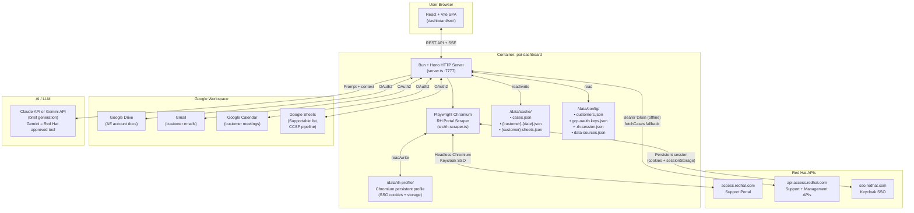
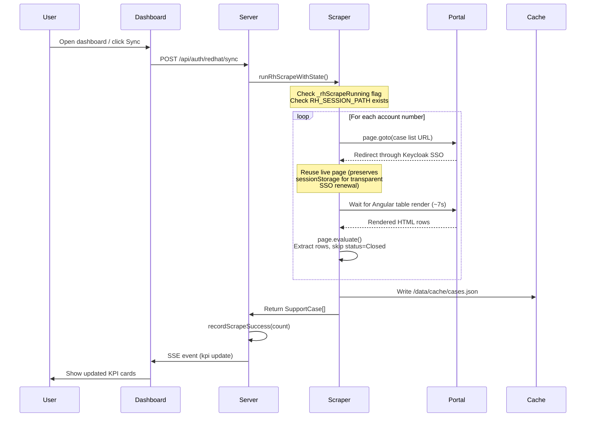
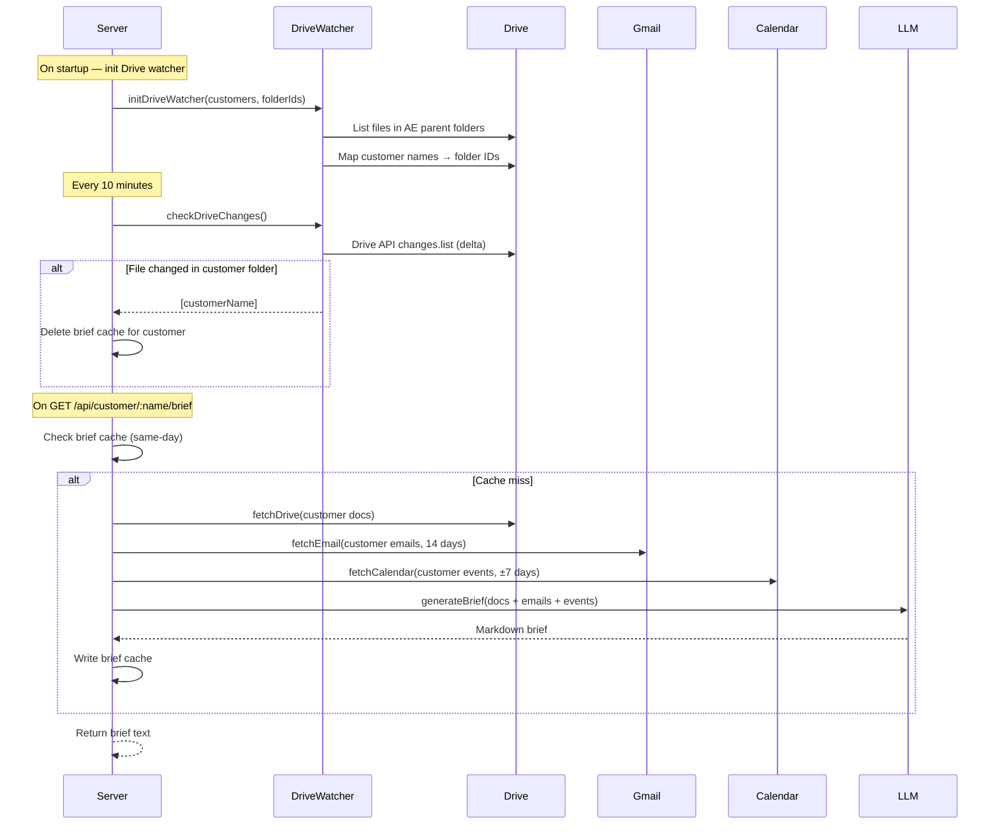
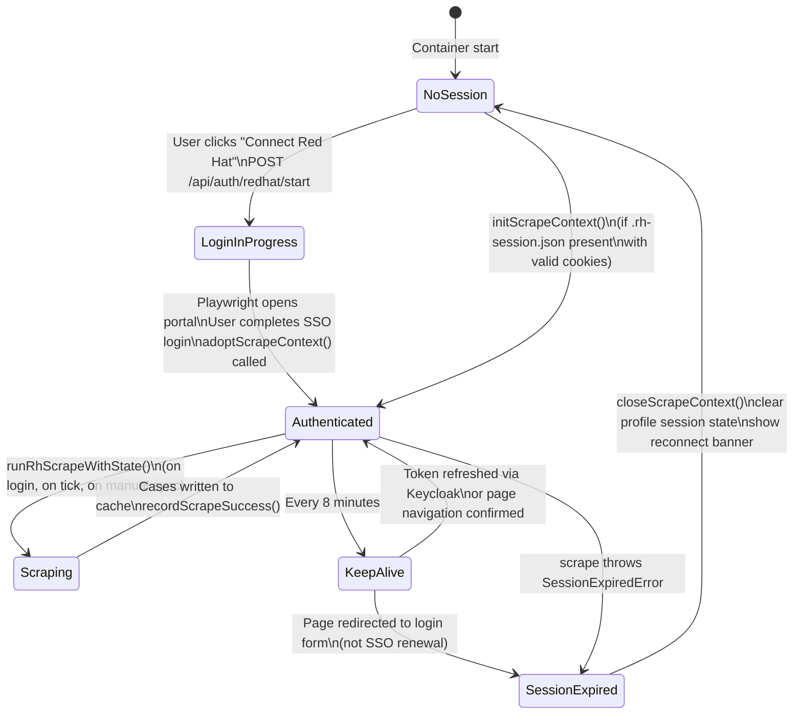

# ASA Command Center — Architecture & Technical Assessment

> **Document purpose:** Technical assessment reference for Red Hat review board.
> Covers system design, data flows, background processes, container architecture,
> testing approach, security posture, and business value for Account Solution Architects.

---

## Executive Summary

The **ASA Command Center** is a self-hosted, containerized web dashboard purpose-built for
Red Hat Account Solution Architects managing 10–20+ enterprise customers. It aggregates
real-time operational intelligence from Red Hat Portal support cases, Google Workspace
(Drive, Gmail, Calendar, Sheets), and optionally a customer knowledge base — surfaced as a
single daily brief per customer.

**Key value proposition:**
- Eliminates the 30–60 min manual prep an ASA spends before each customer EBC or QBR
- Surfaces open support cases, renewal risk, CCSP pipeline, and customer health in one view
- Generates AI-powered daily briefs combining portal data with customer docs and recent emails
- Runs entirely within a single container on the ASA's local machine or a private server — no
  external data storage, no SaaS risk

---

## System Architecture



---

## Data Flows

### Red Hat Support Case Flow



**Cache structure (`/data/cache/cases.json`):**
```json
{
  "scrapedAt": "2026-03-26T23:00:00.000Z",
  "accounts": ["5311018", "5456785"],
  "cases": [
    {
      "caseNumber": "12345678",
      "summary": "OCP cluster upgrade failing",
      "status": "Waiting on Red Hat",
      "severity": "2",
      "accountNumber": "5311018",
      "daysOpen": 14,
      "product": "OpenShift Container Platform"
    }
  ]
}
```

### Google Workspace Data Flow



---

## API Access Limitations & Design Workarounds

Several data retrieval approaches in this dashboard appear unconventional at first glance.
Each is a direct consequence of missing or restricted API access to the authoritative data
source. This section documents those constraints so the assessment team understands the
design decisions are driven by necessity, not preference — and what a cleaner future state
would look like if API access were expanded.

### Red Hat Support Cases — Why Playwright Scraping?

**The limitation:** The Red Hat support case REST API (`api.access.redhat.com/support/v1`)
returns only cases owned by the authenticated user's *individual* account. An ASA managing
15–20 enterprise customers cannot retrieve cases across all customer account numbers through
this API — it is scoped to the individual, not the account relationship.

The Red Hat Customer Portal web interface *does* provide the cross-account view (filterable
by account number), but there is no equivalent bulk or delegated API endpoint that exposes
the same data programmatically for an ASA's portfolio.

**Why this matters:** An ASA is responsible for the support experience of all cases across
their book of business — including cases opened by the customer directly, by other Red Hat
teams, or via partners. Missing these cases means missing critical escalation risk.

**The workaround:** Playwright automates the same portal view the ASA uses manually. The
browser logs in with the ASA's credentials, navigates to the case list filtered by account
number, waits for the Angular SPA to render, and reads the table rows directly. This is
functionally identical to the ASA checking the portal by hand — just automated.

**Ideal state (if API access were expanded):** A delegated or service-account API endpoint
that returns all cases associated with an ASA's assigned accounts would eliminate the need
for Playwright entirely. The scraper, Chromium dependency, and ~1 GB of the container image
would be replaced by a simple `fetch()` call.

---

### Google Sheets as a Data Bridge — Why Not Direct API?

**The limitation:** Operational data the dashboard relies on — the Supportable customer
list (which customers are in an ASA's book of business), CCSP cloud spend, and the sales
pipeline — lives in internal Red Hat systems (Salesforce, internal BI/reporting tools).
These systems do not expose APIs accessible to individual ASAs or to tools running outside
the corporate network.

The data is made available to ASAs indirectly: the operations team periodically exports it
to shared Google Sheets, which ASAs can access via their Google Workspace credentials.

**The workaround:** The dashboard reads these Google Sheets using the standard Google Sheets
API (OAuth2). This gives ASAs the same data they would review manually in spreadsheets, but
surfaced automatically in the dashboard.

**Ideal state (if API access were expanded):** Direct read access to Salesforce or the
internal BI system via an approved service account or partner API would replace the
Google Sheets intermediary entirely. The Sheets dependency — and the manual effort required
to keep those sheets up to date — would be eliminated.

---

### AI Provider — Claude and Gemini

The dashboard is designed to support Gemini as the preferred AI provider for brief
generation, consistent with Red Hat's approved AI tooling direction. However, there is
currently a practical limitation blocking that path.

#### Current State: Claude Code (Approved)

Red Hat does not yet provide programmatic API access to Gemini for individual contributors
in a form usable by a self-hosted tool like this dashboard. There is no CLI, service account
key, or developer API key available through internal Red Hat channels that would allow the
dashboard to call the Gemini API directly and generate customer briefs at runtime.

In the interim, **Claude Code** is being used as the AI development and inference tool
under Red Hat's approved AI process. The ASA author of this dashboard has completed the
required approval steps:

- **Use case form submitted:** Claude Code use case registered at
  [Claude Code User Guide](https://source.redhat.com/projects_and_programs/ai/ai_tools/claude_code_user_guide)
- **Approved AI Tools registry:** Listed under the approved tools catalogue at
  [AI Tools and Use Cases](https://source.redhat.com/projects_and_programs/ai/ai_tools_and_use_cases)

Claude Code (Anthropic's Claude Sonnet/Opus models) is what powers brief generation today.

#### Future State: Gemini (When API Access Is Available)

The dashboard's brief generation layer (`src/customer.ts`) is provider-abstracted. Once
Red Hat provides programmatic Gemini access (API key or service account), switching is
a configuration change — no architectural rework required.

| Provider | Model | Status |
|----------|-------|--------|
| **Anthropic Claude** | claude-sonnet-4-6 | **Active** — in use today via Claude Code (Red Hat approved) |
| **Google Gemini** | gemini-2.0-flash / gemini-1.5-pro | **Planned** — preferred long-term; blocked on Red Hat API access availability |

The AI receives a structured prompt containing customer docs (from Drive), recent emails
(from Gmail), upcoming meetings (from Calendar), and open support case data. It returns
a Markdown daily brief summarizing customer health, action items, and risk signals.

No customer data is retained by the AI provider beyond the single API call — the brief
is generated on-demand and cached locally for the day.

---

## Background Timers & Scheduled Processes

All background work runs as in-process Bun timers — no external cron, no separate worker
processes. The container is the scheduler.

| Timer | Interval | Source | Description |
|-------|----------|--------|-------------|
| **RH case scrape tick** | 15 min (check) | `server.ts:2220` | Fires every 15 min; runs scrape only when ≥4h elapsed since last success. Short tick = reliable in Bun; long single interval was unreliable. |
| **Drive watcher** | 10 min | `server.ts:2251` | Calls Drive API changes.list delta to detect doc changes; invalidates brief cache for affected customers. |
| **Subscriptions refresh** | 4 h (default) | `server.ts:2160` | Re-fetches RH Management API subscriptions for all customers. Configurable via Settings UI. |
| **CCSP pipeline refresh** | 24 h (default) | `server.ts:2161` | Re-fetches CCSP pipeline from Google Sheets. Configurable. |
| **Sales pipeline refresh** | 2 h (default) | `server.ts:2162` | Re-fetches pipeline data from source sheet. Configurable. |
| **RH session keep-alive** | 8 min | `src/rh-scraper.ts:56` | Fires Keycloak `updateToken()` in the live browser page to reset SSO idle timer (30-min default). Falls back to full page navigation if Keycloak adapter unavailable. |

**Why tick-based scrape:** Bun's `setInterval` with intervals ≥ 1 hour has been observed
to not fire reliably. The tick pattern (short interval + elapsed-time check) is the idiomatic
workaround. The 15-min tick ensures the scrape fires within one tick of the 4-hour target.

**Timer startup sequence (container boot):**
```
T+0s   Bun starts server.ts
T+5s   initScrapeContext() — open Chromium persistent context, restore cookies
T+5s   runRhScrapeWithState() — first scrape on boot
T+15m  First tick fires — checks elapsed, skips (< 4h)
T+4h   Tick fires — 4h elapsed, triggers scrape
```

---

## Red Hat Session Lifecycle



**Session persistence across container restarts:**
- On each successful keep-alive and scrape, `storageState()` (cookies + localStorage) is
  written to `/data/rh-profile/session-state.json`
- On `initScrapeContext()` startup, those cookies are restored via `context.addCookies()`
- The long-lived `rh_sso_session` cookie (~14h TTL) survives most container restarts
- If cookies are expired, the user re-authenticates once via the dashboard's Connect flow

---

## Container Architecture

### Multi-Stage Build

The `Containerfile` uses a two-stage build to minimize the final image size:

```
┌─────────────────────────────────────────────────────┐
│  Stage 1: Builder (oven/bun:1-slim)                 │
│  • Install root + dashboard npm dependencies        │
│  • Build React/Vite frontend → dashboard/dist/      │
│  • Result: compiled static assets only              │
└─────────────────────────┬───────────────────────────┘
                          │  COPY --from=builder
┌─────────────────────────▼───────────────────────────┐
│  Stage 2: Runtime (oven/bun:1-slim)                 │
│  • Install Chromium system dependencies (apt-get)   │
│  • COPY dashboard/dist, server.ts, src/, node_modules│
│  • bunx playwright install chromium --no-shell      │
│  • Final image: ~1.3 GB                             │
└─────────────────────────────────────────────────────┘
```

**Why Playwright + Chromium is embedded:**

The Red Hat Customer Portal (`access.redhat.com`) uses Keycloak SSO with PKCE and
`sessionStorage` for token state. The support case list is rendered by an Angular SPA
that requires JavaScript execution. A conventional HTTP client or API cannot:

1. Execute the Angular application to render case rows
2. Maintain `sessionStorage` across requests (required for transparent SSO renewal)
3. Handle the Keycloak redirect flow transparently

A persistent Chromium browser context is the only reliable approach. The `--no-shell` flag
skips the `chromium-headless-shell` download (~250 MB) because `launchPersistentContext()`
uses the full Chromium binary, not headless-shell.

### Volume Architecture

```
/data/                          ← single host mount point
├── config/                     ← CONFIG_DIR
│   ├── customers.json          ← Customer list with account numbers
│   ├── gcp-oauth.keys.json     ← Google OAuth2 client credentials
│   ├── .rh-session.json        ← RH login session marker (written on login)
│   ├── .gdrive-server-credentials.json  ← Google Drive OAuth token
│   ├── .sheets-token.json      ← Google Sheets OAuth token
│   └── data-sources.json       ← Drive folder IDs + refresh intervals
│
├── cache/                      ← CACHE_DIR
│   ├── cases.json              ← Latest scraped support cases
│   ├── {customer}-{date}.json  ← Daily brief cache (one per customer per day)
│   └── {customer}-sheets.json  ← Sheet data cache
│
└── rh-profile/                 ← RH_PROFILE_DIR
    ├── Default/                ← Chromium user data directory
    │   └── (Chromium profile files — cookies, storage)
    └── session-state.json      ← Playwright storageState snapshot
```

**Single-volume design rationale:** All persistent state lives under `/data` so operators
need only one volume mount. Config, cache, and browser state are co-located.

### Deployment

```yaml
# docker-compose.yml
services:
  dashboard:
    image: ghcr.io/hornjason/asacommandcenter:latest
    container_name: pai-dashboard
    restart: unless-stopped
    ports:
      - "7777:7777"
    volumes:
      - ./data:/data
    environment:
      PORT: "7777"
      CONFIG_DIR: /data/config
      CACHE_DIR: /data/cache
      RH_PROFILE_DIR: /data/rh-profile
    env_file:
      - .env          # REDHAT_OFFLINE_TOKEN, ANTHROPIC_API_KEY, etc.
```

**Environment variables (`.env`):**

| Variable | Required | Description |
|----------|----------|-------------|
| `REDHAT_OFFLINE_TOKEN` | Yes | RH SSO offline token (rhsm-api client) for API fallback |
| `ANTHROPIC_API_KEY` | Yes | Claude API key for brief generation |
| `ADMIN_EMAIL` | Yes | Google OAuth admin email |
| `PORT` | No | HTTP port (default: 7777) |

---

## Testing Harness

The project uses **Bun's built-in test runner** (`bun:test`) — no Jest, no extra test deps.

```bash
bun test src/**/*.test.ts
```

### Test Coverage

| Test File | What it covers |
|-----------|----------------|
| `src/rh-scraper.test.ts` | Chromium launch options, cookie restoration, keep-alive hybrid path logic |
| `src/sheets.test.ts` | Sheet data parsing, CCSP record normalization |
| `src/pipeline.test.ts` | Pipeline record mapping, summary generation |
| `src/domains.test.ts` | Customer domain inference from name patterns |

### Test Architecture Philosophy

Tests are structured in three layers:

**Layer 1 — Unit (mocked, fast):** All four test files use mocked dependencies (Playwright,
Google APIs) for logic that doesn't require live credentials. These run in CI in under 5s.

**Layer 2 — Integration (real APIs, manual):** Scraper session management, OAuth token
exchange, and Google Drive delta sync require live credentials. These are verified manually
with documented procedures in each test file's "Live Verification" section.

**Layer 3 — Container smoke test (post-deploy):** After any container rebuild:
1. Start fresh container with `docker compose up -d`
2. Navigate to `http://localhost:7777`
3. Verify setup wizard completes without errors
4. Confirm `/api/kpis` returns `openCasesTotal > 0` after RH sync
5. Confirm brief generation produces non-empty text for at least one customer

**Running tests in the container:**
```bash
docker exec pai-dashboard bun test src/**/*.test.ts
```

### Why Playwright Is Integration-Tested Manually

The Keycloak SSO flow involves:
- A real browser with persistent cookies
- `sessionStorage` state (cannot be reproduced in a mock)
- Server-side SSO idle timer reset (requires an actual Keycloak session)

These cannot be meaningfully unit-tested. The scraper test file validates the _shape_
of launch options and cookie-restore logic; live portal behavior is covered by manual
verification against the actual portal after any scraper changes.

---

## Security Overview

### Credential Handling

| Credential | Where stored | How used |
|------------|-------------|----------|
| RH offline token | `.env` file (host-only) | Exchanged for short-lived Bearer token via SSO |
| Google OAuth tokens | `/data/config/` (container volume) | Refreshed automatically via googleapis |
| RH session cookies | `/data/rh-profile/session-state.json` | Restored to Playwright context on startup |
| Anthropic API key | `.env` file (host-only) | Passed as Authorization header to Claude API (optional) |
| Google Gemini API key | `.env` file (host-only) | Passed as Authorization header to Gemini API (Red Hat approved) |

All secrets are injected at runtime via environment variables — none are baked into the
container image.

### Authentication Flows

**Red Hat Portal:** Keycloak PKCE flow initiated by the embedded Chromium browser. The ASA
logs in once through the dashboard's guided wizard. The `rh_sso_session` cookie (~14h TTL)
persists to disk and is restored on container restart.

**Google Workspace:** Standard OAuth2 authorization code flow. Refresh tokens are stored
in `/data/config/` on the container volume. Access tokens are refreshed automatically by
the googleapis SDK.

### Network Exposure

The dashboard binds to `0.0.0.0:7777` inside the container. In the default docker-compose
configuration this is exposed only on `localhost:7777`. For team use, operators should place
a reverse proxy (nginx, Caddy) with HTTPS in front of it. There is no built-in
authentication layer — the application assumes a trusted network.

### Session CSRF

The Google OAuth callback uses a state parameter generated at request time to validate that
the callback corresponds to the originating flow.

---

## Business Value

### What the Dashboard Solves

| Problem | Before | After |
|---------|--------|-------|
| Pre-meeting prep | 30–60 min manually checking portal, email, Drive | < 5 min: dashboard shows all context per customer |
| Missed critical cases | Check portal only when customer calls | KPI card + severity badge always visible |
| Renewal risk | Manually pull subscription data in portal | Renewals expiring in 120 days surfaced automatically |
| EBC/QBR readiness | Hunt across Drive, email, notes | AI brief synthesizes docs + emails + calendar |
| Multi-customer view | Context-switch across browser tabs and portals | Single dashboard, all customers, unified status |

### Data Sources Aggregated

| Source | Data | Refresh |
|--------|------|---------|
| Red Hat Portal (scraped) | Support cases, severity, status | Every 4 hours + on-demand |
| Red Hat Management API | Subscriptions, renewals | Every 4 hours |
| Google Drive | Customer docs, meeting notes, win wires | On-change (Drive delta) |
| Gmail | Customer emails (last 14 days) | On brief generation |
| Google Calendar | Upcoming + recent meetings | On brief generation |
| Google Sheets | Supportable customer list, CCSP pipeline | Daily / 2-hourly |
| Gemini API *(preferred)* | Brief synthesis from all above | On-demand, cached daily — Red Hat approved AI tool |
| Claude API *(optional)* | Brief synthesis from all above | On-demand, cached daily — development fallback |

### Designed for Compliance

- **No data leaves the ASA's control:** All data fetched from source APIs is stored only on
  the ASA's own host volume. Nothing is sent to a third-party storage service.
- **No SaaS dependency:** The application itself is a container that runs on the ASA's
  laptop or a private server. There is no external backend.
- **Credentials in `.env`:** Standard practice; `.env` is gitignored. No credentials in
  source code or container image.
- **Minimal API permissions:** Google OAuth scopes are restricted to Drive read, Gmail read,
  Calendar read, Sheets read. No write permissions requested.

---

## Dependency Summary

| Component | Version | Purpose |
|-----------|---------|---------|
| Bun | 1.x | Runtime, HTTP server, test runner |
| Hono | 4.x | Lightweight HTTP framework |
| React + Vite | 18.x / 5.x | Frontend SPA |
| @playwright/test | 1.x | Headless Chromium automation |
| googleapis | 148.x | Google API client |
| @google/generative-ai | 0.x | Gemini API client (Red Hat approved AI) |
| @anthropic-ai/sdk | 0.x | Claude API client (optional fallback) |

**Runtime base image:** `oven/bun:1-slim` (Debian bookworm-slim + Bun binary)

**Chromium install:** `bunx playwright install chromium --no-shell` — downloads Playwright's
pinned Chromium build into `/ms-playwright/`. This ensures browser/driver version parity
and avoids system Chromium version drift.

---

*Generated 2026-03-27 — DailyBriefDashboard / ASA Command Center*
