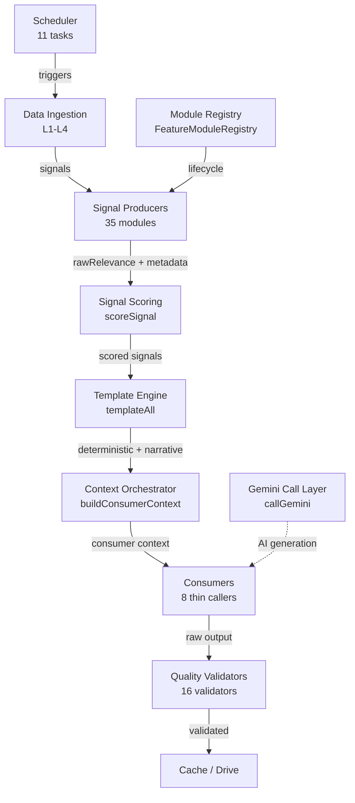
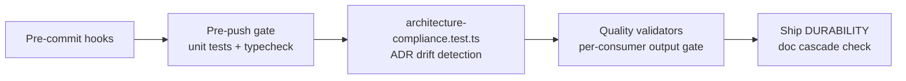

# DailyBriefDashboard — Golden State Architecture

Single-tenant intelligence dashboard for a Red Hat Account Executive. Aggregates RH Portal, Salesforce, Tableau CCSP, Google services (Drive, Gmail, Calendar), and SalesHub into a daily brief UI. Container-only (`pai-dashboard` on port 7777), localhost-only, no auth middleware. Deployed via `make rebuild`.

Read this file first. Follow doc routing table for deeper detail.

---

## Architecture Layers

<!-- ASSERTION: count("src/modules/*-module.ts") == 35 -->
<!-- ASSERTION: count("src/quality-validators/*.ts") == 16 -->
<!-- ASSERTION: count("docs/adr/ADR-*.md") == 26 -->
<!-- ASSERTION: file_exists("src/lib/context-orchestrator.ts") -->
<!-- ASSERTION: file_exists("src/lib/grounding-rules.ts") -->
<!-- ASSERTION: grep("GROUNDING_RULES_BLOCK", "src/lib/grounding-rules.ts") -->

| # | Layer | Purpose | Key Contract | Status | Reference |
|---|---|---|---|---|---|
| 1 | Signal Producers | Modules emit facts with metadata | `rawRelevance` + metadata, registry scores via `scoreSignal()` (ADR-027) | ALIGNED | `PRINCIPLES.md` Layer 1 |
| 2 | Signal Scoring | Centralized scoring by specificity + boosters | `scoreSignal()` in `feature-module-registry.ts`, no hardcoded scores | ALIGNED | `ARCHITECTURE.md` §22 |
| 3 | Template Engine | Deterministic sections from scored signals | `templateAll()` is single data path (ADR-031) | ALIGNED | `src/lib/signal-templates.ts` |
| 4 | Consumers | Thin callers that slice template output | All 8 consumers use `buildConsumerContext` or `templateAll` | ALIGNED | `PRINCIPLES.md` Consumer table |
| 5 | Module Registry | Feature module lifecycle + auto-discovery | 35 modules via `FeatureModuleRegistry.register()` (ADR-020) | ALIGNED | `src/modules/*-module.ts` |
| 6 | Gemini Call Layer | Unified AI call wrapper | `callGemini()` in `gemini-call.ts`: retry, cost tracking, delta cache | ALIGNED | `ARCHITECTURE.md` §21 |
| 7 | Quality Validators | Output validation before caching | 16 validators in `src/quality-validators/` (ADR-024) | ALIGNED | `src/quality-validators/*.ts` |
| 8 | Scheduler | Centralized timer lifecycle | 11 tasks via `schedulerRegistry.register()` (ADR-028) | ALIGNED | `src/background-scheduler.ts` |
| 9 | Data Ingestion | 4-tier cache (L1-L4), Drive sync, scraper pipeline | L4 browser scrapes → Drive → L3 reads → L2 cache → L1 API | ALIGNED | `docs/DATA-INGESTION-ARCHITECTURE.md` |
| 10 | API Surface | HTTP endpoints, localhost-only | 26 route files, Hono framework, no auth middleware | ALIGNED | `PROJECT-STATE.md` |
| 11 | Context Orchestrator | Consumer context assembly | `buildConsumerContext` wraps `templateAll` + Layer 2/3 context | ALIGNED | `src/lib/context-orchestrator.ts` |
| 12 | Enforcement | Pre-commit + pre-push hooks, compliance tests | `architecture-compliance.test.ts`, `SkillEnforcement`, `SecurityValidator` | ALIGNED | `test/unit/architecture-compliance.test.ts` |

### Layer interactions

### Enforcement stack

---

## Module Registry Snapshot

<!-- ASSERTION: grep("schedulerRegistry.register", "src/background-scheduler.ts") -->

| Category | Count | Location |
|---|---|---|
| Feature modules | 35 | `src/modules/*-module.ts` |
| Quality validators | 16 | `src/quality-validators/*.ts` |
| ADRs (active) | 26 | `docs/adr/ADR-*.md` |
| Scheduled tasks | 11 | `src/background-scheduler.ts` |
| Consumers | 8 | See `PRINCIPLES.md` Consumer → File table |
| Grounding rules | 6 | `src/lib/grounding-rules.ts` |
| Route files | 26 | `src/*-routes.ts` |

---

## Known Gaps

<!-- ASSERTION: grep("buildConsumerContext", "src/account-plan.ts") -->
<!-- ASSERTION: grep("buildConsumerContext", "src/campaign-service.ts") -->

### HIGH — Code Drift

| File | Issue | ADR Violated |
|---|---|---|
| `src/account-discovery.ts` | Missing `supportsAllDrives` on Drive API calls | ADR-019 (L3 CSV discovery) |
| `src/product-intelligence.ts` | Triple ADR violation: direct Gemini call bypasses `callGemini()`, no quality validator, no `ensureFresh` | ADR-023, ADR-024, ADR-020 |

### MEDIUM — Doc Debt

| Item | Status |
|---|---|
| ADR-040 (Universal Structured Output) | Proposed — not yet implemented |
| Email Outreach consumer | Missing `ensureFresh` contract |

---

## Doc Routing Table

| If touching... | Read first |
|---|---|
| Any module | `PRINCIPLES.md` (pre-flight questions), `ARCHITECTURE.md` §26 (compliance) |
| Scrapers | `docs/SCRAPER-RULES.md`, `ARCHITECTURE.md` §1-§3a |
| Consumers | `PRINCIPLES.md` (Consumer table, ensureFresh contract) |
| Gemini calls | `docs/adr/ADR-023`, `docs/adr/ADR-024`, `docs/adr/ADR-040` |
| Scheduler | `docs/adr/ADR-028`, `ARCHITECTURE.md` §28 |
| Signals / scoring | `docs/adr/ADR-027`, `PRINCIPLES.md` Layer 1-2 |
| Drive / L3 sync | `ARCHITECTURE.md` §3a, §6, `docs/DATA-INGESTION-ARCHITECTURE.md` |
| Tests | `docs/TESTING-RUNBOOK.md`, `test/unit/architecture-compliance.test.ts` |
| Deploy | `CLAUDE.md` (Deploy section), `Makefile` |
| New feature | `PRINCIPLES.md` (22 pre-flight questions), `docs/MODULE-DEVELOPER-GUIDE.md` |
| ADRs | `docs/adr/`, `PRINCIPLES.md` (ADR → PRINCIPLES enforcement) |
| UI / React | `PROJECT-STATE.md`, `dashboard/src/` |

---

## Anti-patterns — Top 5 Drift Causes

1. **Hardcoded scores in modules** — Use `rawRelevance` + metadata; `scoreSignal()` computes final score
2. **Consumers assembling own signal context** — Call `buildConsumerContext` or `templateAll`, never raw signals
3. **Bypassing `callGemini()` wrapper** — Loses retry, cost tracking, delta cache, timeout tiers
4. **Missing `ensureFresh()` on cached modules** — Consumers generate from stale/empty data
5. **ADR without PRINCIPLES.md update** — Creates rules nobody checks; `architecture-compliance.test.ts` catches this
