<p align="center">
  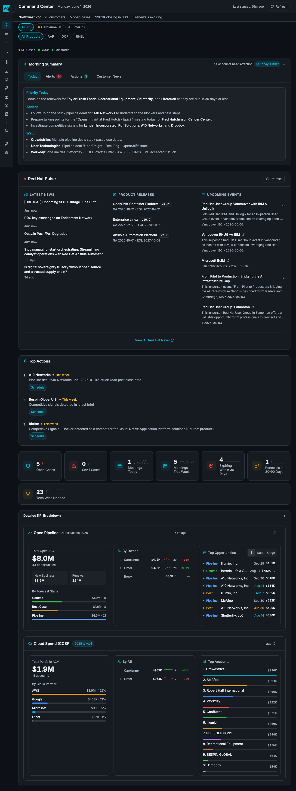
</p>

<h1 align="center">Daily Brief Dashboard</h1>

<p align="center">
  <strong>Customer intelligence that stacks, not data that displays.</strong><br/>
  Walk into every customer conversation prepared — with AI-powered briefs, strategic motions, and 134+ signals per account.
</p>

<p align="center">
  <a href="#quickstart">Quickstart</a> &bull;
  <a href="#features">Features</a> &bull;
  <a href="#intelligence-engine">Intelligence Engine</a> &bull;
  <a href="#screenshots">Screenshots</a> &bull;
  <a href="#setup-wizard">Setup</a> &bull;
  <a href="#large-installs">Large Installs</a> &bull;
  <a href="#architecture">Architecture</a>
</p>

---

## What is this?

A containerized intelligence dashboard for Red Hat Account Solution Architects and Account Executives. One command to install, zero API keys to configure.

It aggregates support cases, subscriptions, cloud spend, pipeline, product intelligence, competitive signals, and Google Workspace data — then layers AI-powered intelligence on top to surface **what matters** and **what to do about it**.

**This is not a data dashboard.** It's an intelligence engine that cross-references 30 signal sources, scores every signal for customer relevance, and generates strategic sales plays with evidence-backed recommendations.

```
Your data stays on your machine. Nothing leaves except API calls
to services you already have access to.
```

---

## Quickstart

```bash
mkdir ~/daily-brief && cd ~/daily-brief
curl -fsSL https://github.com/hornjason/daily-brief-dashboard/releases/latest/download/setup.sh | bash
```

That's it. The installer handles prerequisites, pulls the container, and opens the setup wizard. Setup takes ~5 minutes.

**Requirements:** [Podman](https://podman.io/) (or Docker), 4GB RAM (16GB for [large installs](#large-installs)), 5GB disk. Linux and macOS on Intel and Apple Silicon.

> Want to inspect the script first? `curl -fsSL https://github.com/hornjason/daily-brief-dashboard/releases/latest/download/setup.sh -o setup.sh` then review it.

---

## Available Pods & Regions

During setup, you select the pods and regions you manage. The shared L3 data source provides nightly-synced subscription, pipeline, and cloud spend data for each pod.

### West Commercial

| Pod | Territory | Status |
|-----|-----------|--------|
| **Northwest** | WEST_COMM_CORP_NORTHWEST | Active |
| **Southwest** | WEST_COMM_CORP_SOUTHWEST | Active |
| **North Central** | WEST_COMM_CORP_NORTH_CENTRAL | Active |
| **South Central** | WEST_COMM_CORP_SOUTH_CENTRAL | Active |

### East Commercial

| Pod | Territory | Status |
|-----|-----------|--------|
| **Rough Riders** | EAST_COMM_CORP_POD01 | Active |
| **Big Apple Ballers** | EAST_COMM_CORP_POD02 | Coming Soon |
| **Pythons** | EAST_COMM_CORP_POD03 | Coming Soon |
| **Mad Hatters** | EAST_COMM_CORP_POD05 | Coming Soon |

### Central Enterprise

| Pod | Territory | Status |
|-----|-----------|--------|
| **TOLA** | CENTRAL_ENT_TOLA | Active |
| **High Plains** | CENTRAL_ENT_HIGH_PLAINS | Active |

**7 pods active** across 3 regions. Each pod includes SF pipeline reports, territory spreadsheets, and bookings data. During the setup wizard, you select your region and pods — the dashboard automatically imports AEs and customers from the shared data source.

> Want your region or pod added? Email **jhorn@redhat.com** with your Salesforce report ID and territory codes.

---

## Features

### Command Center — Your Daily Brief

The main dashboard gives you a morning summary with today's priorities, KPI cards across your portfolio, Red Hat Pulse (news, product releases, upcoming events), and top actions ranked by urgency.


### Customer Intelligence — Account Detail (v2.0)

Click any customer to see their full intelligence page — redesigned around intent, not data type. Every section answers "what's the story?" then "what should I do about it?"

- **Account Brief** — AI-generated narrative: who they are, what's happening, what to talk about
- **Sales Strategy** — TDP-aligned expansion phases and tactics with evidence chains, estimated TCV, and one-click campaign generation
- **AI-Discovered Opportunities** — Gemini-surfaced novel sales angles from cross-signal analysis
- **Health Score** — 81-point composite (cases, contacts, renewal, meetings, resolution) with hover breakdown
- **Floating Q&A Widget** — Ask grounded questions about any customer's product data, subscriptions, and tech stack — accessible from any tab
- **3 Sidebar Groups:**
  - **Opportunities** — Product Signals, Expansion Fit, and Recommended Actions (cross-referenced case/solution matches)
  - **People** — Key Contacts with engagement frequency and days-silent alerts
  - **Account Data** — Research Docs, Account Plan, Subscriptions, Cases, Cloud Marketplace, Drive Documents, Signal Sources

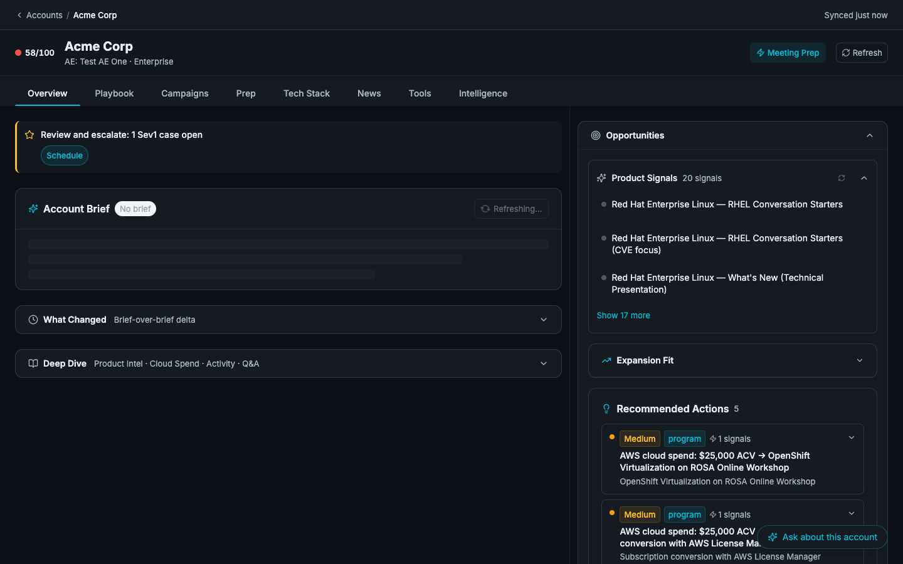

### Sales Strategy — AI-Powered Sales Plays

The intelligence engine cross-references your customer's tech stack, support cases, subscriptions, cloud spend, and pipeline to generate strategic sales plays. Each motion has phases with evidence-backed tactics, compressed views that expand on click, and estimated TCV.

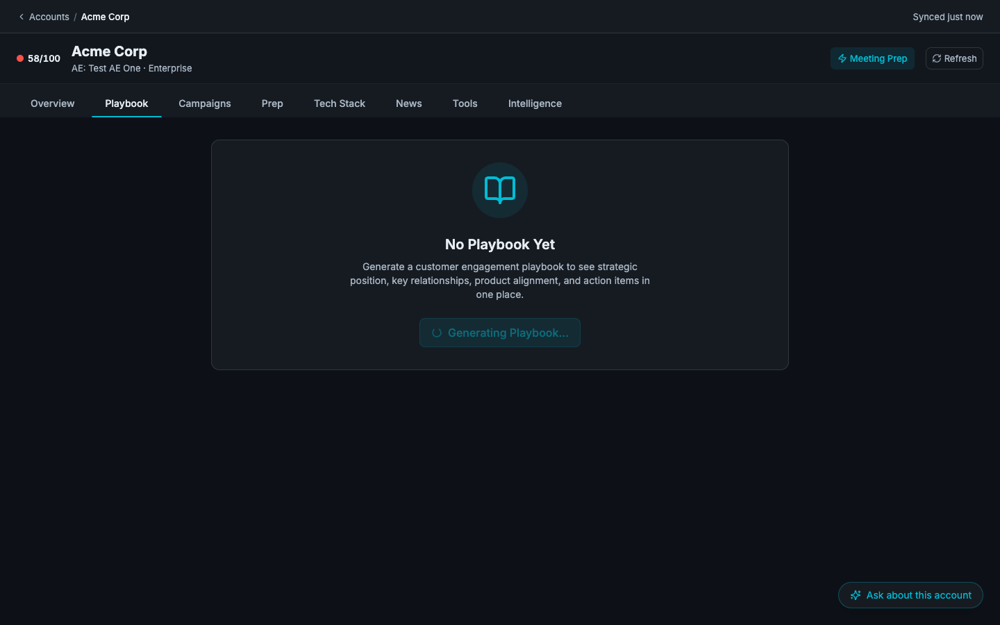

### Pipeline & Cloud Spend

Full pipeline visualization with ACV breakdowns by forecast stage, owner, and top opportunities. Cloud spend (CCSP) tracking by partner, with account-level trends.

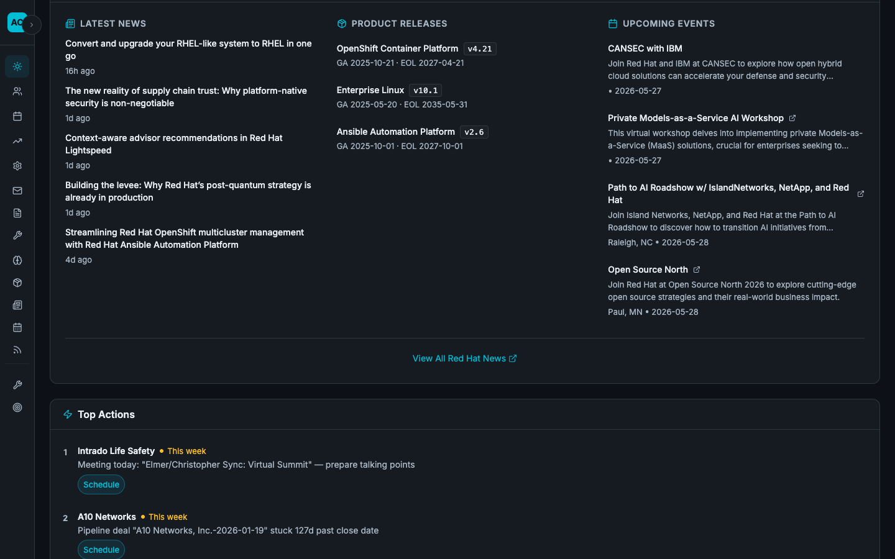

### Product Intelligence

Track new product releases, tech previews, and GA announcements across the Red Hat portfolio. Filter by product family, lifecycle stage, or feature set. Spotlight cards highlight what's new and relevant to your customers.

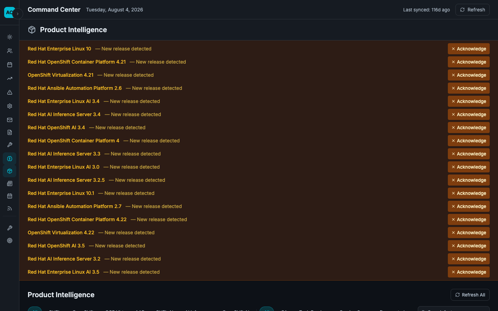

### AI-Generated Campaigns

Generate personalized outreach campaigns per customer, with style guides matching your AE's voice, value propositions mapped to the customer's business objectives, and role-specific email templates.

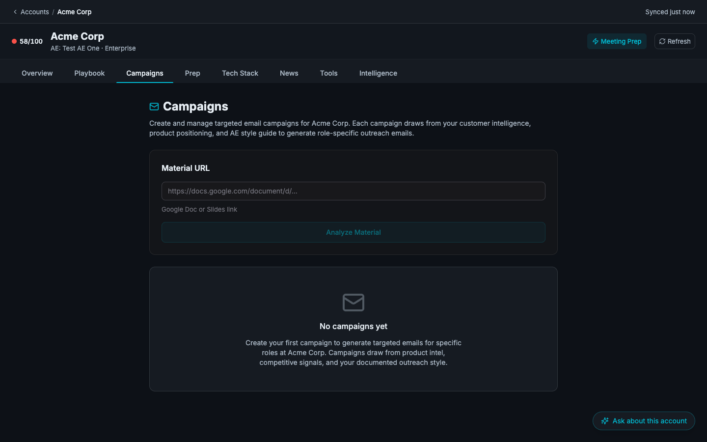

### Meeting Prep

Pre-meeting intelligence briefs with full customer context, talking points, and recent activity — exported directly to Google Docs with Red Hat brand formatting.

### Red Hat Events

Browse upcoming Red Hat events filtered by format (in-person, virtual, hybrid), product focus (AAP, OCP, RHEL, RHOAI), and region. Share event links directly with customers.

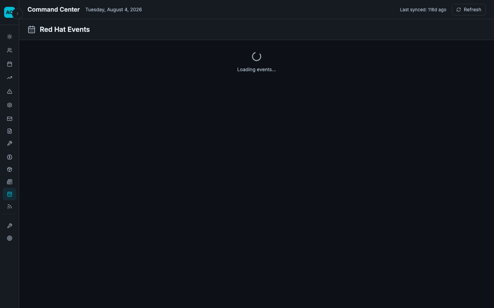

### Book of Business

Portfolio triage view with filterable account lists, summary totals, and combined filter states across AEs and products.

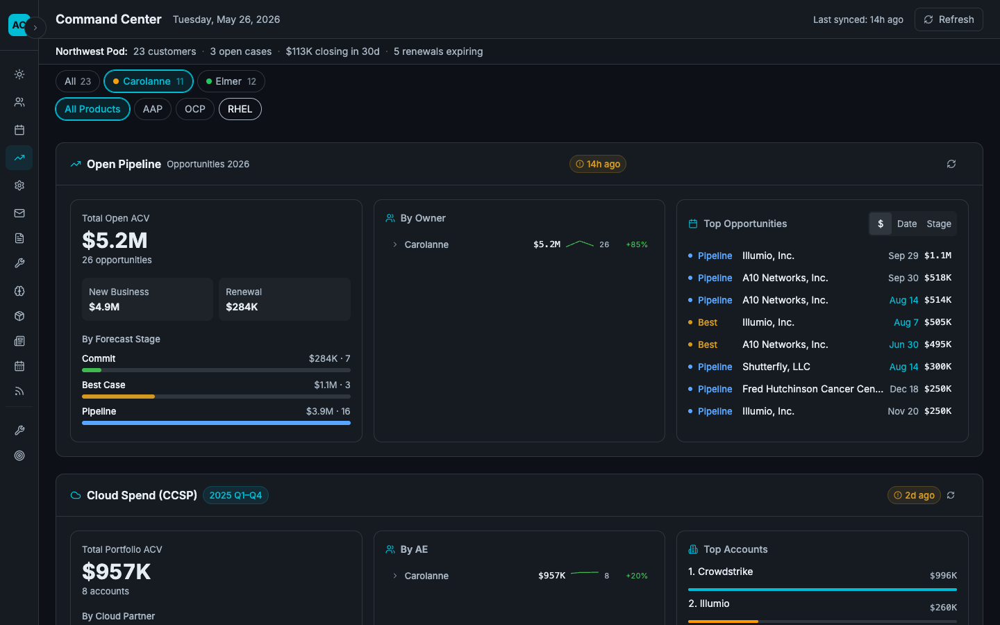

---

## Intelligence Engine

This dashboard is built on a **graph-based intelligence engine** — not a simple data aggregator. Raw data from 23 sources flows through a three-layer architecture that scores, routes, and synthesizes signals into actionable intelligence.

### How It Works

```mermaid
flowchart TD
    subgraph Sources["DATA SOURCES (23 Modules)"]
        S1[Support Cases]
        S2[Subscriptions]
        S3[Cloud Spend]
        S4[Pipeline]
        S5[Tech Stack Detection]
        S6[News Radar]
        S7[Competitive Intel]
        S8[Product Lifecycle]
        S9[Ecosystem Catalog]
        S10[Solution Plays]
        S11["+ 13 more..."]
    end

    subgraph Layer1["LAYER 1: Signal Production"]
        direction LR
        L1[Each module produces signals<br/>with structured metadata:<br/>rawRelevance, products, severity,<br/>confidence, customer context]
    end

    subgraph Layer2["LAYER 2: Scoring Engine"]
        direction LR
        L2A[Specificity Detection<br/>Customer · Industry · General]
        L2B[Score Boosters<br/>+revenue +severity +renewal<br/>+products +confidence]
        L2C[Time Decay &<br/>Budget Caps]
    end

    subgraph Layer3["LAYER 3: Template Engine"]
        direction LR
        L3A[Signal Routing<br/>metadata → section]
        L3B[10 Deterministic<br/>Template Sections]
        L3C[Gemini Synthesis<br/>narrative only]
    end

    subgraph Consumers["CONSUMERS"]
        C1[Account Briefs]
        C2[Strategic Motions]
        C3[Campaign Generator]
        C4[Meeting Prep]
        C5[Playbooks]
    end

    Sources --> Layer1
    Layer1 --> Layer2
    Layer2 --> Layer3
    Layer3 --> Consumers

    style Sources fill:#1a2332,stroke:#00bcd4,color:#e0e0e0
    style Layer1 fill:#1a2332,stroke:#ff9800,color:#e0e0e0
    style Layer2 fill:#1a2332,stroke:#4caf50,color:#e0e0e0
    style Layer3 fill:#1a2332,stroke:#9c27b0,color:#e0e0e0
    style Consumers fill:#1a2332,stroke:#f44336,color:#e0e0e0
```

### The Three Layers

**Layer 1 — Signal Production** &nbsp; Each of 23 modules produces signals with structured metadata. A module reports facts — it never decides importance. Signals carry `rawRelevance`, `redHatProducts`, `severity`, `confidence`, `customerSlug`, and more.

**Layer 2 — Centralized Scoring** &nbsp; A single scoring engine evaluates every signal. It detects specificity (is this customer-specific, industry-level, or general?), applies boosters (revenue, severity, renewal urgency, product match), and enforces budget caps per source so no one data stream dominates.

**Layer 3 — Template Engine** &nbsp; Scored signals are routed to deterministic template sections based on metadata — not editorial judgment. 10 of 18 output sections are fully deterministic (no AI). Gemini only writes narrative synthesis; it never decides what signals matter or where they appear.

### Signal Scoring

Every signal is scored 0–100 using specificity detection and contextual boosters:

| Tier | Score | Meaning | Example |
|------|-------|---------|---------|
| **Critical** | 90–100 | Revenue impact, urgent action | Sev1 case on evaluating tech |
| **High** | 70–89 | Directly actionable | Customer tech + RH product mapping |
| **Medium** | 50–69 | Useful context | Subscription renewal data |
| **Low** | 35–49 | Background awareness | Industry trend, low confidence |
| **Noise** | 0–34 | Filtered from output | Generic blog post |

A generic "OpenShift 4.22 released" signal scores 15 (noise). The **same signal** scores 85 (high) when the customer has OpenShift subscriptions expiring in 30 days with active support cases — because the scoring engine cross-references metadata across all signal sources.

### The Intelligence Graph

The intelligence graph is a **strategic cross-reference matrix** that connects signals across modules:

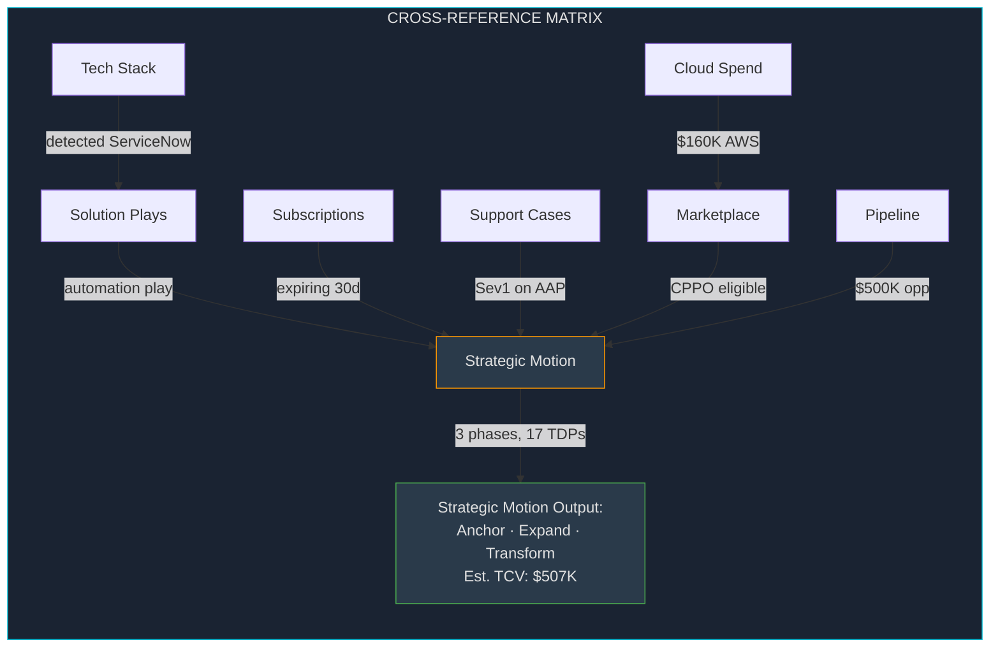

The result: instead of showing you 134 disconnected data points, the dashboard surfaces **"Build and Run Applications for Crowdstrike — 3 phases, 17 TDPs, Est. TCV $507K, high confidence"** with evidence trails linking back to specific cases, subscriptions, and marketplace opportunities.

### What Makes This Different

| Traditional Dashboard | Daily Brief Intelligence |
|---|---|
| Shows raw data | Cross-references 23 sources into scored insights |
| Static views | Dynamic scoring — same data, different score per customer |
| Manual analysis | Auto-generated strategic motions with evidence |
| Flat data display | Graph-based intelligence that stacks and compounds |
| Generic recommendations | Customer-specific plays with TCV estimates |
| Requires interpretation | Surfaces "what to do" not just "what happened" |

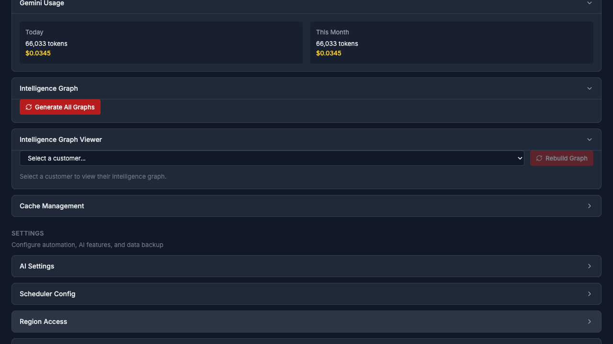

---

## Screenshots

<details>
<summary><strong>Click to expand full screenshot gallery</strong></summary>

| View | Description |
|------|-------------|
|  | **Command Center** — Morning summary, KPIs, Red Hat Pulse, top actions, pipeline overview |
|  | **Customer Detail** — Health score, sales strategy, signals, account brief, floating Q&A |
|  | **Sales Strategy** — Evidence-backed phases with tactics and recommendations |
|  | **Pipeline** — ACV by stage, owner breakdown, top opportunities |
|  | **Products** — Release radar, tech previews, product spotlight |
|  | **Campaigns** — AI-generated outreach with AE voice matching |
|  | **Events** — Filterable by format, product, and region |
|  | **Book of Business** — Portfolio triage with combined filters |

</details>

---

## Setup Wizard

After the installer finishes, the setup wizard opens in your browser at `http://localhost:7777/dashboard/setup`:

### Step 1 — Google Auth

Click **Connect Google** to authorize Gmail, Calendar, Drive, and Sheets. Uses a shared GCP project — any `@redhat.com` Google Workspace account works automatically. OAuth keys are bundled with the container.

### Step 2 — AEs & Customers

1. Paste your **AE parent folder URL** (a Google Drive folder you create)
2. Click **Add AE** for each AE you manage
3. Bootstrap runs automatically — creates Drive folder structure, imports customer data from the shared L3 data source

### Step 3 — AI Settings (Optional)

Configure AI brief generation preferences. Briefs work out of the box using your Google OAuth token with Vertex AI — no additional API keys needed.

Then click **Open Dashboard** at `http://localhost:7777/dashboard`. First data sync takes 3–5 minutes.

> **Google OAuth error?** The shared GCP project uses Internal consent mode — any `@redhat.com` account can authorize. Email **jhorn@redhat.com** if you hit issues.

---

## What is the AE Parent Folder?

A Google Drive folder you create that becomes the root of your data structure:

```
Your AE Parent Folder/
  ├── {AE Name}/
  │   ├── SF Bookings.gsheet       ← subscription data
  │   ├── CCSP.gsheet              ← cloud spend
  │   ├── Pipeline.gsheet          ← Salesforce pipeline
  │   └── {Customer Name}/         ← per-customer docs & intelligence
  ├── Config/                      ← backup sheets
  └── Products/                    ← product intel (openshift, rhel, ansible...)
```

Bootstrap populates everything from the shared L3 data source (updated nightly). The folder lives in your personal Drive — nothing is shared unless you share it.

---

## Data Sources

| Source | What it provides | Update frequency |
|--------|-----------------|------------------|
| **Red Hat Customer Portal** | Support cases by severity | Scheduled + on-demand |
| **Salesforce Bookings** | Subscriptions, renewals, ACV | Nightly via L3 |
| **Salesforce Pipeline** | Opportunities by stage and owner | Nightly via L3 |
| **CCSP (Cloud Spend)** | Cloud consumption by partner | Nightly via L3 |
| **Google Gmail** | Email context for meeting prep | On-demand |
| **Google Calendar** | Upcoming meetings and attendees | On-demand |
| **Red Hat Product Lifecycle** | Release radar, GA/TP/EOL dates | Scheduled |
| **Red Hat Events** | Upcoming events by region/product | Scheduled |
| **Red Hat RSS** | News, blog posts, announcements | Scheduled |
| **SalesHub** | Sales plays, TDPs, solution kits | Scheduled |
| **Cloud Marketplace** | AWS/Azure/GCP offers, CPPO eligibility | Scheduled |
| **Ecosystem Catalog** | Partner integrations, certifications | Scheduled |
| **Tech Stack Detection** | Customer infrastructure signals | On intelligence generation |
| **Competitive Intel** | M&A activity, competitive positioning | Scheduled |
| **News Radar** | Customer-specific news monitoring | Scheduled |
| **Vertex AI (Gemini)** | Account briefs, narrative synthesis | On-demand (4h cache) |

All data is cached locally. The dashboard runs entirely on your machine.

---

## Stopping and Restarting

```bash
podman stop pai-dashboard     # stop
podman start pai-dashboard    # restart
podman rm pai-dashboard       # remove (data preserved in ./data/)
```

## Upgrading

```bash
cd ~/daily-brief
podman compose pull            # pull latest image
podman compose up -d           # restart with new image
```

To always pull the latest on startup (skips caching stale images):

```bash
podman compose up -d --pull always
```

**Manual pull (without compose):**

```bash
podman pull ghcr.io/hornjason/daily-brief-dashboard:latest
podman stop pai-dashboard && podman rm pai-dashboard
# Then re-run your compose or podman run command
```

Data and configuration are preserved — only the application code updates.

---

## Troubleshooting

| Problem | Solution |
|---------|----------|
| Podman machine not running (macOS) | `podman machine start` |
| RAM too low (macOS) | `podman machine stop && podman machine set --memory 8192 && podman machine start` |
| RAM too low (large install, macOS) | `podman machine stop && podman machine set --memory 16384 && podman machine start` |
| Container exits immediately | `podman logs pai-dashboard` — check for missing deps or config |
| Dashboard not loading | `podman ps` to verify container is running, then check logs |
| Pages slow during intel generation | Use `docker-compose-optimized.yaml` — see [Large Installs](#large-installs) |
| "Thin content (1 lines)" on intel docs | Gemini calls timing out — reduce concurrency or increase container memory |
| Google auth errors | Re-run setup wizard at `/dashboard/setup` |
| AI briefs empty | Check `podman logs pai-dashboard` — uses your Google OAuth token |
| SELinux permission denied (Fedora/RHEL) | Use `:Z` volume suffix — already set in compose files |
| Port 7777 in use | Set `PORT=7778` in `.env` and update `docker-compose.yml` |
| Stale image after upgrade | `podman pull ghcr.io/hornjason/daily-brief-dashboard:latest` or use `--pull always` |
| Check container resources (macOS) | `podman machine inspect --format '{{.Resources.CPUs}}c / {{.Resources.Memory}}MB'` |
| Check container resources (Fedora) | `podman info --format '{{.Host.MemTotal}}'` (uses host resources directly) |

Still stuck? Email **jhorn@redhat.com**.

---

## Large Installs

For deployments with **100+ accounts or 2+ pods**, use the optimized compose file for better performance during intelligence generation and page loads.

### Quick Start (Large Install)

```bash
mkdir ~/daily-brief && cd ~/daily-brief
curl -fsSL https://raw.githubusercontent.com/hornjason/daily-brief-dashboard/main/docker-compose-optimized.yaml -o docker-compose.yaml
curl -fsSL https://raw.githubusercontent.com/hornjason/daily-brief-dashboard/main/.env.example -o .env
mkdir -p ./data/config ./data/cache ./data/rh-profile
podman compose up -d --pull always
```

### Resource Sizing

| Accounts | RAM | CPUs | Compose File |
|----------|-----|------|--------------|
| 1–50 | 4GB | 2 | `docker-compose.yml` |
| 50–100 | 8GB | 2 | `docker-compose.yml` |
| 100–250 | 16GB | 4 | `docker-compose-optimized.yaml` |
| 250+ | 16GB+ | 4+ | `docker-compose-optimized.yaml` |

### macOS (Podman Machine)

Podman on macOS runs in a VM — you must allocate resources to the VM:

```bash
podman machine stop
podman machine set --memory 16384 --cpus 4
podman machine start
```

Verify: `podman machine inspect --format '{{.Resources.CPUs}}c / {{.Resources.Memory}}MB'`

### What the Optimized Compose Adds

- **16GB memory limit** — prevents OOM during batch intelligence generation
- **4 CPUs** — parallel Gemini calls and scraper scheduling
- **2GB shared memory** — headless Chrome for web scraping
- **`MAX_RSS_MB=12288`** — raises the browser recycle threshold (default is tuned for 4GB containers)
- **Event loop healthcheck** — detects starvation, not just HTTP availability

---

## Fedora / RHEL Install

Fedora and RHEL run Podman natively — no VM or `podman machine` needed. Containers use host resources directly.

```bash
# Install podman-compose if not present
sudo dnf install -y podman podman-compose

# Standard install
mkdir ~/daily-brief && cd ~/daily-brief
curl -fsSL https://github.com/hornjason/daily-brief-dashboard/releases/latest/download/setup.sh | bash
```

**For large installs on Fedora:**

```bash
mkdir ~/daily-brief && cd ~/daily-brief
curl -fsSL https://raw.githubusercontent.com/hornjason/daily-brief-dashboard/main/docker-compose-optimized.yaml -o docker-compose.yaml
mkdir -p ./data/config ./data/cache ./data/rh-profile
podman-compose up -d --pull always
```

The `:Z` volume flag (for SELinux) is already set in both compose files.

Check available resources: `free -h` for memory, `nproc` for CPUs.

---

## Advanced Install

<details>
<summary><strong>Manual container setup (without installer script)</strong></summary>

### 1. Pull the image

```bash
mkdir ~/daily-brief && cd ~/daily-brief
podman pull ghcr.io/hornjason/daily-brief-dashboard:latest
```

### 2. Create data directories

```bash
mkdir -p ./data/config ./data/cache ./data/rh-profile
```

### 3. Create `.env`

```bash
cat > .env << 'EOF'
PORT=7777
# GOOGLE_CLOUD_PROJECT=jhorn-pai
# GEMINI_MODEL=gemini-2.5-flash
EOF
```

### 4. Run

```bash
podman run -d \
  -p 7777:7777 \
  -v ./data:/data:Z \
  --env-file .env \
  -e PORT=7777 \
  -e CONFIG_DIR=/data/config \
  -e CACHE_DIR=/data/cache \
  -e RH_PROFILE_DIR=/data/rh-profile \
  --shm-size=256m \
  --name pai-dashboard \
  ghcr.io/hornjason/daily-brief-dashboard:latest
```

> **Docker users:** Replace `podman` with `docker` and remove the `:Z` volume suffix.

Open the setup wizard at `http://localhost:7777/dashboard/setup`.

### Environment Variables

| Variable | Default | Description |
|---|---|---|
| `GOOGLE_CLOUD_PROJECT` | `jhorn-pai` | GCP project for Vertex AI |
| `GOOGLE_CLOUD_LOCATION` | `us-east1` | Vertex AI region |
| `GEMINI_MODEL` | `gemini-2.5-flash` | Model for brief generation |
| `PORT` | `7777` | Server port |
| `MAX_RSS_MB` | `12288` | Browser recycle threshold (MB) — raise for large containers |
| `UNIFIED_INTELLIGENCE` | `true` | Enable unified intelligence engine |

</details>

---

## Architecture

The dashboard is built with React + TypeScript on the frontend and Bun + TypeScript on the backend. 35 feature modules register with a central registry. The intelligence engine scores and routes signals deterministically. Gemini handles narrative synthesis only — all signal ranking, filtering, and routing is code, not prompts.

**Supported platforms:** Linux and macOS on Intel (x86_64) and Apple Silicon (arm64). Multi-arch container image.

**System requirements:** 4GB RAM minimum (8GB recommended, 16GB for 100+ accounts), 5GB disk, 2+ cores (4 for large installs).

---

<p align="center">
  <em>Built for Red Hat Account Solution Architects.</em><br/>
  <strong>jhorn@redhat.com</strong>
</p>
