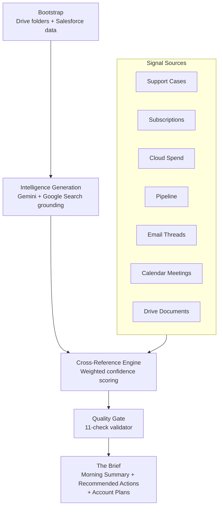

# Brief Encounters — Innovation Days 2026 Global AI Challenge

**Challenge 1: Customer Insight Activation from Telemetry & Data Signals**

> Walk into every customer conversation prepared — with AI-powered briefs built from 7 signal sources, cross-referenced in real time.

---

## What Is This?

An AI-powered intelligence platform that produces customer intelligence briefs for Red Hat Account Solution Architects. It aggregates signals from Salesforce, support cases, Gmail, Calendar, Drive, cloud marketplace, and product lifecycle — then cross-references them with weighted confidence scoring to surface what matters and what to do about it. This is real and running, not a prototype. The demo environment includes full CrowdStrike account data with 19 cases, 17 emails, 6 subscriptions, and 153 graph edges.

---

## How the Brief Gets Built



**Bootstrap:** Creates Drive folder structure, imports Salesforce bookings, discovers customers from shared data source.

**Intelligence Generation:** Gemini with Google Search grounding produces company intelligence docs and industry analysis.

**Signal Sources:** Seven modules produce structured signals with metadata (severity, products, confidence, customer context).

**Cross-Reference Engine:** Detects specificity (customer/industry/general), applies score boosters (revenue, renewal urgency, product match), enforces budget caps.

**Quality Gate:** 11-check validator ensures signal completeness, freshness, and cross-source consistency.

**The Brief:** Morning summary, account briefs, strategic motions with TCV estimates, campaign generator, account plans.

---

## The Three Themes

| Theme | Focus | Judging Criteria |
|-------|-------|-----------------|
| **A: "Show Your Work"** | Expose the pipeline — provenance, quality scores, data maturity, signal flow | Innovation, Technical Excellence, UX |
| **B: "Make It Smarter"** | Better recommendations — "why now" reasoning, signal chains, trend indicators | Innovation, Technical Excellence |
| **C: "Make It Shine"** | Polish — sidebar, loading states, Morning Summary visual hierarchy, first-time UX | User Experience, Feasibility |

---

## Quick Start

```bash
podman pull ghcr.io/hornjason/daily-brief-dashboard:ai-challenge
podman run -d -p 7779:7777 --name brief-encounters ghcr.io/hornjason/daily-brief-dashboard:ai-challenge
# Open http://localhost:7779
```

**Note:** CrowdStrike demo data is baked in — no auth needed for initial exploration.

---

## Explore the Demo

**1. View the Baseline Brief**  
Open http://localhost:7779 → click CrowdStrike account card → read the brief (19 cases, 17 emails, 6 subs, 153 graph edges baseline).

**2. Review Sample Signal**  
Open `data-demo/samples/sample-case-injection.json` — a Sev1 OpenShift networking case designed to trigger cross-references with existing subscription renewals, email contacts, and product patterns.

**3. Inject the Signal**  
Open `data-demo/cache/cases.json` → copy the case object from `sample-case-injection.json` → paste at end of `"cases"` array → save.

**4. Trigger Refresh**  
Dashboard → Admin (gear icon) → click Refresh → wait for pipeline completion.

**5. Compare Before/After**  
Return to CrowdStrike page → observe new case highlighted, new graph edges, updated brief narrative referencing the networking issue and business impact.

**6. Explore Further**  
Check intelligence graph visualization for cross-reference edges, view other demo accounts, toggle product view (RHEL/OpenShift/Ansible grouping).

---

## Submit Ideas

**Feature Request Template:**  
https://github.com/hornjason/daily-brief-dashboard/issues/new?template=ai-challenge-feature-request.yml

---

## Team

| Name | Role | TZ |
|------|------|-----|
| Jason Horn (lead) | Account Solution Architect | ET |
| Aneela Kaplan | Manager - Fleet Console Next | IST |
| Eric Ames | Ansible Evangelist | PT |
| Gonzalo Cabrera | Account SA | CT |
| John Johansson | Senior Specialist Adoption Architect | CET |
| Nikki Yeaton | Ecosystem Marketing | ET |
| Peter Codevilla | | MT |
| Siddardh R A | Senior Software Engineer | IST |
| Riya Sharma | Senior Software Engineer | IST |

---

## Key Dates

| Date | Milestone |
|------|-----------|
| Aug 21 (Fri) | Kickoff call |
| Aug 27 (Thu) | Feature ideas due |
| Aug 28 (Fri) | Week 2 sync |
| Sep 4 (Fri) | Video script finalized |
| Sep 11 (Fri) | Final video submitted |
| Sep 15 (Tue) | **VIDEO DEADLINE 12:00 PM EST** |

---

## Judging Criteria

- **Innovation** — How creative and original?
- **Feasibility** — Can it realistically scale?
- **User Experience** — Intuitive and useful?
- **Technical Excellence** — Thoughtful use of AI?

---

## Built With

- **Claude Code** — Platform development + AI agent pipeline
- **Gemini Enterprise** — Intelligence generation + Google Search grounding

---

## Resources

- **Contributor Guide:** Full inject-and-trace walkthrough in `docs/CONTRIBUTOR-GUIDE.md`
- **Baseline Data:** CrowdStrike signal counts in `data-demo/baselines/crowdstrike/BASELINE-INFO.md`
- **Public Repo:** https://github.com/hornjason/daily-brief-dashboard
- **Lead Contact:** jhorn@redhat.com
