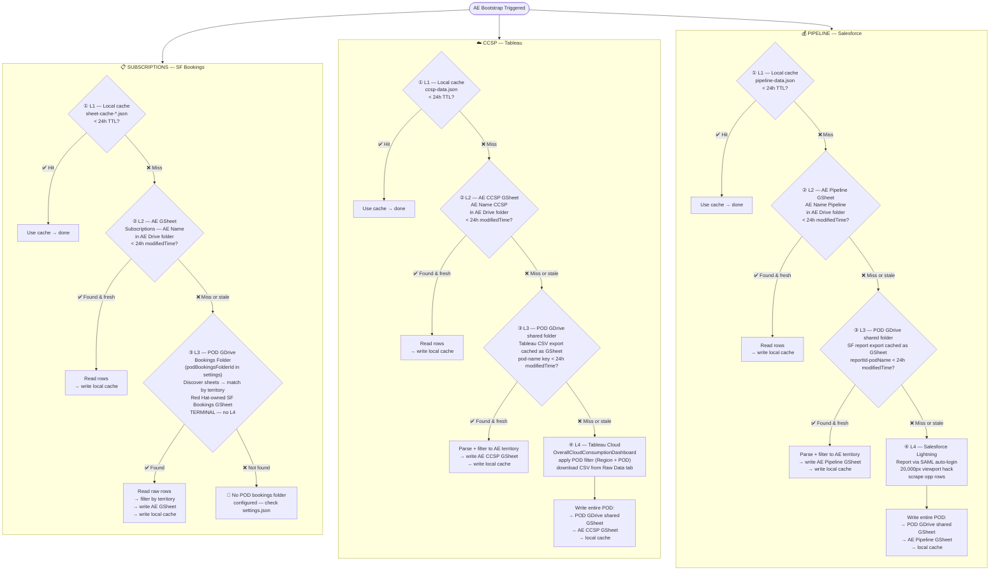

# DailyBriefDashboard — Data Ingestion Flow

Four-tier cache hierarchy — each flow tries L1 first and falls through only when its freshness predicate fails:

```
L1  In-process + disk cache        data/cache/*.json, 24h TTL
L2  Per-AE GSheet in Drive         written and owned by us (subscriptions, CCSP, pipeline tabs)
L3  POD-level GSheet in Drive      owned upstream (SF Bookings sheet, CCSP Tableau export, Pipeline export)
L4  Live external system           Tableau Cloud, Salesforce Lightning — CCSP and Pipeline only
```

**SF Bookings is terminal at L3** — the Red Hat-owned SF Bookings GSheet in the POD GDrive folder is the authoritative source. There is no L4 live scraper for subscriptions.

Every fallback level writes back to local cache before returning.



---

## Daily Sync Schedule + Session Pre-flight

Runs at **6am** (configurable). Sequential — one browser session shared across all flows.
On late laptop/container start: checks `sync-state.json` → if today's sync missed → waits 60s then runs same sequence.

```mermaid
flowchart TD

    TRIGGER(["6am Scheduled Sync\nor Late Startup Detected"])

    TRIGGER --> SFB

    %% ─── SF Bookings — no browser needed ──────────────────
    subgraph SFB["① SF Bookings — No Connection Required"]
        direction TB
        SFB1["Sheets API only\nNo browser session needed"]
        SFB1 --> SFB2["L1 hit? → done\nL2 hit (AE GSheet fresh)? → done\nL3: read POD GDrive bookings folder\n→ write AE GSheet → write local cache"]
        SFB2 --> SFB3{Success?}
        SFB3 -->|✅| SFB_OK["Mark SF Bookings ✅\nin sync-state.json"]
        SFB3 -->|❌ Retry 1-3\n5m→10m→15m| SFB4["🚨 All retries failed\nDashboard banner + ntfy push\nServe stale cache"]
    end

    SFB_OK --> RHP

    %% ─── RH Portal session check ───────────────────────────
    subgraph RHP["② RH Portal Connection Pre-flight"]
        direction TB
        RHP1{"Session active?\n(92+ cookies in profile)"}
        RHP1 -->|✅ Active| RHP_OK["Session live → proceed"]
        RHP1 -->|❌ Expired| RHP2["Silent auto-reconnect\n(existing cookies — no VNC needed)"]
        RHP2 --> RHP3{Reconnect\nsucceeded?}
        RHP3 -->|✅| RHP_OK
        RHP3 -->|❌| RHP_FAIL["🚨 RH Portal session failed\nCCSP + Pipeline skipped\n'Reconnect via Setup page'\nDashboard banner + ntfy push"]
    end

    RHP_OK --> CCSP_SYNC
    RHP_FAIL --> DONE

    %% ─── CCSP ─────────────────────────────────────────────
    subgraph CCSP_SYNC["③ CCSP — Requires: RH Portal + Tableau"]
        direction TB
        TAB1{"Tableau connection\nactive?"}
        TAB1 -->|✅| TAB_GO["L1 hit? → done\nL2 hit (AE CCSP GSheet fresh)? → done\nL3 hit (POD GDrive GSheet fresh)? → done\nL4: scrape Tableau CCSP\napply POD filter → download CSV"]
        TAB1 -->|❌| TAB2["Attempt Tableau reconnect\n(Connect Tableau button flow)"]
        TAB2 --> TAB3{Reconnect?}
        TAB3 -->|✅| TAB_GO
        TAB3 -->|❌| TAB_FAIL["🚨 Tableau connection failed\nCCSP skipped\nDashboard banner + ntfy push"]
        TAB_GO --> TAB4["→ write POD GDrive shared GSheet\n→ write AE CCSP GSheet\n→ write local cache"]
        TAB4 --> MID1{"Mid-sync session\ndrop detected?"}
        MID1 -->|No| CCSP_OK["Mark CCSP ✅\nin sync-state.json"]
        MID1 -->|Yes| MID2["Silent reconnect attempt"]
        MID2 -->|✅ Success| TAB_GO
        MID2 -->|❌ Fail| MID3["Save progress so far\nMark CCSP PARTIAL\n🚨 notify\nServe pre-sync cache"]
    end

    CCSP_OK --> SFP
    TAB_FAIL --> SFP
    MID3 --> SFP

    %% ─── Salesforce session check ──────────────────────────
    subgraph SFP["④ Salesforce Connection Pre-flight"]
        direction TB
        SF1{"Salesforce session\nactive? (SAML)"}
        SF1 -->|✅| SF_OK["Session live → proceed"]
        SF1 -->|❌| SF2["SAML auto-login attempt\n(Connect Salesforce button flow)"]
        SF2 --> SF3{Login\nsucceeded?}
        SF3 -->|✅| SF_OK
        SF3 -->|❌| SF_FAIL["🚨 Salesforce session failed\nPipeline skipped\n'Reconnect via Setup page'\nDashboard banner + ntfy push"]
    end

    SF_OK --> PIPE_SYNC
    SF_FAIL --> DONE

    %% ─── Pipeline ─────────────────────────────────────────
    subgraph PIPE_SYNC["⑤ Pipeline — Requires: Salesforce"]
        direction TB
        PP1["L1 hit? → done\nL2 hit (AE Pipeline GSheet fresh)? → done\nL3 hit (POD GDrive GSheet fresh)? → done\nL4: scrape Salesforce report (SAML)\n20,000px viewport → scrape opp rows"]
        PP1 --> PP2["→ write POD GDrive shared GSheet\n→ write AE Pipeline GSheet\n→ write local cache"]
        PP2 --> PP3{Success?}
        PP3 -->|✅| PIPE_OK["Mark Pipeline ✅\nin sync-state.json"]
        PP3 -->|❌ Retry 1-3\n5m→10m→15m| PP4["🚨 All retries failed\nDashboard banner + ntfy push\nServe stale cache"]
        PP2 --> MID4{"Mid-sync session\ndrop detected?"}
        MID4 -->|No| PP3
        MID4 -->|Yes| MID5["SAML auto-login attempt"]
        MID5 -->|✅| PP1
        MID5 -->|❌| MID6["Save progress\nMark Pipeline PARTIAL\n🚨 notify\nServe pre-sync cache"]
    end

    PIPE_OK --> DONE
    MID6 --> DONE

    DONE(["Sync complete\nsync-state.json updated\nDashboard refreshed via SSE"])
```



## Stale-Not-Blank Rule

Cache TTL expiry **never deletes data** — it marks data as stale. The dashboard always renders what's in cache. Stale data shows a staleness badge ("Last synced 18h ago"). A background sync runs to refresh. Cache is only overwritten with equal-or-more data, never blanked.

## Admin Page — Escape Hatch

The Admin page "Run Now" buttons bypass the entire cache hierarchy and go straight to source (L3 for SF Bookings, L4 for CCSP and Pipeline). They reset the retry counter and mark that flow as synced for today in `sync-state.json`. Use when the scheduled sync failed or data is known stale.

## SSE Cache-Level Telemetry

**Endpoint:** `GET /api/ingest/events` — long-lived SSE stream.

Emits one event per cache tier hit during bootstrap and refresh runs:

```
event: connected
data: {"type":"connected","timestamp":"..."}

event: cache-level
data: {"type":"cache-level","ae":"Carolanne Farrell","flow":"sfBookings","level":2,"rowCount":42,"timestamp":"..."}
```

**Fields:** `ae` (AE name, or `null` for pod-level refresh events), `flow` (`sfBookings` | `ccsp` | `sfPipeline`), `level` (1–4), `rowCount` (present when data is returned), `timestamp`.

**Monitor during a test run:**
```bash
curl -N http://localhost:7776/api/ingest/events
```

**Implementation:** `src/ingest-events.ts` — exports `onCacheLevel` / `offCacheLevel` / `emitCacheLevel` / `IngestCacheEvent`. Calls to `emitCacheLevel()` are fire-and-forget in the waterfall path.

**Important scope:** Telemetry fires on the L1→L4 waterfall path (second+ bootstrap run, daily refresh). The **onboarding path** (first-time folder creation, new AE) reads L3 directly and writes L2 — it does NOT emit cache-level events. This is expected behavior.

---

## Verified Cache Paths (2026-04-19)

| Level | Condition | Confirmed |
|-------|-----------|-----------|
| **L1** | Local cache present and < 24h TTL | ✅ Confirmed (~5s warm run) |
| **L2** | L1 absent/stale; AE GSheet present and < 24h modifiedTime | ✅ Confirmed (~15s warm run) |
| **L3** | Both L1 and L2 absent/stale; POD GDrive GSheet present | ✅ Confirmed (27.2s cold onboarding) |
| **L4** | All higher levels missing; reads live external system | ⚠️ Prod-only — `DISALLOW_LIVE_SCRAPE` blocks L4 in test container |

**Baseline timings** (Carolanne Farrell, 11 customers):
- Cold onboarding (new Drive folder): **27.2s**
- L2 warm (L1 wiped, sheets fresh): **~15s**
- L1 warm: **~5s**

---

## Invariants

| Rule | Detail |
|---|---|
| **Local cache TTL** | 24h across all 3 flows — CCSP and Pipeline update at most 1×/day |
| **Always hit L1 first** | Cache check is gate 1 every time, no exceptions |
| **Write-back on every fallback** | Every level that reads from a fallback writes back to local cache before returning |
| **Fallback order** | L1 (disk) → L2 (AE GSheet) → L3 (POD GDrive GSheet) → L4 (live system) |
| **L3 writes all levels above** | L3 read writes L2 then L1 before returning |
| **L4 writes all levels** | L4 scrape writes L3 (POD GSheet) first, then L2 (AE GSheet), then L1 (local cache) |
| **GDrive TTL** | All GDrive reads (L2 AE GSheet, L3 POD GSheet) check modifiedTime < 24h before using — stale = miss, fall through |
| **SF Bookings = terminal at L3** | The Red Hat-owned SF Bookings GSheet in `podBookingsFolderId` is always authoritative. No freshness check — always read if L1/L2 miss. No L4. |
| **SF Bookings = no live scraper** | L3 is a Google Sheet, not an external system. No Playwright, no Tableau, no Salesforce API. |
| **Onboarding ≠ waterfall** | First-time AE folder creation reads L3 directly and writes L2; does not traverse L1→L4 waterfall; no cache-level events emitted |
| **SSE telemetry = waterfall only** | `emitCacheLevel()` fires during second+ bootstrap runs and daily refresh; not during onboarding |
| **L3 POD GSheet = unparsed** | Contains full POD rows, not filtered per AE |
| **L2 AE GSheet = parsed** | Filtered to this AE's territory only |
