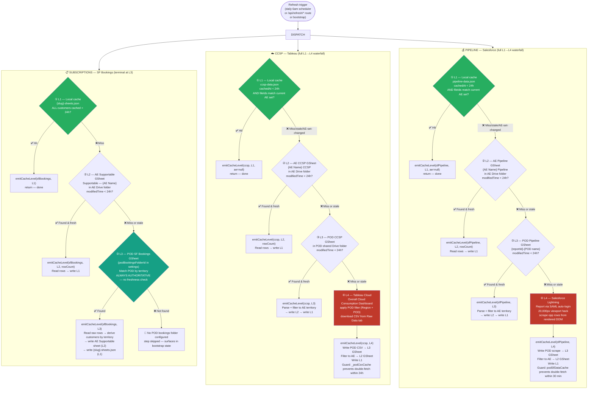

# DailyBriefDashboard — Data Ingestion Flow

This document covers how external data (RH Portal cases, Tableau cloud spend, Salesforce pipeline, SF Bookings subscriptions) flows from source systems through the four-tier cache hierarchy into the dashboard, and how every tier transition surfaces on the `/api/ingest/events` SSE stream.

It is the data-side companion to `docs/ai-ingestion-flow.md` (which covers the AI brief pipeline). The two systems share the L1–L4 hierarchy concept but operate independently — different caches, different invalidation rules, different SSE streams.

---

## How Data Ingestion Works (Plain English)

The dashboard never reads from external systems on every request. Instead, every data source flows through a **fall-through cache hierarchy** with four tiers:

| Tier | Where the data lives | TTL | Owner |
|------|---------------------|-----|-------|
| **L1** | In-process + on-disk cache (`data/cache/*.json`) | 24h | This app |
| **L2** | Per-AE Google Sheet inside the AE's Drive folder | 24h modifiedTime | This app (we write it) |
| **L3** | POD-level Google Sheet inside the POD's shared Drive folder | 24h modifiedTime (CCSP / Pipeline) / always-authoritative (SF Bookings) | Upstream (Red Hat ops / Tableau export / SF report export) |
| **L4** | Live external system (Tableau Cloud, Salesforce Lightning) | live | Tableau / Salesforce |

When a customer detail page loads, the request reads from L1 (disk cache) first. If L1 is missing or older than 24 hours, it tries L2. If L2 is missing or stale, it tries L3. If L3 is missing or stale, it falls through to L4 (live scrape). **Every tier that successfully reads data writes it back to all higher tiers before returning.** That means an L4 scrape produces an L3 sheet, an L2 sheet, and an L1 cache file in one pass — the next request hits L1.

There are three independent flows:

1. **SF Bookings (subscriptions)** — terminal at L3. The Red Hat-owned SF Bookings GSheet in the POD's shared Drive folder is authoritative; there is no live scraper for subscriptions.
2. **CCSP cloud spend** — full L1→L4 waterfall. L4 is a Tableau Cloud scrape that downloads a CSV from the Overall Cloud Consumption Dashboard.
3. **SF Pipeline** — full L1→L4 waterfall. L4 is a Salesforce Lightning report scrape (SAML auto-login + 20,000 px viewport hack).

Plus one special source that does **not** flow through the L1–L4 waterfall:

- **RH Portal cases** — scraped on a separate schedule by `rh-scraper.ts` and cached at `data/cache/cases.json`. The brief pipeline reads this file directly.

---

## What Each Cache Tier Contains

### L1 — On-disk cache (24h TTL)

Per-flow JSON files written by the refresh engine. The L1 disk cache is the **fastest** path and **only** path checked on every request. If L1 is fresh (< 24h `cachedAt`), the request returns immediately — zero Drive API calls, zero scraper calls.

| File | Flow | Owner module | Reader API |
|------|------|--------------|-----------|
| `data/cache/ccsp-data.json` | CCSP | `cache-layer.ts:writeCCSPCache` | `readCCSPCache()` |
| `data/cache/pipeline-data.json` | Pipeline | `cache-layer.ts:writePipelineCache` | `readPipelineCache()` |
| `data/cache/{slug}-sheets.json` | SF Bookings (per-customer) | `cache-layer.ts:writeSheetCache` | `readSheetCache(name)` |
| `data/cache/cases.json` | RH Portal cases | `rh-scraper.ts` | direct file read |

L1 also stores hash-derived metadata so two consecutive writes of identical data don't bump `cachedAt` (preserves brief-fingerprint stability — see ai-ingestion-flow.md):

- `ccsp-data.json` carries a `hash` (SHA256 of records) and `fileIds` (the L2 sheet IDs that fed it).
- `pipeline-data.json` carries the same `hash` + `fileIds` pair.
- `{slug}-sheets.json` carries a SHA256 of rows; identical rows skip the write entirely.

### L2 — Per-AE Google Sheets (24h modifiedTime)

This app **writes** these sheets — they are not upstream data sources. The pattern is: scrape or pull POD-level data, filter to this AE's territory, write the filtered rows to a per-AE Google Sheet. The next bootstrap or refresh reads this sheet directly without re-doing the territory filter or re-hitting the POD source.

| Sheet name | Flow | Drive folder |
|------------|------|--------------|
| `Supportable — {AE Name}` | SF Bookings | AE's Drive folder |
| `{AE Name} CCSP` | CCSP | AE's Drive folder |
| `{AE Name} Pipeline` | Pipeline | AE's Drive folder |

Each AE config (`aes.json`) carries the `supportableSheetId` / `ccspSheetId` / `pipelineSheetId` so the L2 read is a direct Sheets API call — no Drive search.

L2 freshness rule: `modifiedTime` < 24 hours. Older = stale, fall through to L3.

### L3 — POD-level Google Sheets (24h modifiedTime, except SF Bookings)

The POD's shared Drive folder contains POD-level GSheets shared by all AEs in that POD. Each is unparsed: it contains the full POD's rows, not filtered per-AE.

| File pattern | Flow | Source upstream |
|--------------|------|-----------------|
| `SF Bookings — {POD}` (configured by `podBookingsFolderId`) | SF Bookings | Red Hat ops writes this |
| `{POD-name}-CCSP-{period}` | CCSP | Tableau export (this app uploads the L4 CSV) |
| `{reportId}-{POD-name}` | Pipeline | SF report export (this app uploads the L4 scrape) |

**SF Bookings is special**: the POD GSheet is always authoritative (the canonical Red Hat-owned source). There is no L4 live scraper for subscriptions. If L1 and L2 miss, L3 is read unconditionally — no `modifiedTime` freshness check.

For CCSP and Pipeline, L3 freshness rule: `modifiedTime` < 24 hours. Older = stale, fall through to L4.

### L4 — Live external systems

| System | Flow | Implementation | When invoked |
|--------|------|----------------|--------------|
| **Tableau Cloud** (Overall Cloud Consumption Dashboard) | CCSP | `ccsp-scraper.ts:runCcspScrape` — Playwright + shared browser context, applies POD filter, downloads CSV from "Raw Data" tab | L1 missing/stale, L2 missing/stale, L3 missing/stale |
| **Salesforce Lightning** (configured report) | Pipeline | `sf-scraper.ts:scrapeSfReport` — SAML auto-login, 20,000px viewport hack, scrape opp rows from rendered report | L1 missing/stale, L2 missing/stale, L3 missing/stale |
| **(no L4)** | SF Bookings | terminal at L3 | n/a |

L4 is the most expensive path: opens a browser, runs a real session, parses the rendered output. Once L4 returns rows, the refresh path writes back to L3 (POD GSheet), L2 (AE GSheet), and L1 (disk cache) before returning — so the next request hits L1.

---

## The Waterfall — Visual



---

## Daily Sync — When the Waterfall Actually Runs

```mermaid
flowchart TD

    TRIGGER(["6am scheduled sync\nOR late laptop/container start\nOR Admin 'Run Now'\nOR /api/refresh/* call"])

    TRIGGER --> SFB

    %% ─── SF Bookings — no browser needed ──────────────────
    subgraph SFB["① SF Bookings — Sheets API only, no browser"]
        direction TB
        SFB1["L1 cache check (all customers)\n→ L2 (AE Supportable sheet)\n→ L3 (POD SF Bookings folder)\nWrite back at every miss"]
        SFB1 --> SFB2{Success?}
        SFB2 -->|✅| SFB_OK["Mark sfBookings ✅\nin sync-state.json"]
        SFB2 -->|❌ Retry 1-3\n5m → 10m → 15m| SFB3["🚨 All retries failed\nDashboard banner + ntfy push\nServe stale L1 cache"]
    end

    SFB_OK --> RHP
    SFB3 --> RHP

    %% ─── RH Portal session check ───────────────────────────
    subgraph RHP["② RH Portal session pre-flight"]
        direction TB
        RHP1{"Session active?\n(92+ cookies in profile)"}
        RHP1 -->|✅| RHP_OK["Session live → proceed"]
        RHP1 -->|❌ Expired| RHP2["Silent auto-reconnect\n(existing cookies — no VNC needed)"]
        RHP2 --> RHP3{Reconnect?}
        RHP3 -->|✅| RHP_OK
        RHP3 -->|❌| RHP_FAIL["🚨 RH Portal session failed\nCCSP + Pipeline skipped\nDashboard banner + ntfy push"]
    end

    RHP_OK --> CCSP_SYNC
    RHP_FAIL --> DONE

    %% ─── CCSP ─────────────────────────────────────────────
    subgraph CCSP_SYNC["③ CCSP — needs RH Portal + Tableau"]
        direction TB
        TAB1{"Tableau session active?"}
        TAB1 -->|✅| TAB_GO["Run CCSP waterfall\nL1 → L2 → L3 → L4 if needed\nemitCacheLevel at each tier"]
        TAB1 -->|❌| TAB2["Reconnect via Connect Tableau button"]
        TAB2 --> TAB3{Reconnect?}
        TAB3 -->|✅| TAB_GO
        TAB3 -->|❌| TAB_FAIL["🚨 Tableau failed\nCCSP skipped"]
        TAB_GO --> TAB4["Write back: L4 → L3 → L2 → L1"]
        TAB4 --> MID1{"Mid-sync session drop?"}
        MID1 -->|No| CCSP_OK["Mark ccsp ✅"]
        MID1 -->|Yes| MID2["Silent reconnect attempt"]
        MID2 -->|✅| TAB_GO
        MID2 -->|❌| MID3["Save partial progress\n🚨 ntfy"]
    end

    CCSP_OK --> SFP
    TAB_FAIL --> SFP
    MID3 --> SFP

    %% ─── Salesforce session check ──────────────────────────
    subgraph SFP["④ Salesforce session pre-flight"]
        direction TB
        SF1{"SF SAML session active?"}
        SF1 -->|✅| SF_OK["Session live → proceed"]
        SF1 -->|❌| SF2["SAML auto-login attempt"]
        SF2 --> SF3{Login?}
        SF3 -->|✅| SF_OK
        SF3 -->|❌| SF_FAIL["🚨 SF login failed\nPipeline skipped"]
    end

    SF_OK --> PIPE_SYNC
    SF_FAIL --> DONE

    %% ─── Pipeline ─────────────────────────────────────────
    subgraph PIPE_SYNC["⑤ Pipeline — needs Salesforce"]
        direction TB
        PP1["Run pipeline waterfall\nL1 → L2 → L3 → L4 if needed\nemitCacheLevel at each tier"]
        PP1 --> PP2["Write back: L4 → L3 → L2 → L1"]
        PP2 --> PP3{Success?}
        PP3 -->|✅| PIPE_OK["Mark sfPipeline ✅"]
        PP3 -->|❌ Retry 1-3| PP4["🚨 All retries failed"]
    end

    PIPE_OK --> DONE
    PP4 --> DONE
    DONE(["Sync complete — sync-state.json updated"])
```



---

## Stale-Not-Blank Rule

Cache TTL expiry **never deletes data**. The dashboard always renders what's in L1 cache. Stale data shows a staleness badge ("Last synced 18h ago"). A background sync runs to refresh.

L1 writes are guarded against the silent-empty-overwrite footgun:

| Cache | Guard | Why |
|-------|-------|-----|
| `ccsp-data.json` | If new records is `[]` AND existing has rows AND AE set unchanged AND not forced → keep existing | Tableau quota failures return `[]` silently |
| `pipeline-data.json` | If new records is `[]` AND existing has rows → keep existing | Same — SF scrape failures can return `[]` |
| `{slug}-sheets.json` | Hash-equal write skipped → preserves `cachedAt` | Brief fingerprint relies on `cachedAt` stability |
| (any AE batch sub) | If batch returns 0 rows for a customer with existing data → keep existing | Quota-induced empty rows |

**Forced overwrite paths** (when `force=true`):
- `/api/refresh/ccsp?force=true` bypasses freshness checks but still respects the AE-set-changed guard.
- `/api/refresh/pipeline?force=true` bypasses freshness checks; empty-result guard still applies.
- AE-set-change (a customer added/removed) bypasses the empty guard for CCSP because 0 records is valid for a brand-new AE set.

---

## SSE Cache-Level Telemetry

**Endpoint:** `GET /api/ingest/events` — long-lived Server-Sent Events stream.

**Implementation:** `server.ts:1321-1346` registers the route. `src/ingest-events.ts` exports the emitter (`onCacheLevel` / `offCacheLevel` / `emitCacheLevel`) and the `IngestCacheEvent` type. Calls to `emitCacheLevel()` are advisory and fire-and-forget — a broken listener never crashes the ingest path (the emitter swallows all errors).

### Event schema

```typescript
type IngestCacheEvent = {
  type: 'cache-level'
  ae: string | null                                 // AE name, or null for pod-level events
  flow: 'sfBookings' | 'ccsp' | 'sfPipeline'
  level: 1 | 2 | 3 | 4                              // numeric tier
  rowCount?: number                                 // present when data was returned
  timestamp: string                                 // ISO 8601
}
```

### What fires when

| Flow | Level | Fired by | When | `ae` field | `rowCount` |
|------|-------|----------|------|-----------|-----------|
| sfBookings | 1 | `refresh-engine.ts:142` | All customers' L1 caches < 24h | null | absent |
| sfBookings | 2 | `bootstrap-orchestrator.ts:1836` | AE Supportable sheet < 24h, has rows | AE name | row count |
| sfBookings | 3 | `bootstrap-orchestrator.ts:1845, 1850` | L2 stale or empty — falling through to L3 | AE name | absent |
| ccsp | 1 | `refresh-engine.ts:186` / `bootstrap-orchestrator.ts:889, 1957` | L1 disk cache < 24h, AE-set matches | null or AE name | absent |
| ccsp | 2 | `bootstrap-orchestrator.ts:895, 1977` | AE CCSP sheet < 24h | AE name | row count |
| ccsp | 3 | `bootstrap-orchestrator.ts:1989` | L2 missing/stale — pulling from POD GSheet | AE name | absent |
| ccsp | 4 | (Tableau scrape path) | Live Tableau download | n/a | n/a |
| sfPipeline | 1 | `refresh-engine.ts:234` / `bootstrap-orchestrator.ts:864, 2050` | L1 disk cache < 24h, AE-set matches | null or AE name | absent |
| sfPipeline | 2 | `bootstrap-orchestrator.ts:870, 2059` | AE Pipeline sheet < 24h | AE name | row count |
| sfPipeline | 3 | `bootstrap-orchestrator.ts:2079` | L2 missing — falling through to L3 | AE name | absent |
| sfPipeline | 4 | `bootstrap-orchestrator.ts:2111` | Live SF Lightning scrape | AE name | absent |

**`ae` semantics:**
- `null` ⇒ pod-level event (the daily refresh decided not to bother any AE because L1 was fresh for everyone).
- string ⇒ per-AE event during bootstrap, the most common case.

**Important scope:** Telemetry fires on the **L1→L4 waterfall path** (second-and-later bootstrap runs, daily refresh). The **first-time onboarding path** reads L3 directly, derives customers, writes L2 — and does NOT emit cache-level events for the SF Bookings flow at L1/L2. This is intentional: cold onboarding is a separate code path and would otherwise emit a misleading "L1 hit" for an empty cache.

### Live observation

```bash
curl -N http://localhost:7777/api/ingest/events
# event: connected
# data: {"timestamp":"2026-04-25T19:30:00.000Z"}
#
# event: cache-level
# data: {"type":"cache-level","ae":"Carolanne Farrell","flow":"sfBookings","level":2,"rowCount":42,"timestamp":"..."}
#
# event: cache-level
# data: {"type":"cache-level","ae":null,"flow":"ccsp","level":1,"timestamp":"..."}
```

### Programmatic observation (Playwright)

```typescript
const events = await page.evaluate(async (base) => {
  const out: unknown[] = []
  return new Promise<unknown[]>((resolve) => {
    const es = new EventSource(`${base}/api/ingest/events`)
    setTimeout(() => { es.close(); resolve(out) }, 8000)
    es.addEventListener('cache-level', (e) => out.push(JSON.parse((e as MessageEvent).data)))
  })
}, BASE)
```

See `test/integration/sse-cache-waterfall.spec.ts` (SSE-WATERFALL-01) for the canonical test pattern.

---

## Thundering-Herd Mitigations

When a bootstrap run processes multiple AEs in a single POD, each AE would otherwise re-fetch the same POD-level data. Two in-process caches eliminate that:

### `podSfDataCache` (SF Pipeline, 30-min TTL)

Defined at `src/bootstrap-orchestrator.ts:244-245`. Keyed by SF report ID.

```typescript
let podSfDataCache: { reportId: string; data: SfReportRow; expiresAt: number } | null
const POD_SF_CACHE_TTL_MS = 30 * 60 * 1000  // 30 min — safe within a single bootstrap run
```

When AE-1's pipeline scrape returns rows for the entire POD, `podSfDataCache` is populated. AE-2's bootstrap step finds the cache fresh, filters the cached rows to AE-2's territory, and skips re-scraping. The 30-min TTL is a safety net — bootstrap runs that span longer than 30 minutes (rare) will trigger one re-fetch.

### `_podCsvCache` (CCSP, 24h TTL)

Defined at `src/ccsp-scraper.ts:137-138`. Keyed by `{pod, period}`.

```typescript
let _podCsvCache: { rows: …; period: string; expiresAt: number; pod: string; driveFileId?: string } | null
const POD_CSV_CACHE_TTL_MS = 24 * 60 * 60 * 1000  // 24h — matches all other flow TTLs
```

The Tableau CSV download is the most expensive operation in the system (~30s for a large POD). After the first AE in the POD downloads it, every subsequent AE in the same POD reads from `_podCsvCache` and filters in-process. The cache also tracks the Drive file ID written at L3 — if upstream regenerates the file, `_podCsvCache` is invalidated automatically.

Without these mitigations, a 4-AE POD bootstrap would scrape Tableau 4 times and SF Lightning 4 times. With them, each happens once per POD per day.

---

## Per-Endpoint Reference

| Endpoint | What it returns | L1 source | Triggers waterfall? |
|----------|-----------------|-----------|---------------------|
| `GET /api/aes` | All AEs from `aes.json` | none — direct config read | No |
| `GET /api/customers` | All customers from `customers.json` | none — direct config read | No |
| `GET /api/accounts` | Customers with attention scores merged in | `{slug}-sheets.json`, `cases.json`, `ccsp-data.json` | No (read-only) |
| `GET /api/ccsp` | All CCSP records | `ccsp-data.json` | No |
| `GET /api/pipeline` | All pipeline records | `pipeline-data.json` | No |
| `GET /api/cases` | All RH Portal cases | `cases.json` | No |
| `GET /customer/:name/brief` | Per-customer brief | `{slug}-{date}.json` | No (AI pipeline, not data waterfall) |
| `GET /customer/:name/ccsp` | Filtered CCSP for one customer | `ccsp-data.json` | No |
| `POST /api/refresh` | Refresh all flows | n/a | **Yes** — runs full waterfall |
| `POST /api/refresh/ccsp` | Refresh CCSP only | n/a | **Yes** |
| `POST /api/refresh/pipeline` | Refresh pipeline only | n/a | **Yes** |
| `POST /api/refresh/subscriptions` | Refresh SF Bookings only | n/a | **Yes** |
| `GET /api/status/scrapes` | Last sync / error / running state per source | reads scraper-status-store.ts | No |
| `GET /api/ingest/events` | Live SSE cache-level events | listens on event emitter | No (just streams) |

---

## Verified Cache Paths (2026-04-25)

| Level | Condition | Confirmed |
|-------|-----------|-----------|
| **L1** | Local cache present and < 24h TTL | ✅ Confirmed (~5s warm run) |
| **L2** | L1 absent/stale; AE GSheet present and < 24h modifiedTime | ✅ Confirmed (~15s warm run) |
| **L3** | Both L1 and L2 absent/stale; POD GDrive GSheet present | ✅ Confirmed (27.2s cold onboarding) |
| **L4** | All higher levels missing; reads live external system | ⚠️ Prod-only — `DISALLOW_LIVE_SCRAPE` blocks L4 in test container |

**Baseline timings** (Carolanne Farrell, 11 customers, 1 POD):
- Cold onboarding (no Drive folder yet): **27.2s**
- L2 warm (L1 wiped, AE sheets fresh): **~15s**
- L1 warm: **~5s**

---

## Invariants

| Rule | Detail |
|---|---|
| **L1 TTL is always 24h** | Across all 3 waterfall flows |
| **Always check L1 first** | Cache check is gate 1 every time, no exceptions |
| **Write back on every fallback** | Every level that reads from a fallback writes back to ALL higher tiers before returning |
| **Fallback order** | L1 (disk) → L2 (AE GSheet) → L3 (POD GSheet) → L4 (live scrape) |
| **L3 read writes L2 and L1** | Filtered rows land in AE GSheet; raw cache lands in `data/cache/` |
| **L4 scrape writes L3, L2, L1** | POD GSheet first (so other AEs can hit L3), then per-AE L2, then L1 |
| **GDrive `modifiedTime` is the freshness signal** | Every L2/L3 read checks `modifiedTime` < 24h before using (except SF Bookings L3) |
| **SF Bookings is terminal at L3** | The Red Hat-owned SF Bookings GSheet in `podBookingsFolderId` is always authoritative — no `modifiedTime` check, no L4 |
| **SF Bookings has no live scraper** | L3 is a Google Sheet, not an external system — no Playwright, no Tableau, no Salesforce |
| **Onboarding ≠ waterfall** | First-time AE folder creation reads L3 directly and writes L2; no cache-level events |
| **SSE telemetry = waterfall only** | `emitCacheLevel()` fires during second-and-later bootstrap runs and daily refresh; not during onboarding |
| **L3 POD GSheet is unparsed** | Contains the full POD's rows, not filtered per-AE |
| **L2 AE GSheet is parsed** | Filtered to this AE's territory only |
| **AE-set change forces refresh** | If `cached.fileIds` doesn't match the current AE set's sheet IDs, L1 is treated as stale (CCSP and Pipeline) |
| **Empty results never overwrite populated cache** | Quota failures returning `[]` are detected; existing cache preserved (except when AE set genuinely changed) |
| **Hash-equal writes are no-ops** | If new data hashes identically to existing data, the write is skipped to preserve `cachedAt` stability for brief fingerprint |
| **Pod-level caches survive AE iteration** | `podSfDataCache` (30 min) and `_podCsvCache` (24h) prevent N-AE-per-POD thundering herds |

---

## Admin Page — Escape Hatch

The Admin page **Run Now** buttons bypass the entire L1→L4 cache hierarchy and go straight to source:

- SF Bookings → reads L3 directly
- CCSP → scrapes Tableau (L4) directly
- Pipeline → scrapes SF Lightning (L4) directly

They reset the retry counter and mark that flow as synced for today in `sync-state.json`. Use when the scheduled sync failed or data is known stale.

---

## Related Docs

- `docs/ai-ingestion-flow.md` — AI brief pipeline (separate cache hierarchy: brief / email / meeting / doc / industry / account intel)
- `docs/SCRAPER-RULES.md` — rules for modifying any scraper file (read first if touching `*-scraper.ts`)
- `docs/DATA-RULES.md` — rules for cache, sheets, and territory sync
- `docs/adr/ADR-013.md` — Tier-2/Tier-3 cache hierarchy ADR
- `docs/PROJECT-MAP.md` — module index for finding the actual code
