# E2E Bootstrap Test — New User Journey Flow

Full end-to-end spec for `test/bootstrap-e2e.spec.ts`. Runs on the Mac Mini against the hero image (port 7776, `e2e-tier` Playwright project). All assertions are hard — no informational-only checks.

---

## Drive Folder Map

Two completely separate Drive locations are involved. They serve opposite roles — the test **writes** to the first and **reads data from** the second. Never confuse them.

### Location 1 — Test output folder (writes go here)

Set via `TEST_DRIVE_PARENT_URL` env var. This is the isolated test sandbox — equivalent to what a real user configures as their AE parent folder during setup. Everything bootstrap creates lands here.

```
TEST_DRIVE_PARENT_URL (asa-e2e-test-runs)         ← parentFolderId
│                                                  ALL bootstrap writes go here
│                                                  SOURCE: TEST_DRIVE_PARENT_URL env var → extract folder ID
│
├── Config/                                        ← scaffold: backup sheets (sibling to AE folder)
├── Products/                                      ← scaffold: product slug folders (sibling to AE folder)
│   ├── openshift/
│   ├── rhel/
│   └── … (one per product slug from products.json)
│
└── Carolanne Farrell/                             ← AE folder (directly under parent — no region/POD subfolder)
    ├── SF Bookings                                ← subscriptionSheetId — SF subscription rows from L3
    ├── CCSP                                       ← ccspSheetId — CCSP rows from L3
    ├── Pipeline                                   ← pipelineSheetId — pipeline rows from L3
    ├── Customer A/                                ← customer folder
    │   └── Account Intelligence/                 ← created when intelligence generation runs
    │       ├── {Customer} — Company Intelligence (Google Doc)
    │       └── {Customer} — Industry Analysis (Google Doc)
    └── … (~8 customers total from L3 territory)
```

### Location 2 — L3 shared folder (reads come from here)

Pre-configured on the Mac Mini. The test never sets or modifies this — it is established during the hero install and reflects the region the user selected during setup (see below). Bootstrap reads the POD booking GSheet from this folder, filters rows by `tableauTerritories`, and derives customers + subscription data from it.

```
settings.json → region.podBookingsFolderId        ← L3 shared folder
│                                                  ALL bootstrap reads come from here
│                                                  SOURCE: baked into hero install image; set during setup.sh
│
└── {POD booking GSheet}                           ← SF bookings sheet matched by tableauTerritories
    └── rows filtered by territory → customers + subscription data
```

### How `settings.json` gets its region

`settings.json` is baked into the hero install image (`Dockerfile.hero`) with all available regions — each entry includes the territory sheets and corresponding SF URLs for that region. During install, `setup.sh` copies `settings.json` to disk before the container starts. At first run, the user is prompted to select one of the available regions. This selection is **step 0** of setup: it is not shown in the normal bootstrap wizard flow and is only accessible via the admin panel to change after initial selection.

The test relies on the Mac Mini already having a region selected and `region.podBookingsFolderId` pointing at a valid L3 shared folder. This is a pre-flight precondition, not something the test sets.

**Data source rule:** The test never triggers L4 scrapes. It reads whatever L3 already has — always at least one day of data because the Mac Mini sync daemon runs nightly.

---

## New User Journey Flowchart

```mermaid
flowchart TD
    A["beforeAll
    POST /api/regions/access — seed region + POD
    POST /api/setup/reset?confirm=true — wipe AE + customer state
    HARD: GET /api/aes → aes.length === 0"] --> B

    B["Drive auth
    GET /api/auth/google/status
    HARD: hasSession=true OR connected=true OR driveReady=true
    (L3 shared folder read requires this)"] --> C

    C["Validate parent folder
    POST /api/aes/validate-folder { folderUrl: TEST_DRIVE_PARENT_URL }
    HARD: ok=true OR valid=true OR folderId non-null
    parentFolderId used for all scaffold + AE folder writes"] --> D

    D["AE setup
    POST /api/aes { name, pod, territory, parentFolderId, sfReportId, tableauTerritories }
    HARD: GET /api/aes finds AE by name with sfReportId persisted"] --> E

    E["Bootstrap — 5 steps
    POST /api/bootstrap/auto { aeName, parentFolderId, sfReportId, tableauTerritories }
    poll GET /api/bootstrap/auto/status up to 10 min (5s interval)
    HARD: no step has status = error
    HARD: GET /api/aes → AE.driveFolderId non-null (Step 1 created AE folder under parentFolderId)
    HARD: AE.subscriptionSheetId non-null (Step 4 created SF Bookings sheet)
    HARD: AE.ccspSheetId non-null (Step 5 created CCSP sheet)
    HARD: AE.pipelineSheetId non-null (Step 5 created Pipeline sheet)"] --> E2

    E2["Domain inference — all customers have a domain
    Runs automatically inside bootstrap after Step 5 completes (60s timeout)
    GET /api/bootstrap/auto/status → resources.domainInference (array of results)
    GET /customers filtered to this AE
    HARD: every customer has domain non-null and non-empty string
    HARD: no customer has needsManualDomain = true
    WARN (soft): resources.inferenceWarning absent — all domains resolved without fallback
    capture: list of {customerName, domain} for later Drive + intelligence cross-checks"] --> F

    F["Drive scaffold
    GET /api/bootstrap/scaffold-status
    HARD: configFolderId non-null (Config/ folder under parentFolderId)
    HARD: productsFolderId non-null (Products/ folder under parentFolderId)
    HARD: Object.keys(productSubfolders).length > 0 (slug folders under Products/)"] --> G

    G["SF bookings sync
    POST /api/scrape/sf-bookings-sync { aeNames: [AE_NAME] }
    poll GET /customers up to 90s (5s interval)
    Reads from L3 shared folder (podBookingsFolderId in settings.json)
    HARD: customers filtered to this AE > 0
    → capture firstCustomer = customers[0].name for all downstream steps
    → FIRE AND FORGET: POST /api/customer/:firstCustomer/generate-intelligence?force=true
      (no await — kicks off in background while remaining steps run)"] --> H

    H["Subscription data integrity
    GET /customer/:name/sheetdata — reads from AE.subscriptionSheetId
    HARD: rows.length > 1 (header + at least one customer row)"] --> I

    I["CCSP data — API shape + count
    GET /api/ccsp?ae=AE_NAME — reads from AE.ccspSheetId (L3 data)
    HARD: byAE entry exists for this AE
    HARD: byAE[0].acv > 0 (real dollar amounts, not zero)
    HARD: byAE[0].topAccounts.length > 0 (accounts with spend)
    capture: totalAcv and topAccounts for UI cross-check"] --> J

    J["Pipeline data — API shape + count
    GET /api/pipeline?ae=AE_NAME — reads from pipelineSheetId (L3 data)
    HARD: openCount > 0
    HARD: totalAcv > 0
    HARD: topOpps.length > 0 (each has oppName + acv)
    capture: totalAcv and topOpps for UI cross-check"] --> K

    K["Dashboard landing page
    page.goto /dashboard
    HARD: no error state visible
    HARD: AE name (Carolanne Farrell) visible on page"] --> L

    L["Pipeline tile — UI matches API
    (still on /dashboard)
    HARD: pipeline tile visible (locator: text matching AE name near pipeline section)
    HARD: totalAcv value visible on tile matches /api/pipeline totalAcv (within rounding)
    HARD: at least one topOpp name from API is visible in the tile
    HARD: at least one ACV dollar value from topOpps is visible"] --> M

    M["CCSP tile — UI matches API
    (still on /dashboard)
    HARD: CCSP tile visible with AE name
    HARD: total ACV amount visible matches /api/ccsp byAE[0].acv (within rounding)
    HARD: at least one account name from byAE[0].topAccounts visible in tile"] --> N

    N["Account portfolio — subscriptions visible
    (still on /dashboard — AccountPortfolioGrid)
    HARD: account cards visible (count > 0)
    HARD: at least one account card shows product/subscription data
    (not blank, not loading spinner)"] --> O

    O["Account detail page
    page.goto /dashboard/customer/:firstCustomer
    HARD: customer name visible in header
    HARD: subscription section visible with at least one product row"] --> P

    P["Poll account intelligence — started at step G
    Intelligence generation was kicked off in background after customers confirmed
    poll GET /api/customer/:firstCustomer/intelligence-status up to 5 min (15s interval)
    (most of that time was consumed by steps H–O while intelligence ran in background)
    HARD: status = complete
    HARD: companyDocUrl non-null
    HARD: industryDocUrl non-null"] --> Q

    Q["Verify Account Intelligence in Drive
    GET /api/customer/:firstCustomer/intelligence-status for doc URLs
    Then verify via /api/__test/drive-list or Drive API:
    HARD: Account Intelligence/ subfolder exists inside customer Drive folder
    HARD: >= 2 Google Docs inside the subfolder"] --> R

    R["Generate account plan
    POST /api/customers/:id/account-plan/generate
    poll or await response
    HARD: driveUrl non-null
    HARD: markdown.length > 100 (real content, not empty stub)"] --> S

    S["afterAll cleanup
    Try DELETE /api/__test/drive-cleanup?folderId=AE.driveFolderId
    POST /api/setup/reset — wipe local aes.json + customers.json
    HARD (soft): GET /api/aes returns empty array after reset"]
```



---

## Gap Analysis — Current Spec vs Required

| Test | Current assertion | Required assertion | Status |
|---|---|---|---|
| `beforeAll` | seeds region, resets, checks empty aes | ✅ correct | ✅ |
| `drive auth` | `hasSession` OR `connected` | ✅ correct | ✅ |
| `wizard — drive folder validate` | `ok` OR `folderId` | ✅ correct | ✅ |
| `wizard — ae setup` | `sfReportId` persisted | ✅ correct | ✅ |
| `bootstrap completes` | no step `status=error` | + all 3 sheet IDs + `driveFolderId` non-null on AE | ❌ |
| *(missing)* | — | domain inference: every customer has `domain` non-null + no `needsManualDomain` | ❌ |
| `drive scaffold created` | `configFolderId` non-null | + `productsFolderId` + `productSubfolders` has entries | ❌ |
| `sf bookings sync` | customers appear (soft) | hard: `customers.length > 0` | ❌ |
| *(missing)* | — | subscription `rows.length > 1` — real data not header-only | ❌ |
| `ccsp data visible` | informational log only | hard: `byAE[0].acv > 0` + `topAccounts.length > 0` | ❌ |
| `pipeline data visible` | informational log only | hard: `openCount > 0` + `totalAcv > 0` + `topOpps.length > 0` | ❌ |
| *(missing)* | — | dashboard landing: AE name visible, no error | ❌ |
| *(missing)* | — | pipeline tile: totalAcv + opp name visible, matches API | ❌ |
| *(missing)* | — | CCSP tile: AE listed, ACV amount + account name matches API | ❌ |
| *(missing)* | — | account portfolio: account cards with subscription data visible | ❌ |
| `customer detail page` | customer name visible | + subscription section with product rows | ❌ |
| `intelligence — assert results` | `companyDocUrl` non-null | + Drive: `Account Intelligence/` subfolder + >= 2 docs | ❌ |
| *(missing)* | — | account plan: `driveUrl` non-null + `markdown.length > 100` | ❌ |
| `afterAll` | resets state + drive cleanup | ✅ correct | ✅ |

---

## Run Command (Mac Mini)

```bash
TEST_DRIVE_PARENT_URL=https://drive.google.com/drive/folders/1BxxIwOUTWjPB_VAIdsrEdfuRyXC6su0_ \
TEST_AE_NAME='Carolanne Farrell' \
TEST_SF_REPORT_ID='00OPe00000isU2zMAE' \
npx playwright test test/bootstrap-e2e.spec.ts --project=e2e-tier --workers=1
```

**`TEST_DRIVE_PARENT_URL` must always point at `asa-e2e-test-runs` (`1BxxIwOUTWjPB_VAIdsrEdfuRyXC6su0_`).**
**Never use `CommandCenter` (`1BV0uRHei3oRvGYVEXBX_qBB-VGu0r9wq`) — that is the production folder.**
