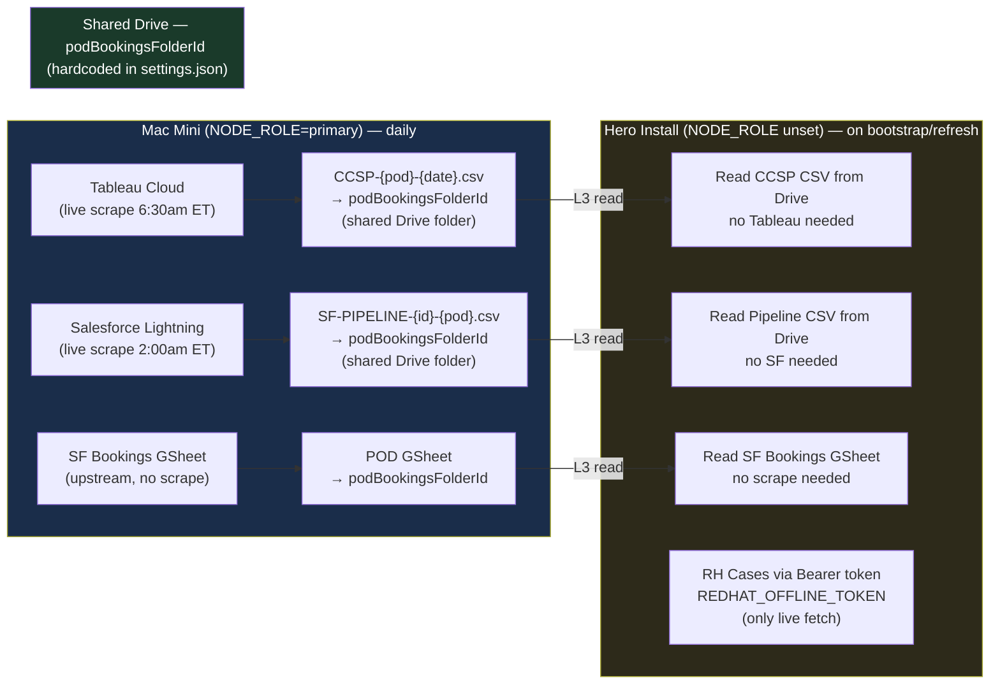

# Hero Install — Design & Setup Guide

<!-- doc-type: design-spec | status: council-approved | owner: jason | updated: 2026-04-30 | council: Serena reviewed 2026-04-29 (hero wizard) + 2026-04-30 (sync daemon architecture, NODE_ROLE gate, SSO TTL) -->

## What is a hero install?

A **hero install** is an L3-only instance of DailyBriefDashboard for an AE or SA who wants their own local copy. `NODE_ROLE` is unset (not `primary`), meaning:

- No live Tableau scrape — reads today's CCSP CSV from the shared Drive L3 folder
- No live Salesforce scrape — reads today's Pipeline CSV from the shared Drive L3 folder
- No RH Portal browser scrape — RH Cases fetched via Bearer token (pure HTTP)
- SF Bookings always L3 (no live scraper exists for any install type)

All L3 data lives in a **single shared `podBookingsFolderId`** per region — hardcoded in `settings.json`, the same folder for all installs. Hero installs read from it; the primary Mac Mini writes to it.

---

## Node Role Architecture

| `.env` setting | Role | What it runs |
|---|---|---|
| `NODE_ROLE` unset | Hero install (L3-only) | Full app server — reads from shared Drive L3 folder, no scrapers, no browser |
| `NODE_ROLE=primary` | Mac Mini sync daemon | **No server, no GUI, no AEs** — runs `scripts/sync-l3-daemon.ts` (long-running, internal scheduler) |

**Never set `NODE_ROLE=primary` as a default.** Only the designated Mac Mini carries it.

The primary Mac Mini's only job is writing L3 files to `podBookingsFolderId` daily. It does not run the dashboard server, does not need AEs configured, and does not run the setup wizard. It is a long-running headless daemon that holds a warm browser context for RH SSO and fires the daily sync internally at 5:30am ET.

**Role-as-entrypoint:** the container CMD declares the role. Hero install → `bun server.ts`. Primary → `bun scripts/sync-l3-daemon.ts`. `NODE_ROLE=primary` is retained as a defense-in-depth guard inside per-scraper functions, not as the primary control flow.

---

## L3 Sync Daemon — `scripts/sync-l3-daemon.ts` *(BKL-SYNC-L3-01)*

Long-running daemon. No server. No AE data. Reads `settings.json` as the sole source of truth. Holds a warm Playwright browser context to keep RH SSO cookies alive between daily runs (SSO idle TTL is 4–10h — an ephemeral cron approach expires before the next run).

### `data-sync/config/settings.json` — daemon's only config

Regions and pods only. No AEs, no customers:

```json
{
  "regions": [
    {
      "id": "west-commercial",
      "pods": {
        "POD01": { "sfReportId": "00O..." },
        "POD02": { "sfReportId": "00O..." }
      },
      "podBookingsFolderId": "14I0UH1CiSNNOqVHdZVS7tHOPibJMN5Oo"
    }
  ]
}
```

Add a new region entry here when a new pod comes online. No code changes required.

### Pod readiness check (per pod, before scraping)

`podBookingsFolderId` is a constant — same folder for all regions, always set. The check is whether a **pod is ops-ready**:

| Check | Source | Skip if missing |
|---|---|---|
| `sfReportId` set | `settings.json pods[key].sfReportId` | Pod not wired in Salesforce yet |
| Bookings GSheet exists in folder | Drive file list in `podBookingsFolderId` | Subscription data source not ready |

Both must be present. If either is missing → log `"pod {podKey} not configured — skipping"` and include in email summary.

### Daemon internals — two timers

```
startup
  load settings.json → normalizeRegions()
  init browser → Tableau + SF SSO session (persistent Chromium profile in data-sync/)
  init Google Drive auth

Timer 1 — SSO keepalive (every 2h):
  visit Tableau dashboard URL   → prevents RH SSO cookie expiry
  visit SF Lightning report URL → keeps SF session alive
  if either visit redirects to login → log error + send alert email

Timer 2 — Daily sync (5:30am ET via setTimeout reschedule loop):
  for each region → for each pod:
    if !pod.sfReportId || no Bookings GSheet → skip, note in results
    scrapePodCcspRaw(['{podKey}_TERR01'], folderId)
      → writes CCSP-{podKey}-{date}.csv (auto-skips if today's file exists)
    runSfPodSync(pod.sfReportId, podKey, folderId)
      → writes SF-PIPELINE-{id}-{podKey}-{date}.csv
  write sync-status.json to Drive (last-run, files written, skipped pods + reason)
  send summary email to jhorn@redhat.com (one email per run, success or failure)
```

### Email summary format

**Subject:** `L3 Sync Complete — 2026-04-30 | 3 pods synced, 1 skipped`

**Body:**
```
West Commercial — POD01   CCSP: 847 rows    SF Pipeline: 312 rows
West Commercial — POD02   CCSP: 1,203 rows  SF Pipeline: 489 rows
TOLA — POD01              CCSP: 2,104 rows  SF Pipeline: 701 rows
East Commercial — POD02   ⚠️ SKIPPED — SF report ID not configured

Completed: 2026-04-30 06:02:14 ET
```

On failure, subject changes to `L3 Sync FAILED — 2026-04-30 | pod X: <reason>`.

### Makefile targets (Mac Mini)

```makefile
make sync-up      # start daemon (long-running, --restart=unless-stopped)
make sync-down    # stop + remove container
make sync-logs    # tail daemon logs
make sync-status  # show container state + last sync-status.json
make sync-up-vnc  # one-time auth mode: adds VNC port 6082 for initial SSO setup
```

No host crontab. The daemon IS the cron — internal `setTimeout` reschedule loop.

### New code required

| Item | Size | File |
|---|---|---|
| `scripts/sync-l3-daemon.ts` | ~120 lines | Daemon entrypoint — two timers, SSO keepalive, email |
| `scripts/sync-pod-l3.ts` | ~80 lines | Per-run sync loop — called by daemon at 5:30am ET |
| `runSfPodSync(reportId, podKey, folderId)` | ~20 lines | New thin wrapper in `src/sf-scraper.ts` |
| `make sync-up/down/logs/status/sync-up-vnc` | ~30 lines | New Makefile targets |

### What the primary does NOT need

No HTTP server · No setup wizard · No AE bootstrap · No refresh engine · No RH Cases scraper · No territory sync · No dashboard UI · No host crontab

---

## Setup Wizard — Hero Install Flow

### Step 0 — Region & Pod Access *(NEW — shown once on first boot only)*

```
╔══════════════════════════════════════════════════════════╗
║  Step 0 — Select Your Region & Pods                      ║
║  Choose what you want access to. Saved once — editable   ║
║  later from Admin › Region Access.                       ║
╠══════════════════════════════════════════════════════════╣
║                                                          ║
║  ☑  West Commercial                          ▼ collapse  ║
║  │   ☑  Northwest Corp                                   ║
║  │   ☑  Southwest Corp                                   ║
║  │   ☐  North Central Corp                               ║
║  │   ☐  South Central Corp                               ║
║                                                          ║
║  ☐  Central Enterprise – TOLA        ▶ expand            ║
║     Single territory — no pod sub-selection              ║
║                                                          ║
║  ☐  East Enterprise                  ▶ expand            ║
║     🕐 Coming soon — data reports pending                ║
║                                                          ║
║  ☐  East Commercial                  ▶ expand            ║
║     🕐 Coming soon — data reports pending                ║
║                                                          ║
╠══════════════════════════════════════════════════════════╣
║  2 pods selected across 1 region         [ Save & Next ] ║
╚══════════════════════════════════════════════════════════╝
```

**Selectable regions** — must have all of the following in `settings.json`:
- `territorySheetUrl` non-empty
- `podBookingsFolderId` non-empty
- At least one pod with a non-empty `sfReportId`

**Coming Soon** — visible, not selectable. East regions appear here until ops configures `sfReportId` and `podBookingsFolderId`.

**TOLA** — single territory; auto-selects its one pod when the region is checked. No sub-selection UI.

**Persistence** — writes `enabledRegions: string[]` and `enabledPods: string[]` to `settings.json`. Never shown again after first boot. Editable from **Admin › Region Access**.

After save the card collapses to a summary line:
> West Commercial: Northwest Corp, Southwest Corp  [Edit]

---

### Step 1 — Google OAuth Keys *(existing — unchanged)*

Upload GCP OAuth credentials JSON or paste `client_id` / `client_secret`. Exactly as today.

---

### Step 2 — Google Auth *(existing — unchanged)*

Connect Google account via OAuth browser flow. Token saved to `data/config/`. Powers territory sheet reads and AE Drive folder reads.

---

### Step 3 — RH API Token *(new UI step)*

```
  Paste your Red Hat offline token to enable support case sync.
  Get yours at: sso.redhat.com → Security › Offline tokens

  Offline token:  [________________________________]

  [ Validate & Save ]          ✓ Token valid — saved to .env
```

- User pastes `REDHAT_OFFLINE_TOKEN` into the field
- App validates (exchanges for a short-lived Bearer JWT via `redhat.ts::getToken()`)
- On success: writes `REDHAT_OFFLINE_TOKEN=...` to `.env` and restarts token cache
- Powers RH Cases — the only live data fetch on a hero install

---

### Step 4 — AEs & Customers *(existing — unchanged, filtered by Step 0)*

Exactly what exists today (Single AE tab + Full POD tab). The only differences for a hero install:

- **Region and POD dropdowns pre-filtered** to Step 0 selections — user only sees the pods they chose
- **SF Report ID and POD selector hidden** for regions with no `sfReportId` (already built — `hasPodSfReports` gate in `BootstrapConfigBlock.tsx`)
- **No Tableau VNC step, no "7–15 min" warning** — not applicable; CCSP reads from L3 Drive CSV
- **"Open Dashboard" button** appears at the bottom of this step (moved here since Refresh Timer section is hidden on L3)

**Auto-bootstrap sequence (same 6 steps, L3 behavior):**

| # | Step | L3 behavior |
|---|---|---|
| 1 | Create Drive Folder | Creates AE subfolder under parent Drive folder |
| 2 | Create Customer Folders | Creates per-customer folders |
| 3 | Read SF Bookings Sheet | Reads POD GSheet from shared `podBookingsFolderId` — always L3 |
| 4 | Write Subscriptions Sheet | Writes AE-filtered data to L2 sheet |
| 5 | Create CCSP Sheet | Reads today's `CCSP-${pod}-${date}.csv` from shared `podBookingsFolderId` — no Tableau |
| 6 | Sync Pipeline Sheet | Reads today's `SF-PIPELINE-${id}-${pod}.csv` from shared `podBookingsFolderId` — no SF |

All L3 files are in the same shared `podBookingsFolderId` configured in `settings.json` — hardcoded, same folder for all installs. No folder URL entry required beyond the AE's own parent Drive folder.

---

### Steps NOT shown for L3 *(hidden when `NODE_ROLE` is unset — `isL3Only = true`)*

| Section | Why hidden |
|---|---|
| Data Sources (Tableau, CCSP, Supportable connections) | L4 scrapers only — never run on L3 |
| Refresh Timer & Settings | L4 scrape schedules — not applicable |
| Automation & Limits | L4 batch controls — not applicable |

**Zero code removed.** Purely conditional visibility based on `isL3Only` flag (`NODE_ROLE !== 'primary'`, exposed by server). L4/primary installs see the full wizard unchanged.

---

## Data Sources on a Hero Install

| Source | Mechanism | Requirement |
|---|---|---|
| SF Bookings (subscriptions) | L3 POD GSheet in shared Drive folder | `podBookingsFolderId` in `settings.json` |
| CCSP (cloud spend) | L3 Drive CSV — `CCSP-${pod}-${date}.csv` | Primary ran today |
| SF Pipeline | L3 Drive CSV — `SF-PIPELINE-${id}-${pod}.csv` | Primary ran today |
| RH Cases | Bearer token SOLR fetch — no browser | `REDHAT_OFFLINE_TOKEN` in `.env` (Step 3) |
| Tableau (live) | Not applicable | — |
| SF Lightning (live) | Not applicable | — |

All L3 files live in `podBookingsFolderId` — one shared folder per region, hardcoded in `settings.json`, written by the primary Mac Mini daily.

---

## Naming Conventions

These conventions apply across all regions — use them when creating new SF reports, Drive folders, and CCSP territory configs so wiring up a new region is mechanical and repeatable.

> **All L3 files live in one shared `podBookingsFolderId` per region.** All regions currently share the same folder ID (`14I0UH1CiSNNOqVHdZVS7tHOPibJMN5Oo`). Hero installs read from it; the primary Mac Mini writes to it. This is hardcoded in every `settings.json` — prod, test, seed, and demo all use the same value.

---

### File naming reference — all known pods

Three file types must be present in `podBookingsFolderId` for a region to be selectable. The existence check matches on prefix (any date suffix accepted) so a region configured yesterday doesn't flip to "Coming Soon" before today's scrape runs.

#### West Commercial — `west-commercial`

| Pod key | Pod label | Bookings GSheet | CCSP CSV prefix | SF Pipeline CSV prefix |
|---|---|---|---|---|
| `WEST_COMM_CORP_NORTHWEST` | Northwest Corp | `West Commercial - Northwest Corp - SF Bookings` | `CCSP-WEST_COMM_CORP_NORTHWEST-` | `SF-PIPELINE-WEST_COMM_CORP_NORTHWEST-` |
| `WEST_COMM_CORP_SOUTHWEST` | Southwest Corp | `West Commercial - Southwest Corp - SF Bookings` | `CCSP-WEST_COMM_CORP_SOUTHWEST-` | `SF-PIPELINE-WEST_COMM_CORP_SOUTHWEST-` |
| `WEST_COMM_CORP_NORTH_CENTRAL` | North Central Corp | `West Commercial - North Central Corp - SF Bookings` | `CCSP-WEST_COMM_CORP_NORTH_CENTRAL-` | `SF-PIPELINE-WEST_COMM_CORP_NORTH_CENTRAL-` |
| `WEST_COMM_CORP_SOUTH_CENTRAL` | South Central Corp | `West Commercial - South Central Corp - SF Bookings` | `CCSP-WEST_COMM_CORP_SOUTH_CENTRAL-` | `SF-PIPELINE-WEST_COMM_CORP_SOUTH_CENTRAL-` |

#### Central Enterprise – TOLA — `central-enterprise-tola`

| Pod key | Pod label | Bookings GSheet | CCSP CSV prefix | SF Pipeline CSV prefix |
|---|---|---|---|---|
| `CENTRAL_ENT_TOLA` | TOLA | `Central Enterprise - TOLA - SF Bookings` | `CCSP-CENTRAL_ENT_TOLA-` | `SF-PIPELINE-CENTRAL_ENT_TOLA-` |

#### East Enterprise — `east-enterprise` *(Coming Soon — not yet in settings.json)*

Territory codes use underscores throughout — confirmed against actual Tableau territory values.

| Pod key | Pod label | Territory code | CCSP CSV prefix | SF Pipeline CSV prefix |
|---|---|---|---|---|
| `NORTHEAST_ENT_MID_ATLANTIC` | Mid-Atlantic Maulers | `Northeast_Ent_Mid_Atlantic_Terr##` | `CCSP-NORTHEAST_ENT_MID_ATLANTIC_POD-` | `SF-PIPELINE-{id}-NORTHEAST_ENT_MID_ATLANTIC-` |
| `NORTHEAST_ENT_NEW_ENGLAND` | New England Boston Tech Party | `Northeast_Ent_New_England_Terr##` | `CCSP-NORTHEAST_ENT_NEW_ENGLAND_POD-` | `SF-PIPELINE-{id}-NORTHEAST_ENT_NEW_ENGLAND-` |
| `NORTHEAST_ENT_STRATEGIC_NORTH` | Strategic N Yardgoats | `Northeast_Ent_Strategic_North_Terr##` | `CCSP-NORTHEAST_ENT_STRATEGIC_NORTH_POD-` | `SF-PIPELINE-{id}-NORTHEAST_ENT_STRATEGIC_NORTH-` |
| `NORTHEAST_ENT_STRATEGIC_SOUTH` | Strategic S Money Badgers | `Northeast_Ent_Strategic_South_Terr##` | `CCSP-NORTHEAST_ENT_STRATEGIC_SOUTH_POD-` | `SF-PIPELINE-{id}-NORTHEAST_ENT_STRATEGIC_SOUTH-` |
| `SOUTHEAST_ENT_GA` | SE GA HeavyHitters | `Southeast_Ent_GA_Terr##` | `CCSP-SOUTHEAST_ENT_GA_POD-` | `SF-PIPELINE-{id}-SOUTHEAST_ENT_GA-` |
| `SOUTHEAST_ENT_GREAT_LAKES` | SE Great Lakes Guardians | `Southeast_Ent_Great_Lakes_Terr##` | `CCSP-SOUTHEAST_ENT_GREAT_LAKES_POD-` | `SF-PIPELINE-{id}-SOUTHEAST_ENT_GREAT_LAKES-` |
| `SOUTHEAST_ENT_NC_SC` | SE NC/SC Carolina Reapers | `Southeast_Ent_NC_SC_Terr##` | `CCSP-SOUTHEAST_ENT_NC_SC_POD-` | `SF-PIPELINE-{id}-SOUTHEAST_ENT_NC_SC-` |
| `SOUTHEAST_ENT_VA_AL_TN` | SE VA/AL/TN The Untouchables | `Southeast_Ent_VA_AL_TN_Terr##` | `CCSP-SOUTHEAST_ENT_VA_AL_TN_POD-` | `SF-PIPELINE-{id}-SOUTHEAST_ENT_VA_AL_TN-` |

#### East Commercial — `east-commercial` *(Coming Soon — not yet in settings.json)*

Pod keys confirmed from territory sheet. Pod 4 tab is hidden/inactive — skipped.

| Pod key | Pod label | Territory code | CCSP CSV prefix | SF Pipeline CSV prefix |
|---|---|---|---|---|
| `EAST_COMM_CORP_POD01` | Rough Riders | `East_Comm_Corp_Pod1_Terr##` | `CCSP-EAST_COMM_CORP_POD01-` | `SF-PIPELINE-{id}-EAST_COMM_CORP_POD01-` |
| `EAST_COMM_CORP_POD02` | Big Apple Ballers | `East_Comm_Corp_Pod2_Terr##` | `CCSP-EAST_COMM_CORP_POD02-` | `SF-PIPELINE-{id}-EAST_COMM_CORP_POD02-` |
| `EAST_COMM_CORP_POD03` | Pythons | `East_Comm_Corp_Pod3_Terr##` | `CCSP-EAST_COMM_CORP_POD03-` | `SF-PIPELINE-{id}-EAST_COMM_CORP_POD03-` |
| `EAST_COMM_CORP_POD05` | Mad Hatters | `East_Comm_Corp_Pod5_Terr##` | `CCSP-EAST_COMM_CORP_POD05-` | `SF-PIPELINE-{id}-EAST_COMM_CORP_POD05-` |

---

### Pod filter keys (`enabledPods` in `settings.json`)
```
${regionId}.${podKey}
```
- `west-commercial.WEST_COMM_CORP_NORTHWEST`
- `central-enterprise-tola.CENTRAL_ENT_TOLA`
- `east-enterprise.SOUTHEAST_ENT_NC_SC_POD`

Region IDs are the existing `id` slugs from `settings.json`. Qualified keys prevent collisions when East regions ship with overlapping pod name segments.

### SF Pipeline reports — naming in Salesforce (L4 primary only)

`sfReportId` is used exclusively by the primary Mac Mini to pull live data from Salesforce and write the SF Pipeline CSV to `podBookingsFolderId`. Hero installs never use the report ID — they read the CSV output.

The report name in Salesforce is for human findability only — the code uses the 18-char report ID, not the name. Name them however makes sense to find them in Salesforce. Once created, copy the report ID → paste into `settings.json` under `pods.{POD_KEY}.sfReportId`.

**West Commercial (existing):**
- West Commercial - Northwest Corp
- West Commercial - Southwest Corp
- West Commercial - North Central Corp
- West Commercial - South Central Corp

**Central Enterprise – TOLA (existing):**
- Central Enterprise - TOLA

**East Commercial (create these):**
- East Commercial - Rough Riders → pod key `EAST_COMM_CORP_POD01`
- East Commercial - Big Apple Ballers → pod key `EAST_COMM_CORP_POD02`
- East Commercial - Pythons → pod key `EAST_COMM_CORP_POD03`
- East Commercial - Mad Hatters → pod key `EAST_COMM_CORP_POD05`

**East Enterprise (create when ready):**
- East Enterprise - Mid-Atlantic Maulers → pod key `NORTHEAST_ENT_MID_ATLANTIC`
- East Enterprise - New England Boston Tech Party → pod key `NORTHEAST_ENT_NEW_ENGLAND`
- East Enterprise - Strategic N Yardgoats → pod key `NORTHEAST_ENT_STRATEGIC_NORTH`
- East Enterprise - Strategic S Money Badgers → pod key `NORTHEAST_ENT_STRATEGIC_SOUTH`
- East Enterprise - SE GA HeavyHitters → pod key `SOUTHEAST_ENT_GA`
- East Enterprise - SE Great Lakes Guardians → pod key `SOUTHEAST_ENT_GREAT_LAKES`
- East Enterprise - SE NC/SC Carolina Reapers → pod key `SOUTHEAST_ENT_NC_SC`
- East Enterprise - SE VA/AL/TN The Untouchables → pod key `SOUTHEAST_ENT_VA_AL_TN`

### SF Bookings / Subscription Data Drive folder — naming in Drive

One shared folder per region. Currently all regions share the same folder — if East regions get their own folder, create it as:
```
{Region Label} - Subscription Data
```
- `West Commercial - Subscription Data` ← folder ID `14I0UH1CiSNNOqVHdZVS7tHOPibJMN5Oo`
- `East Enterprise - Subscription Data` ← create when ready, paste ID into `settings.json`

### CCSP territory codes (`tableauTerritories` per AE)
No manual naming needed — derived automatically from territory sheet row codes via `podKeyFromTerritoryCode()`. When Tableau is set up for East, the territory codes come from the sheet and are handled by existing logic.

---

### Checklist: flipping a region from "Coming Soon" → selectable in Step 0

A region is **selectable** when all three file types are present in `podBookingsFolderId` (prefix match — any date suffix). If any is missing, the region shows "Coming Soon" with a note listing what's absent.

| Required file | Existence check | Who creates it | Status |
|---|---|---|---|
| Bookings GSheet | Any GSheet matching `{Region} - {Pod} - SF Bookings` | Ops (upstream, permanent) | West + TOLA ✓ |
| CCSP CSV | Any file matching `CCSP-{POD_KEY}-*.csv` | Primary (daily Tableau scrape) | West + TOLA ✓ |
| SF Pipeline CSV | Any file matching `SF-PIPELINE-{POD_KEY}-*.csv` | Primary (daily SF scrape) | West + TOLA ✓ |

**`sfReportId` in `settings.json` is NOT a selectable gate** — it's an L4 config for the primary scraper only. Hero installs don't need it to function.

To add a new region:
1. Add region + pod definitions to all `settings.json` files (prod `data/config/`, test `data-test/config/`, seed `scripts/seed-data/`, demo `data-demo/config/`)
2. Set `territorySheetUrl` for the region
3. Create the Bookings GSheet in Drive → confirm it matches naming convention
4. Let the primary run once → CCSP + SF Pipeline CSVs appear in the folder
5. Region flips from "Coming Soon" → selectable automatically — no code change

---

## What Needs to Be Built

Two parallel workstreams that together deliver the complete hero install system. See `BACKLOG.md` for full acceptance criteria.

### BKL-SYNC-L3-02 — Gate L4 schedulers at `initBackgroundScheduler()` startup *(ship first)*

Gate all L4 scheduler paths with a single `isPrimary` predicate at `initBackgroundScheduler()` startup. L3 reader paths (heartbeat, RH cases, subs, email delivery) register only on hero. L4 writer paths (territory sync, pipeline, CCSP scheduled sync) register only on primary. Late-startup catch-up block (lines 1198–1255) also gated behind `isPrimary` — currently fires on every hero restart and throws. Per-scraper guards in `ccsp-scraper.ts` and `sf-scraper.ts` stay as defense-in-depth.

### BKL-SYNC-L3-01 — L3 sync daemon *(primary Mac Mini — after SYNC-L3-02)*

| Phase | Item | Description |
|---|---|---|
| 0 | `runSfPodSync()` | ~20-line wrapper in `src/sf-scraper.ts`; takes `(reportId, podKey, folderId)` |
| 1 | `scripts/sync-pod-l3.ts` | ~80-line per-run sync loop; pod readiness check; `scrapePodCcspRaw` + `runSfPodSync` per pod; writes sync-status.json; sends summary email |
| 2 | `scripts/sync-l3-daemon.ts` | ~120-line daemon entrypoint; Timer 1 = SSO keepalive every 2h; Timer 2 = calls sync-pod-l3 logic at 5:30am ET |
| 3 | Makefile targets | `sync-up`, `sync-down`, `sync-logs`, `sync-status`, `sync-up-vnc` |

### BKL-SYNC-L3-04 — One-time SSO setup playbook *(after SYNC-L3-01 on Mac Mini)*

Initial auth sequence for the Mac Mini sync daemon: `make sync-up-vnc` → open VNC at port 6082 → auth Tableau (email autofill handles email field, complete SSO popup) → auth SF Lightning → verify keepalive log → `make sync-down && make sync-up` (removes VNC port). Recovery path when keepalive emails about expiry: repeat steps 1–4.

### BKL-SYNC-L3-03 — Remove schedulers + Refresh Timer *(deferred, after SYNC-L3-01 stable ≥1 week)*

Remove `scheduleCcspSync`, `schedulePipelineSync`, and the Refresh Timer section from the app entirely. Final cleanup once sync daemon is the canonical L3 write path.

### BKL-SYNC-L3-05 — Split container image: server vs sync *(deferred, after SYNC-L3-03)*

`daily-brief-dashboard:server` (no Chromium, ~600MB) for hero installs. `daily-brief-dashboard:sync` (with Chromium, ~1.4GB) for Mac Mini only. Most users never download Chromium.

---

### BKL-HERO-01 — Hero install wizard *(app server — hero installs)*

Phased implementation per Serena's council review (2026-04-29).

### BKL-HERO-01 (in scope)

| Phase | Item | Description |
|---|---|---|
| 0 | `GET /api/node-role` | Returns `{ isL3Only: boolean }`; read-only, no caching |
| 0 | `settings.json` schema | Add optional `enabledRegions?: string[]` and `enabledPods?: string[]`; backward-compat (undefined = no filter) |
| 0 | `GET /api/regions/catalog` | Returns region list with `selectable` flag + pod list per region |
| 0 | `POST /api/regions/access` | Validates + writes `enabledRegions`/`enabledPods` to `settings.json`; rejects Coming Soon IDs server-side |
| 1 | `Step0RegionAccess.tsx` | New first-boot component; save-on-change; collapses to summary after save |
| 2 | `isL3Only` gating | Hides Data Sources, Refresh Timer, Automation; keeps AI Settings visible; Step 3 body swapped |
| 3 | `HeroStep3Connections.tsx` | Paste `REDHAT_OFFLINE_TOKEN`; validate via `getToken()` before saving; stores to `data-sources.json` (NOT `.env`) |
| 3 | Startup token hydration | One line in `server.ts` to load persisted token into `process.env` on startup so it survives container restart |
| 4 | Step 4 POD filter | Filter `podOptions` in parent before passing to `BootstrapConfigBlock`; empty `enabledPods` = no filter (critical) |
| 5 | "Open Dashboard" button | Render after AEs section when `isL3Only && aeCount > 0`; primary button at line 4040 unchanged |

**`BootstrapConfigBlock.tsx` receives zero changes.**

### BKL-HERO-02 (deferred — separate backlog item)

| Item | Description |
|---|---|
| Admin › Region Access | Edit screen to re-trigger Step 0 without full reset; reuses `Step0RegionAccess.tsx` |

### Key architectural decisions (Serena council 2026-04-29)

- **Token storage:** `data-sources.json` via existing `saveOfflineToken()` path — NOT `.env`. Writing long tokens to `.env` has a documented corruption incident. The validate-and-save route calls `getToken()` with the candidate token before persisting — fail loud at paste time, not 4 hours later.
- **Filter empty-list guard:** `Array.isArray(enabledPods) && enabledPods.length > 0` is the only condition that activates filtering. `undefined`, `null`, and `[]` all render the full list. This protects every existing primary install.
- **`isL3Only` defaults `false`** until `/api/node-role` resolves — primary path is the safe default during page load.
- **AI Settings kept visible** on L3 — Gemini brief generation works on hero installs (on-demand HTTP, not a scraper).

Existing code (`hasPodSfReports`, bootstrap 6-step sequence, L3 CSV read path) is **unchanged**.

---

---

## Flow Diagrams

### Wizard Flow — Hero Install (L3)


---

### Data Flow — Hero Install vs Primary



---

## Related Docs

- `docs/DATA-INGESTION-ARCHITECTURE.md` — L1–L4 waterfall, Bearer path, CCSP L3 section
- `docs/DATA-INGESTION-FLOW.md` — full mermaid diagrams for all flows
- `docs/ADDING-NEW-AE.md` — AE onboarding runbook
- `src/ccsp-scraper.ts::checkCcspL3Exists()` — L3 existence check
- `src/case-client.ts::getConfiguredTransport()` — Bearer vs browser routing
- `src/redhat.ts::getToken()` — offline token exchange
