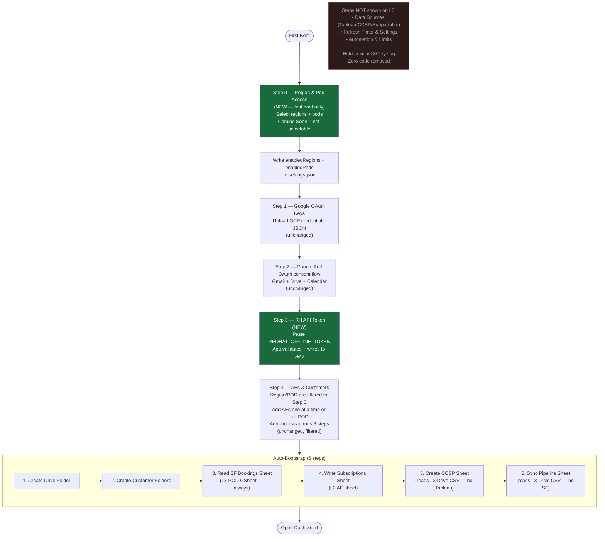
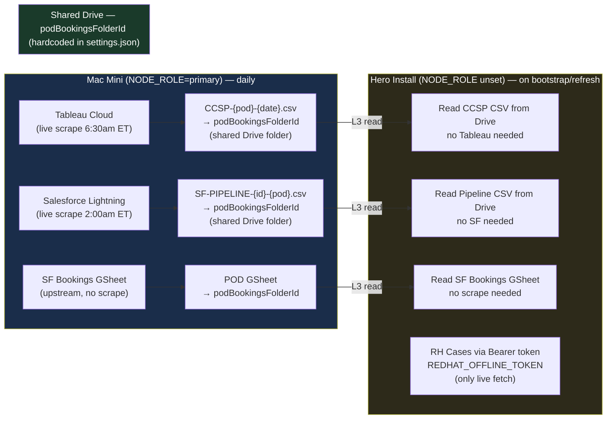

# Hero Install — Design & Setup Guide

<!-- doc-type: design-spec | status: signed-off | owner: jason | updated: 2026-04-29 | council: Serena reviewed 2026-04-29 -->

## What is a hero install?

A **hero install** is an L3-only instance of DailyBriefDashboard for an AE or SA who wants their own local copy. `NODE_ROLE` is unset (not `primary`), meaning:

- No live Tableau scrape — reads today's CCSP CSV from the shared Drive L3 folder
- No live Salesforce scrape — reads today's Pipeline CSV from the shared Drive L3 folder
- No RH Portal browser scrape — RH Cases fetched via Bearer token (pure HTTP)
- SF Bookings always L3 (no live scraper exists for any install type)

All L3 data lives in a **single shared `podBookingsFolderId`** per region — hardcoded in `settings.json`, the same folder for all installs. Hero installs read from it; the primary Mac Mini writes to it.

---

## Node Role Architecture

| `.env` setting | Role | Scrapes |
|---|---|---|
| `NODE_ROLE` unset | Hero install (L3-only) | None — reads from shared Drive L3 folder |
| `NODE_ROLE=primary` | Mac Mini (L4 leader) | Tableau, SF Lightning — writes L3 CSVs to Drive |

**Never set `NODE_ROLE=primary` as a default.** Only the designated Mac Mini carries it.

---

## Setup Wizard — Hero Install Flow

### Step 0 — Region & Pod Access *(NEW — shown once on first boot only)*

```
╔══════════════════════════════════════════════════════════╗
║  Step 0 — Select Your Region & Pods                      ║
║  Choose what you want access to. Saved once — editable   ║
║  later from Admin › Region Access.                       ║
╠══════════════════════════════════════════════════════════╣
║                                                          ║
║  ☑  West Commercial                          ▼ collapse  ║
║  │   ☑  Northwest Corp                                   ║
║  │   ☑  Southwest Corp                                   ║
║  │   ☐  North Central Corp                               ║
║  │   ☐  South Central Corp                               ║
║                                                          ║
║  ☐  Central Enterprise – TOLA        ▶ expand            ║
║     Single territory — no pod sub-selection              ║
║                                                          ║
║  ☐  East Enterprise                  ▶ expand            ║
║     🕐 Coming soon — data reports pending                ║
║                                                          ║
║  ☐  East Commercial                  ▶ expand            ║
║     🕐 Coming soon — data reports pending                ║
║                                                          ║
╠══════════════════════════════════════════════════════════╣
║  2 pods selected across 1 region         [ Save & Next ] ║
╚══════════════════════════════════════════════════════════╝
```

**Selectable regions** — must have all of the following in `settings.json`:
- `territorySheetUrl` non-empty
- `podBookingsFolderId` non-empty
- At least one pod with a non-empty `sfReportId`

**Coming Soon** — visible, not selectable. East regions appear here until ops configures `sfReportId` and `podBookingsFolderId`.

**TOLA** — single territory; auto-selects its one pod when the region is checked. No sub-selection UI.

**Persistence** — writes `enabledRegions: string[]` and `enabledPods: string[]` to `settings.json`. Never shown again after first boot. Editable from **Admin › Region Access**.

After save the card collapses to a summary line:
> West Commercial: Northwest Corp, Southwest Corp  [Edit]

---

### Step 1 — Google OAuth Keys *(existing — unchanged)*

Upload GCP OAuth credentials JSON or paste `client_id` / `client_secret`. Exactly as today.

---

### Step 2 — Google Auth *(existing — unchanged)*

Connect Google account via OAuth browser flow. Token saved to `data/config/`. Powers territory sheet reads and AE Drive folder reads.

---

### Step 3 — RH API Token *(new UI step)*

```
  Paste your Red Hat offline token to enable support case sync.
  Get yours at: sso.redhat.com → Security › Offline tokens

  Offline token:  [________________________________]

  [ Validate & Save ]          ✓ Token valid — saved to .env
```

- User pastes `REDHAT_OFFLINE_TOKEN` into the field
- App validates (exchanges for a short-lived Bearer JWT via `redhat.ts::getToken()`)
- On success: writes `REDHAT_OFFLINE_TOKEN=...` to `.env` and restarts token cache
- Powers RH Cases — the only live data fetch on a hero install

---

### Step 4 — AEs & Customers *(existing — unchanged, filtered by Step 0)*

Exactly what exists today (Single AE tab + Full POD tab). The only differences for a hero install:

- **Region and POD dropdowns pre-filtered** to Step 0 selections — user only sees the pods they chose
- **SF Report ID and POD selector hidden** for regions with no `sfReportId` (already built — `hasPodSfReports` gate in `BootstrapConfigBlock.tsx`)
- **No Tableau VNC step, no "7–15 min" warning** — not applicable; CCSP reads from L3 Drive CSV
- **"Open Dashboard" button** appears at the bottom of this step (moved here since Refresh Timer section is hidden on L3)

**Auto-bootstrap sequence (same 6 steps, L3 behavior):**

| # | Step | L3 behavior |
|---|---|---|
| 1 | Create Drive Folder | Creates AE subfolder under parent Drive folder |
| 2 | Create Customer Folders | Creates per-customer folders |
| 3 | Read SF Bookings Sheet | Reads POD GSheet from shared `podBookingsFolderId` — always L3 |
| 4 | Write Subscriptions Sheet | Writes AE-filtered data to L2 sheet |
| 5 | Create CCSP Sheet | Reads today's `CCSP-${pod}-${date}.csv` from shared `podBookingsFolderId` — no Tableau |
| 6 | Sync Pipeline Sheet | Reads today's `SF-PIPELINE-${id}-${pod}.csv` from shared `podBookingsFolderId` — no SF |

All L3 files are in the same shared `podBookingsFolderId` configured in `settings.json` — hardcoded, same folder for all installs. No folder URL entry required beyond the AE's own parent Drive folder.

---

### Steps NOT shown for L3 *(hidden when `NODE_ROLE` is unset — `isL3Only = true`)*

| Section | Why hidden |
|---|---|
| Data Sources (Tableau, CCSP, Supportable connections) | L4 scrapers only — never run on L3 |
| Refresh Timer & Settings | L4 scrape schedules — not applicable |
| Automation & Limits | L4 batch controls — not applicable |

**Zero code removed.** Purely conditional visibility based on `isL3Only` flag (`NODE_ROLE !== 'primary'`, exposed by server). L4/primary installs see the full wizard unchanged.

---

## Data Sources on a Hero Install

| Source | Mechanism | Requirement |
|---|---|---|
| SF Bookings (subscriptions) | L3 POD GSheet in shared Drive folder | `podBookingsFolderId` in `settings.json` |
| CCSP (cloud spend) | L3 Drive CSV — `CCSP-${pod}-${date}.csv` | Primary ran today |
| SF Pipeline | L3 Drive CSV — `SF-PIPELINE-${id}-${pod}.csv` | Primary ran today |
| RH Cases | Bearer token SOLR fetch — no browser | `REDHAT_OFFLINE_TOKEN` in `.env` (Step 3) |
| Tableau (live) | Not applicable | — |
| SF Lightning (live) | Not applicable | — |

All L3 files live in `podBookingsFolderId` — one shared folder per region, hardcoded in `settings.json`, written by the primary Mac Mini daily.

---

## Naming Conventions

These conventions apply across all regions — use them when creating new SF reports, Drive folders, and CCSP territory configs so wiring up a new region is mechanical and repeatable.

### Pod filter keys (`enabledPods` in `settings.json`)
```
${regionId}.${podKey}
```
- `west-commercial.WEST_COMM_CORP_NORTHWEST`
- `central-enterprise-tola.CENTRAL_ENT_TOLA`
- `east-enterprise.SOUTHEAST_ENT_NC_SC_POD`

Region IDs are the existing `id` slugs from `settings.json`. Qualified keys prevent collisions when East regions ship with overlapping pod name segments.

### SF Pipeline reports — naming in Salesforce when you create them
```
DBD - {Region Label} - {Pod Label}
```
- `DBD - West Commercial - Northwest Corp`
- `DBD - East Enterprise - Carolina Reapers`
- `DBD - East Commercial - Rough Riders`

"DBD" prefix makes them findable in Salesforce. Once created, copy the 18-char report ID → paste into `settings.json` under `pods.{POD_KEY}.sfReportId`.

### SF Bookings / Subscription Data Drive folder — naming in Drive
```
{Region Label} - Subscription Data
```
- `West Commercial - Subscription Data` ← exists
- `East Enterprise - Subscription Data` ← create when ready

Folder ID goes into `settings.json regions[].podBookingsFolderId`. One per region, shared across all AEs and all install types.

### CCSP territory codes (`tableauTerritories` per AE)
No manual naming needed — derived automatically from territory sheet row codes via `podKeyFromTerritoryCode()`. When Tableau is set up for East, the territory codes come from the sheet and are handled by existing logic.

---

### Checklist: flipping a region from "Coming Soon" → selectable in Step 0

| Field | Location | Action |
|---|---|---|
| `territorySheetUrl` | `settings.json regions[].territorySheetUrl` | Already set for all regions |
| `podBookingsFolderId` | `settings.json regions[].podBookingsFolderId` | Create Drive folder `{Region} - Subscription Data` → paste ID |
| At least one `sfReportId` | `settings.json regions[].pods.{KEY}.sfReportId` | Create SF report `DBD - {Region} - {Pod}` → paste ID |

No code change required. The `selectable` flag in `/api/regions/catalog` derives from these three fields automatically.

---

## What Needs to Be Built

Phased implementation per Serena's council review (2026-04-29). See `BACKLOG.md` BKL-HERO-01 and BKL-HERO-02.

### BKL-HERO-01 (in scope)

| Phase | Item | Description |
|---|---|---|
| 0 | `GET /api/node-role` | Returns `{ isL3Only: boolean }`; read-only, no caching |
| 0 | `settings.json` schema | Add optional `enabledRegions?: string[]` and `enabledPods?: string[]`; backward-compat (undefined = no filter) |
| 0 | `GET /api/regions/catalog` | Returns region list with `selectable` flag + pod list per region |
| 0 | `POST /api/regions/access` | Validates + writes `enabledRegions`/`enabledPods` to `settings.json`; rejects Coming Soon IDs server-side |
| 1 | `Step0RegionAccess.tsx` | New first-boot component; save-on-change; collapses to summary after save |
| 2 | `isL3Only` gating | Hides Data Sources, Refresh Timer, Automation; keeps AI Settings visible; Step 3 body swapped |
| 3 | `HeroStep3Connections.tsx` | Paste `REDHAT_OFFLINE_TOKEN`; validate via `getToken()` before saving; stores to `data-sources.json` (NOT `.env`) |
| 3 | Startup token hydration | One line in `server.ts` to load persisted token into `process.env` on startup so it survives container restart |
| 4 | Step 4 POD filter | Filter `podOptions` in parent before passing to `BootstrapConfigBlock`; empty `enabledPods` = no filter (critical) |
| 5 | "Open Dashboard" button | Render after AEs section when `isL3Only && aeCount > 0`; primary button at line 4040 unchanged |

**`BootstrapConfigBlock.tsx` receives zero changes.**

### BKL-HERO-02 (deferred — separate backlog item)

| Item | Description |
|---|---|
| Admin › Region Access | Edit screen to re-trigger Step 0 without full reset; reuses `Step0RegionAccess.tsx` |

### Key architectural decisions (Serena council 2026-04-29)

- **Token storage:** `data-sources.json` via existing `saveOfflineToken()` path — NOT `.env`. Writing long tokens to `.env` has a documented corruption incident. The validate-and-save route calls `getToken()` with the candidate token before persisting — fail loud at paste time, not 4 hours later.
- **Filter empty-list guard:** `Array.isArray(enabledPods) && enabledPods.length > 0` is the only condition that activates filtering. `undefined`, `null`, and `[]` all render the full list. This protects every existing primary install.
- **`isL3Only` defaults `false`** until `/api/node-role` resolves — primary path is the safe default during page load.
- **AI Settings kept visible** on L3 — Gemini brief generation works on hero installs (on-demand HTTP, not a scraper).

Existing code (`hasPodSfReports`, bootstrap 6-step sequence, L3 CSV read path) is **unchanged**.

---

---

## Flow Diagrams

### Wizard Flow — Hero Install (L3)



---

### Data Flow — Hero Install vs Primary



---

## Related Docs

- `docs/DATA-INGESTION-ARCHITECTURE.md` — L1–L4 waterfall, Bearer path, CCSP L3 section
- `docs/DATA-INGESTION-FLOW.md` — full mermaid diagrams for all flows
- `docs/ADDING-NEW-AE.md` — AE onboarding runbook
- `src/ccsp-scraper.ts::checkCcspL3Exists()` — L3 existence check
- `src/case-client.ts::getConfiguredTransport()` — Bearer vs browser routing
- `src/redhat.ts::getToken()` — offline token exchange
