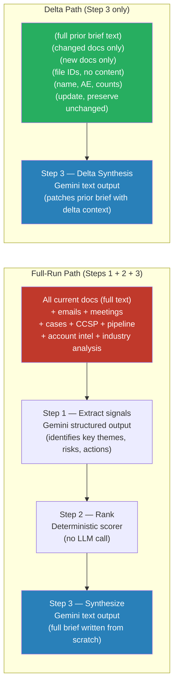

# AI Intelligence Ingestion Flow

This document covers how the DailyBriefDashboard generates, caches, and re-generates AI-powered customer briefs. It mirrors the L1–L4 cache hierarchy used by the data ingestion system, extended with fingerprint-based invalidation, corpus delta mode, and real-time SSE observability.

All features described here are shipped as of 2026-04-19 (BKL-AI-FP-01 through BKL-AI-FP-09 complete).

---

## How Brief Generation Works (Plain English)

When a user opens a customer's detail page and requests a brief, the system:

1. **Assembles inputs in parallel** — fetches the customer's recent emails (Gmail, filtered by customer name/domain), upcoming meetings (Google Calendar, filtered by customer name in attendees/title), CCSP data, pipeline stage, support cases, and Drive documents
2. **Computes a fingerprint** over those inputs — a SHA256 hash of sorted email/meeting tuples, CCSP tier, pipeline stage, open case counts (last 90 days), and user preferences
3. **Checks the L1 brief cache** — if the fingerprint matches the cached brief's stored fingerprint, the cached brief is returned immediately (zero Gemini cost)
4. **If inputs changed**, checks whether corpus delta mode applies (see below). Either path writes the new brief with the updated fingerprint
5. **Full-run path**: passes everything to the three-step Gemini pipeline (extract signals → rank → synthesize)
6. **Delta path**: skips Steps 1+2, sends only changed/new docs plus the previous brief to Step 3 directly

The brief is **lazy/on-demand** — generated when requested. The background scheduler pre-generates briefs on a schedule but uses the same fingerprint gate, so it only calls Gemini when something actually changed.

### What drives brief regeneration

There are **two fingerprints** in play. Both must be unchanged for the cached brief to be served.

**Route-level fingerprint** — computed in `customer-routes.ts:484-494` over all input sources (emails, meetings, docs, cases, subscriptions, products, pipeline records, CCSP records). This is the gate that decides "serve from cache vs call generateBrief()". Persisted at `inputFingerprint` in the brief cache JSON.

**generateBrief-level fingerprint** — computed in `customer.ts:1213-1228` over a `BriefInputBundle`. This currently has **fewer signals** than the route-level fingerprint:

```typescript
// customer.ts:1213-1228 — actual code
const inputBundle: BriefInputBundle = {
  emailTuples: …, meetingTuples: …,
  ccspTier: null,       // not available at this call site — future enhancement
  pipelineStage: null,  // not available at this call site — future enhancement
  openCaseCounts,
  preferencesHash: '',  // user preferences not yet wired — future enhancement
}
```

The route-level fingerprint covers the full input set today; the generateBrief-level bundle is the deeper gate intended for future enhancements (per-customer CCSP tier, pipeline stage, user prefs). Today both gates effectively fire on email / meeting / doc / cases changes.

| Signal | Detected by | Which fingerprint? |
|--------|-------------|--------------------|
| New customer email arrived | Gmail cache expires (2h TTL) → re-fetch with customer query → new email tuples | Both |
| New customer meeting added | Calendar cache expires (2h TTL) → re-fetch filtered by customer name → new meeting tuples | Both |
| Drive doc edited | Doc content cached by fileId+modifiedTime → edit changes modTime → new fileId set in route fingerprint | Route-level (doc IDs hashed); generateBrief-level (delta gate via `docCorpusSnapshot`) |
| Drive doc added or removed | New/missing doc ID in the fileId list | Route-level |
| Subscription added/changed | New SKU / status / endDate in product list | Route-level |
| New pipeline opportunity | New oppId in pipeline records | Route-level |
| CCSP record added/changed | New (account, partner, quarter) tuple | Route-level (record set hashed); generateBrief-level (`ccspTier` reserved, not yet populated) |
| Support case opened/closed | New caseNumber in cases list | Both (route-level: case numbers; generateBrief-level: 90d severity counts) |
| **No change in any signal** | Both fingerprints match | Cached brief returned — no Gemini calls |

**The 2h email/calendar TTL is a polling window, not a staleness signal.** It means: "check Gmail/Calendar for this customer at most every 2 hours." If new emails or meetings arrived since the last poll, the fingerprint changes and the brief regenerates. If nothing new arrived, the fingerprint is identical and the cached brief is returned.

**Emails and meetings are customer-specific.** `fetchCustomerEmails` queries Gmail with a customer name/domain filter. `fetchCustomerMeetings` filters Calendar events where the customer name appears in attendees or event title. The brief does not process all emails or all calendar events — only those relevant to the specific customer.

---

## Drive Document Scanning

### How the customer folder is found

The system locates the customer's Drive folder using three priority levels:

1. **Per-customer `driveFolderId`** (stored directly in customer config) — fastest, no search needed; set this when a customer has a dedicated folder not under the AE hierarchy
2. **AE's `driveFolderId` → fuzzy-match customer subfolder** — the most common path. The system lists subfolders under the AE's Drive folder and fuzzy-matches by customer name and any configured aliases. Also searches one level deeper (e.g., `AE Folder → Accounts → Customer`) to handle nested structures
3. **Global `AE_PARENT_FOLDER_ID` fallback** — legacy path for older account structures

### What gets scanned

Once the customer folder is found, the system does a **BFS (breadth-first scan)** up to `DRIVE_SUBFOLDER_DEPTH=5` levels deep, collecting all files modified in the last 2 years. Folder shortcuts are followed (targets treated as subfolders). Files are deduplicated by Drive fileId.

**Adding a new file to the folder triggers re-generation.** New files have a new fileId — no cache entry exists — so their content is fetched fresh on the next brief request. There is no separate "added vs edited" path. Both result in new content flowing into the brief.

### Supported file formats

| Format | Extraction method | Notes |
|--------|------------------|-------|
| **Google Docs** | `drive.files.export(text/plain)` — Drive native | Full text, all formatting stripped |
| **Google Slides** (Presentations) | `drive.files.export(text/plain)` — Drive native | Slide text content extracted |
| **Google Sheets** | `drive.files.export(text/plain)` — Drive native | Cell values as plain text |
| **PDF** | Step 1: local extraction via `unpdf` (zero token cost). Step 2: if extraction fails/empty → Gemini multimodal fallback (raw PDF bytes sent as `inlineData`) | PDFs over 15MB are skipped |
| **PowerPoint (.pptx) / Office files** | **Not supported** — skipped silently | Upload as Google Slides or export as PDF first |

All extracted text is stored in the **L3 doc content cache** keyed by `fileId+modifiedTime`, so extraction runs once per file version — not on every brief request.

---

## What Each Cache Tier Contains

### L1 — Brief cache
The compiled brief text, written after every successful Gemini generation. Keyed by `{slug}-{YYYY-MM-DD}.json`. Stores the brief text, the `inputFingerprint` (SHA256 hash of all inputs at generation time), and the `docCorpusSnapshot` (fileId → modifiedTime map for corpus delta detection). A 7-day wall-clock TTL acts as a safety net — after 7 days the brief regenerates unconditionally even if inputs appear unchanged.

### L2 — Email cache / Meeting cache
Per-customer cache of recent Gmail messages and Google Calendar events. Each is a flat JSON file keyed by customer slug. Expires after 2 hours, at which point the next brief request re-fetches from the live API using a customer-specific query. This TTL exists because polling Gmail/Calendar on every brief request would hit API quota limits and add significant latency.

### L3 — Doc content cache
Full extracted text of a Google Drive file attached to the customer. Keyed by `{fileId}-{modifiedTime}` — this means the cache **automatically invalidates when the file is edited in Drive**, because the modifiedTime changes. No TTL needed: the key itself is content-addressed. Used for Google Docs (exported as plain text) and PDFs (multimodal extraction).

### L3 — Doc classification cache
Gemini's label for a Drive document's type — e.g., QBR, Account Plan, EBC Notes, Technical Discovery. Same `{fileId}-{modifiedTime}` key as the doc content cache. When a doc is edited, both the content cache and the classification cache for that file are automatically invalidated. The classification determines how the brief pipeline weights and presents the document.

### L4 — Industry analysis cache
A shared industry landscape text generated by Gemini grounded search. Keyed by `{industry}-{region}` — the same industry analysis is reused for all customers in the same industry and region, avoiding redundant Gemini calls. Expires after 30 days. Industry landscape changes slowly; monthly refresh is sufficient.

### L4 — Account intelligence cache
Per-customer intelligence blob containing a company profile (specific to this customer) and industry analysis context. Stored at `data/cache/product-intel/{slug}-customer-intel/{slug}.json`. Protected by a `contentHash` computed from: Drive slides text, customer docs hash, subscriptions, support cases, account intel company profile, and product features hash. When the underlying data changes, the hash mismatches and Gemini regenerates. A 14-day wall-clock TTL acts as a safety net for cases where hash inputs drift without triggering a hash change.

**Account intel vs. industry analysis:** Account intel is per-customer (company profile + context). Industry analysis is shared across all customers in the same industry. Both feed into the brief's XML context bundle.

---

## Brief Generation Flow

This is the complete current flow. All six stages run on every brief request.

```mermaid
flowchart TD
    REQ["GET /api/customer/:name/brief"] --> FETCH

    subgraph FETCH ["① Assemble inputs — parallel"]
        direction LR
        E{"Email cache\n< 2h TTL?"}
        E -->|"✅ hit"| EC["emails.json"]
        E -->|"❌ miss"| GMAIL["Gmail API → write cache"]

        M{"Meeting cache\n< 2h TTL?"}
        M -->|"✅ hit"| MC["meetings.json"]
        M -->|"❌ miss"| GCAL["Calendar API → write cache"]

        CCSP["ccsp-data.json\n(hash-guarded by ingestion)"]
        PIPE["pipeline-data.json\n(hash-guarded by ingestion)"]
        CASES["cases.json\n(updated by RH scraper)"]
    end

    FETCH --> FP

    subgraph FP ["② Compute fingerprint — change-detection gate"]
        BUNDLE["BriefInputBundle\n• sorted email tuples\n• sorted meeting tuples\n• CCSP tier\n• pipeline stage\n• case counts (90d severity)\n• preferences hash"]
        DELTA["detectFingerprintDelta(prev, bundle)"]
        BUNDLE --> DELTA
    end

    DELTA --> L1{"L1 cache hit?\nfingerprint unchanged?"}

    L1 -->|"✅ HIT — return cached"| EVHIT["emitAIEvent(cache:hit)\nReturn cached brief"]
    L1 -->|"❌ MISS — inputs changed"| EVMISS["emitAIEvent(cache:miss / cache:cold)"]

    EVMISS --> DGEMINI{"DISALLOW_GEMINI\n= true? (test env)"}
    DGEMINI -->|yes| BYPASS["emitAIEvent(cache:bypass)\nReturn fixture stub"]
    DGEMINI -->|no| DOCS

    subgraph DOCS ["③ Load document intelligence — parallel"]
        direction LR
        D{"Doc content:\ncached for fileId+modTime?"}
        D -->|"✅ hit"| DOCC["Cached text (Google Doc / PDF)"]
        D -->|"❌ miss"| DRIV["Drive export or PDF extraction\n→ write docs/ cache"]

        DC{"Doc type label:\ncached for fileId+modTime?"}
        DC -->|"✅ hit"| DCC["Cached label (QBR, Account Plan…)"]
        DC -->|"❌ miss"| GEMCLS["Gemini classifies doc type\n→ write doc-classifications/ cache"]
    end

    subgraph ACCTINTEL ["④ Account intelligence"]
        AI{"intelligence/{slug}.json\n< 14d TTL?"}
        AI -->|"✅ fresh"| AIC["Inject: company profile\n+ industry context"]
        AI -->|"❌ stale / missing"| AIST["emitAIEvent(cache:stale)\nInject staleness marker\n→ background regen triggered"]
    end

    subgraph IND ["⑤ Industry analysis"]
        INDC{"industry-analysis/{slug}.json\n< 30d TTL?"}
        INDC -->|"✅ hit"| IAC["Shared industry landscape\n(same for all customers, same industry+region)"]
        INDC -->|"❌ miss"| GEMIND["Gemini grounded call → write cache"]
    end

    DOCS --> ACCTINTEL --> IND

    IND --> CORPUSDIFF["diffDocCorpus(prevSnapshot, currSnapshot)\nshouldUseDeltaMode(diff, hasPrev)?"]

    CORPUSDIFF -->|"✅ DELTA\n≥3 unchanged + ≥1 changed\n+ previous brief exists"| DPATH["Corpus Delta Path\n→ see Corpus Delta Mode section"]
    CORPUSDIFF -->|"❌ FULL-RUN\nall other cases"| FPATH

    subgraph FPATH ["⑥ Full-run — three-step pipeline"]
        S1["Step 1: Extract signals\nGemini structured output\n(reads ALL docs)"]
        S2["Step 2: Rank\ndeterministic scorer, no LLM"]
        S3["Step 3: Synthesize\nGemini text output"]
        S1 --> S2 --> S3
    end

    DPATH --> WRITEFP
    FPATH --> WRITEFP

    WRITEFP["writeBriefCache(text, fingerprint, corpusSnapshot)\nemitAIEvent(generation:complete, durationMs)"]
    WRITEFP --> RESP["Return brief text"]

    subgraph SSE ["GET /api/ai/events — live observer"]
        direction LR
        EV1["cache:cold  cache:hit  cache:miss\ncache:bypass  cache:stale"]
        EV2["generation:start  generation:complete  generation:error"]
    end

    style L1 fill:#27ae60,color:#fff
    style WRITEFP fill:#27ae60,color:#fff
    style EVHIT fill:#2980b9,color:#fff
    style EVMISS fill:#2980b9,color:#fff
    style DGEMINI fill:#8e44ad,color:#fff
    style BYPASS fill:#8e44ad,color:#fff
    style AIST fill:#e67e22,color:#fff
    style DPATH fill:#27ae60,color:#fff
    style CORPUSDIFF fill:#16a085,color:#fff
```



---

## Corpus Delta Mode

### The problem it solves

When a fingerprint miss occurs (inputs changed), the system historically sent the **complete Drive document corpus** to Gemini every time — even if only one of 20 documents changed. For a customer with 20 docs at ~1000 tokens each, that's 20,000+ tokens sent to Gemini for a change to a single file. Delta mode eliminates that waste.

### How it works — end to end

```
On every successful generation:
  writeBriefCache saves: text + inputFingerprint + docCorpusSnapshot
                                                       ↑
                               { fileId: modifiedTime } for every doc in the corpus

On next fingerprint miss:
  readBriefCache returns: text + prevCorpusSnapshot
  Build currCorpusSnapshot: { fileId: modifiedTime } for every current doc
  diffDocCorpus(prev, curr) → { newDocs, changedDocs, removedDocs, unchangedDocs }
  shouldUseDeltaMode(diff, hasPrev) → true/false
```

### Activation gate

Delta mode only activates when all three conditions are met:

| Condition | Value | Why |
|-----------|-------|-----|
| Unchanged docs | ≥ 3 | Savings must justify complexity; cold/small corpus always does full-run |
| Changed or new docs | ≥ 1 | Nothing to delta if everything changed or nothing changed |
| Previous brief exists | true | Delta synthesizes *from* the prior brief; cold cache has no prior brief |

If any condition fails → **full-run** (Steps 1 → 2 → 3).

### Full-run vs delta path — what goes to Gemini



### Gemini payload comparison

| Element | Full-Run | Delta |
|---------|---------|-------|
| All Drive docs (full text) | ✅ Every doc | ❌ Omitted — unchanged docs not sent |
| Changed docs (full text) | ✅ Included | ✅ Included in `<modified_documents>` |
| New docs (full text) | ✅ Included | ✅ Included in `<new_documents>` |
| Removed docs | ✅ Absent from corpus | ✅ Listed by fileId in `<removed_documents>` (no content) |
| Previous brief | ❌ Not used | ✅ Full text in `<previous_brief>` |
| Emails | ✅ Full list | ✅ Count only (`<email_count>`) |
| Meetings | ✅ Full list | ✅ Count only (`<meeting_count>`) |
| Cases | ✅ Full list | ✅ Count only (`<open_case_count>`) |
| CCSP / Pipeline / Subscriptions | ✅ Full structured XML | ✅ Full structured XML |
| Step 1 (signal extraction) | ✅ Runs | ❌ Skipped — prior brief already encodes unchanged signals |
| Step 2 (ranking) | ✅ Runs | ❌ Skipped |
| Approximate token reduction | — | ~80–90% for large corpora (1 of 20 docs changed) |

### Example scenario

Customer Acme Corp has 18 Drive docs. AE updates the Q2 EBC Notes doc (1 doc changed). Next brief request:

```
prevCorpusSnapshot: { "doc-abc": "2026-04-01", "doc-xyz": "2026-04-17", ...18 entries }
currCorpusSnapshot: { "doc-abc": "2026-04-01", "doc-xyz": "2026-04-19", ...18 entries }

diffDocCorpus(prev, curr):
  changedDocs:   ["doc-xyz"]   ← modifiedTime changed
  unchangedDocs: ["doc-abc", ...17 more]
  newDocs:       []
  removedDocs:   []

shouldUseDeltaMode: 17 unchanged ≥ 3 ✅ | 1 changed ≥ 1 ✅ | hasPrev ✅
→ DELTA MODE

Console: [brief] delta mode: 17 unchanged, 1 changed, 0 new, 0 removed

Gemini receives:
  <previous_brief>   ← ~500 tokens (the full prior brief)
  <modified_documents>
    <document name="Q2 EBC Notes">...</document>   ← 1 doc, ~800 tokens
  </modified_documents>
  <customer_context>...</customer_context>   ← ~100 tokens
  <instructions>Update the brief...</instructions>

Total: ~1,400 tokens vs ~18,000 tokens full-run → 92% reduction
```

### What the prior brief covers for unchanged docs

In delta mode, Steps 1 and 2 are skipped entirely. The previous brief already encodes the signals from unchanged documents — their key themes, risks, and action items are already in the brief text. The delta synthesis prompt instructs Gemini to preserve all content from the prior brief that isn't contradicted by the delta. Unchanged docs are not re-sent to Gemini; they're implicitly represented by the prior brief text.

---

## Fingerprint Design

Two fingerprints, two gates:

**Route-level fingerprint** (`customer-routes.ts:484-494`) — the gate that prevents a Gemini-bearing pipeline run when nothing changed. Computed as SHA256 over a JSON of `{emails, meetings, docs, cases, subscriptions, products, pipeline, ccsp}` field tuples. Persisted at `inputFingerprint` in the brief cache JSON.

**generateBrief-level fingerprint** (`customer.ts:1213-1230`, via `detectFingerprintDelta()`) — the deeper gate inside `generateBrief()` itself. SHA256 over a sorted `BriefInputBundle`. Sorting is critical: reordered emails or meetings must not produce a false cache miss.

```typescript
// src/ai-fingerprint.ts — type definition
interface BriefInputBundle {
  emailTuples: Array<{ subject: string; sender: string; date: string }>   // sorted by date desc
  meetingTuples: Array<{ title: string; attendees: string[]; date: string }> // sorted by date desc
  ccspTier: string | null                  // RESERVED — currently always null at generateBrief call site
  pipelineStage: string | null             // RESERVED — currently always null at generateBrief call site
  openCaseCounts: Record<string, number>   // severity → count, last-90d open cases only
  preferencesHash: string                  // RESERVED — user preferences not yet wired (always '')
}
```

Three fields (`ccspTier`, `pipelineStage`, `preferencesHash`) are defined in the bundle type but currently passed as `null`/`''` at the only call site (`customer.ts:1224-1227`). The route-level fingerprint already covers CCSP and pipeline change-detection at the outer gate; surfacing them in the bundle would mainly tighten the inner gate for direct callers of `generateBrief()`. Tracked as a future enhancement, not a correctness gap.

**Why not include doc content in the fingerprint?** Drive doc content is already change-driven via `fileId+modifiedTime` content-addressing. When a doc is edited, the new modTime produces a cache miss at the L3 layer — the new text flows automatically into brief inputs. The fingerprint doesn't need to hash doc text directly.

**The fingerprint controls *when* Gemini runs. The corpus snapshot controls *what* Gemini receives.** These are two distinct invalidation axes stored separately in the L1 cache JSON:
- `inputFingerprint` — "did signals (email/meeting/CCSP/pipeline/cases) change?"
- `docCorpusSnapshot` — "which docs changed since the last generation?" (used by `diffDocCorpus`)

Both are written on every successful generation and read at the start of every cache miss.

---

## Event Schema (`src/ai-events.ts`)

This is the actual runtime type — verified against `src/ai-events.ts` 2026-04-25.

```typescript
type AIIntelEvent = {
  type: 'cache:cold' | 'cache:hit' | 'cache:miss' | 'cache:bypass'
       | 'cache:stale' | 'generation:start' | 'generation:complete' | 'generation:error'
  accountId: string         // customer slug (toSlug of customer.name)
  flow: 'brief' | 'account-intel' | 'product-intel'
  source: 'l1' | 'l2' | 'l3' | 'l4'
  fingerprintHash?: string  // set on cache:hit, generation:start, generation:complete
  tokensUsed?: number       // RESERVED — defined in the type but not currently populated by any emitter
  durationMs?: number       // set on generation:complete (Date.now() - generationStart)
  timestamp: string         // ISO 8601, set by emitAIEvent
}
```

**Fields documented in earlier drafts but NOT present in the runtime type:**

- `deltaMode?: boolean` — not in `AIIntelEvent` and not set by any emitter. Delta vs full-run is currently observable only via the server log line `[brief] delta mode: …` / `[brief] full-run: …` (see `customer.ts:1248-1250`). To make this observable on the SSE bus, add the field to `AIIntelEvent` and pass it from the `generation:start` / `generation:complete` emit calls in `customer.ts`. Tracked as a future enhancement; not currently a gap that breaks any consumer.
- `unchangedDocCount?: number` — same status. The diff is computed (`corpusDiff.unchangedDocs.length`) but never surfaced on the bus.

**Event meanings:**

| Event type | When emitted | What it means | Where in code |
|------------|-------------|---------------|---------------|
| `cache:cold` | (reserved — type defined, no current emitter) | Would mean: first-ever brief request for this customer | `ai-events.ts:7` |
| `cache:hit` | Fingerprint matches stored fingerprint | All inputs unchanged — returning cached brief | `customer.ts:1234` |
| `cache:miss` | (reserved — type defined, no current emitter) | Would mean: fingerprint changed; brief will regenerate | `ai-events.ts:7` |
| `cache:bypass` | `DISALLOW_GEMINI=true` is set when `callLLM` runs | Test environment — Gemini call replaced by fixture stub | `customer.ts:568, 1015` |
| `cache:stale` | Account intel TTL expired during `buildXmlSources` | Account intelligence is stale; staleness marker injected; background regen triggered | `customer.ts:961` |
| `generation:start` | Just before delta or full-run synthesis call | Starting synthesis (delta or full-run) | `customer.ts:1302, 1340` |
| `generation:complete` | Synthesis returned successfully | Includes `durationMs`; brief about to be cached | `customer.ts:1310, 1347` |
| `generation:error` | (reserved — type defined, no current emitter) | Would mean: Gemini call failed | `ai-events.ts:7` |

**Important nuance — `cache:bypass` fires inside `callLLM` regardless of path:** because `callLLM` itself bypasses Gemini when `DISALLOW_GEMINI=true`, the bypass event fires during BOTH the full-run path (via `extractSignals` → `callLLMStructured`) AND the delta path (via `callLLM` for delta synthesis). Subscribers should treat `cache:bypass` as an indicator of test-environment short-circuit, not as a specific cache state.

**Live observation:**
```bash
curl -N http://localhost:7777/api/ai/events
# → event: connected   {"timestamp":"..."}
# → event: ai-intel    {"type":"cache:hit","accountId":"acme-corp","flow":"brief","source":"l1","fingerprintHash":"…","timestamp":"…"}
# → event: ai-intel    {"type":"generation:start","accountId":"some-co","flow":"brief","source":"l1","fingerprintHash":"…","timestamp":"…"}
# → event: ai-intel    {"type":"generation:complete","accountId":"some-co","flow":"brief","source":"l1","fingerprintHash":"…","durationMs":1820,"timestamp":"…"}
```

**Identifying delta vs full-run today:** check the server log line emitted at `customer.ts:1248-1250` (`[brief] delta mode: …` vs `[brief] full-run: …`). The SSE bus does not currently distinguish the two paths on `generation:complete`. See the field-status note above for the path to surface this.

---

## Cache Tier Reference

| Tier | What | Cache path | Invalidation strategy | Why this strategy |
|------|------|------------|----------------------|-------------------|
| L1 | Brief | `{slug}-{YYYY-MM-DD}.json` | **Fingerprint match** (7d TTL safety-net) | Re-generates exactly when inputs change — not before, not after 7 days of silence |
| L2 | Emails | `{slug}-emails.json` | 2h wall-clock TTL | Gmail API quota; polling per-request not viable |
| L2 | Meetings | `{slug}-meetings.json` | 2h wall-clock TTL | Calendar API quota + latency |
| L3 | Doc content | `docs/{fileId}-{modTime}.json` | Content-addressed (fileId + modifiedTime) | Drive edit changes modTime → old cache entry orphaned automatically |
| L3 | Doc classification | `doc-classifications/{fileId}-{modTime}.json` | Content-addressed | Same key as doc content — edit invalidates both together |
| L3 | CCSP data | `ccsp-data.json` | Hash-guarded (data ingestion waterfall) | Hash written by ingestion pipeline; brief reads new hash |
| L3 | Pipeline data | `pipeline-data.json` | Hash-guarded (data ingestion waterfall) | Same pattern as CCSP |
| L4 | Industry analysis | `industry-analysis/{slug}.json` | 30-day TTL, shared by industry+region | Changes slowly; shared across all customers in same industry |
| L4 | Account intel | `product-intel/…-customer-intel/{slug}.json` | `contentHash` match + 14d TTL | Hash covers slides, docs, subscriptions, cases, features; 14d safety-net |
| L4 | Product features | `product-intel/{slug}-features.json` | `corpusHash` match | Hash over the feature corpus; miss triggers Gemini re-synthesis |

---

## What is still TTL-driven (by design)

Some caches will always be TTL-based rather than change-driven. This is intentional — not a gap.

| Cache | TTL | Why not change-driven |
|-------|-----|----------------------|
| Emails | 2h | Polling Gmail on every brief request would exhaust API quota. 2h polling is a practical tradeoff between freshness and API cost |
| Meetings | 2h | Same — Calendar API quota + latency penalty on every request |
| Industry analysis | 30d | Industry landscape changes slowly and is expensive to regenerate (Gemini grounded call). Shared across all customers in the same industry+region |
| Account intelligence | 14d | Company profile changes slowly; regeneration is expensive (Gemini synthesis over all customer docs + subscriptions + cases) |

---

## Backlog

All items complete as of 2026-04-19.

| ID | Priority | Status | Description |
|----|----------|--------|-------------|
| BKL-AI-FP-01 | P0 | ✅ DONE | `DISALLOW_GEMINI` env flag + `cache:bypass` event |
| BKL-AI-FP-02 | P2 | ✅ DONE | `detectFingerprintDelta()` pure function in `src/ai-fingerprint.ts` |
| BKL-AI-FP-03 | P1 | ✅ DONE | Brief fingerprint at cache boundary in `generateBrief` |
| BKL-AI-FP-04 | P2 | ✅ DONE | `src/ai-events.ts` + `GET /api/ai/events` SSE endpoint |
| BKL-AI-FP-05 | P2 | ✅ DONE 2026-04-19 | Account intel 14d TTL + stale detection in `buildXmlSources` |
| BKL-AI-FP-06 | P2 | ✅ DONE 2026-04-19 | 14-spec integration test suite across L1/L2/L3/L4 |
| BKL-AI-FP-07 | P3 | ✅ DONE 2026-04-19 | ADR-013 update: AI L1–L4 tier map + fingerprint correction |
| BKL-AI-FP-08 | P3 | ✅ DONE 2026-04-19 | Enforce `corpusHash` at product feature call sites |
| BKL-AI-FP-09 | P2 | ✅ DONE 2026-04-19 | Corpus delta — `docCorpusSnapshot` diff, delta-aware synthesis prompt (commit `73a753b`) |
