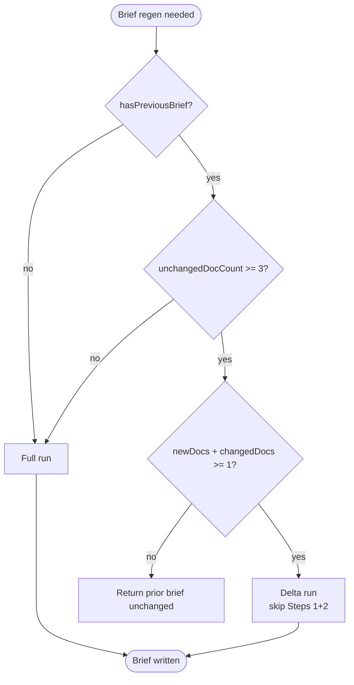

# AI Intelligence Ingestion Flow

This document describes the end-to-end flow for AI-driven brief generation, the
4-tier cache hierarchy that gates Gemini calls, the fingerprint design used to
invalidate the brief cache on signal changes, and the corpus delta mode that
eliminates redundant Gemini work when most documents are unchanged.

Companion docs:

- `docs/DATA-INGESTION-ARCHITECTURE.md` — upstream data ingestion (RH Portal,
  Tableau CCSP, Salesforce Bookings, Gmail, Calendar, Drive)
- `docs/GEMINI-AUDIT.md` — per-call-site cost audit
- `docs/adr/ADR-013.md` — formal AI cache hierarchy decision

---

## 1. Implemented Flow

The brief pipeline is a series of cache lookups. Each tier has a different
invalidation strategy: TTL for time-bounded freshness, content hashes for
deterministic invalidation, and composite fingerprints for cross-signal
invalidation.

```mermaid
flowchart TD
    Start([Brief request<br/>GET /customer/:slug/brief]) --> FP{L1 brief<br/>fingerprint cache?<br/>7d TTL}

    FP -- hit --> Return([Return cached brief])
    FP -- miss --> Emails

    Emails{L2 email cache?<br/>2h TTL}
    Emails -- hit --> EmailsOK
    Emails -- miss --> GmailAPI[Gmail API<br/>users.messages.list]
    GmailAPI --> EmailsOK([emails ready])

    EmailsOK --> Meetings
    Meetings{L2 meeting cache?<br/>2h TTL}
    Meetings -- hit --> MeetingsOK
    Meetings -- miss --> CalendarAPI[Calendar API<br/>events.list]
    CalendarAPI --> MeetingsOK([meetings ready])

    MeetingsOK --> Docs
    Docs{L3 doc content cache?<br/>content-addressed<br/>fileId+modTime}
    Docs -- hit --> DocsOK
    Docs -- miss --> DriveExport[Drive export<br/>per-doc fetch]
    DriveExport --> DocsOK([doc content ready])

    DocsOK --> Industry
    Industry{L4 industry analysis?<br/>30d TTL}
    Industry -- hit --> IndustryOK
    Industry -- miss --> GeminiIndustry[Gemini grounded<br/>industry analysis]
    GeminiIndustry --> IndustryOK([industry ready])

    IndustryOK --> Account
    Account{L4 account intel?<br/>14d TTL<br/>+ contentHash}
    Account -- hit --> AccountOK
    Account -- miss --> DriveFolder{Drive folder<br/>scan?}
    DriveFolder -- hit --> AccountOK
    DriveFolder -- miss --> GeminiAccount[Gemini grounded<br/>account intel]
    GeminiAccount --> AccountOK([account intel ready])

    AccountOK --> Features
    Features{L4 product features?<br/>corpusHash}
    Features -- hit --> FeaturesOK
    Features -- miss --> CorpusScan{Drive corpus<br/>scan?}
    CorpusScan -- hit --> FeaturesOK
    CorpusScan -- miss --> GeminiFeatures[Gemini structured<br/>feature extraction]
    GeminiFeatures --> FeaturesOK([features ready])

    FeaturesOK --> Synth[Brief synthesize<br/>callLLMStructured + callLLM]
    Synth --> Write[Write L1 brief<br/>fingerprint cache]
    Write --> Return
```



### Tier responsibilities

| Tier | Purpose | Invalidation |
|------|---------|--------------|
| L1 | Whole-brief cache, fingerprint-keyed | composite fingerprint change OR 7d TTL |
| L2 | Per-source raw signal cache (emails, meetings) | 2h TTL |
| L3 | Per-document raw content + classification | content-addressed (`fileId-modTime`) |
| L4 | Derived intelligence (industry, account, features) | TTL + content hash hybrid |

---

## 2. Fingerprint Design

The L1 brief cache key is a composite fingerprint hash. It changes whenever any
input signal changes, even within the 7-day TTL window. This makes brief
invalidation deterministic and intra-day responsive without paying for a
Gemini call on every page view.

**Inputs hashed into the brief fingerprint:**

- **Emails (window-bounded):** sorted tuples of `(subject, sender, date)` for
  every customer-tagged email in the active window. Sorting prevents fingerprint
  churn from message ordering changes inside Gmail's response.
- **Meetings (window-bounded):** sorted tuples of `(title, attendees, date)`
  for every customer-tagged calendar event in the rolling window.
- **CCSP tier:** the customer's current CCSP subscription tier label.
- **Pipeline stage:** the dominant SF opportunity stage (or stage distribution
  hash if multi-opp).
- **Open case count by severity:** count of OPEN cases bucketed by severity,
  restricted to the **last 90 days** of `lastUpdated`. Older cases are static
  noise — including them would invalidate briefs every 90 days for no signal
  change.
- **User preferences hash:** SHA of the user-level brief preference settings
  (tone, length, focus areas) so preference changes invalidate without a TTL
  wait.

The fingerprint is computed in `src/ai-fingerprint.ts`. The cache key is
`{slug}-{YYYY-MM-DD}.json` plus the fingerprint hash stored inside the JSON; if
fingerprint differs from the stored value, the entry is treated as a miss.

---

## 3. Corpus Delta Mode

Most customer Drive folders change slowly. On a typical day a customer has
0–2 new documents and 0–1 modified documents — the rest of the corpus is
unchanged from the prior brief. Delta mode exploits this: instead of re-sending
the entire XML doc bundle to Gemini, we send the previous brief plus only the
modified/new/removed documents and let Gemini patch the brief in-place.

### 3.1 Activation gate

Delta mode activates only when all three conditions hold. Otherwise the pipeline
falls back to a full run.

```
unchangedDocCount >= 3 AND (newDocs + changedDocs >= 1) AND hasPreviousBrief
```



The minimum-3-unchanged requirement guards against degenerate cases (small new
folder, mass-rename event) where delta mode would not save meaningful tokens.
The `newDocs + changedDocs >= 1` requirement prevents a delta run that has
nothing new to encode.

### 3.2 Full-run vs delta payload

| Step | Full run | Delta run |
|------|----------|-----------|
| Step 1 — extract per-doc signals | Yes (every doc) | **Skipped** |
| Step 2 — synthesize raw signal bundle | Yes | **Skipped** |
| Step 3 — generate brief markdown | XML doc bundle + signals | `<previous_brief>` + delta XML + always-included |

**Why Steps 1+2 are skipped in delta mode:** the unchanged documents' signals
are already encoded inside `<previous_brief>`. Re-running extraction on
unchanged content would produce the same vectors and waste tokens. Step 3 is
given the prior brief plus a structured description of what changed and is
prompted to update only the affected sections.

### 3.3 Delta XML structure

```xml
<previous_brief>{{existing brief text}}</previous_brief>
<delta>
  <new_documents>
    <doc id="..." title="..." modified="...">{{full content}}</doc>
  </new_documents>
  <modified_documents>
    <doc id="..." title="..." modified="...">{{full content}}</doc>
  </modified_documents>
  <removed_documents>
    <doc id="..." title="..." />
  </removed_documents>
</delta>
<always_included>
  {{emails, meetings, cases, CCSP, pipeline}}
</always_included>
```

`<always_included>` is sent on every run (full or delta) because emails,
meetings, cases, CCSP tier, and pipeline data have their own fingerprint
contributions and are cheap to include. Only Drive doc content is gated by the
delta path.

**Token impact:** for customers with 20+ static docs and 1–2 changes per day,
delta mode reduces Gemini input tokens by 80–90% on the affected brief
regenerations. Combined with the L1 fingerprint cache, this keeps daily Gemini
spend flat as the corpus grows.

---

## 4. Cache Hierarchy Reference

| Tier | Name | Path | Invalidation |
|------|------|------|--------------|
| L1 | Brief cache | `{slug}-{YYYY-MM-DD}.json` | 7d TTL |
| L2 | Email cache | `{slug}-emails.json` | 2h TTL |
| L2 | Meeting cache | `{slug}-meetings.json` | 2h TTL |
| L3 | Doc content cache | `docs/{fileId}-{modTime}.json` | content-addressed |
| L3 | Doc class cache | `doc-classifications/{fileId}` | content-addressed |
| L3 | CCSP data | `ccsp-data.json` | hash-guarded |
| L3 | Pipeline data | `pipeline-data.json` | hash-guarded |
| L3 | Cases | `cases.json` | scraper-controlled |
| L4 | Industry analysis | `industry-analysis/{slug}.json` | 30d TTL |
| L4 | Account intel | `product-intel/{slug}-customer-intel/{cslug}.json` | contentHash + 14d |
| L4 | Product features | `product-intel/{slug}-features.json` | corpusHash |

All paths are relative to `data/cache/`. The cache root is container-internal
(see `docs/DEMO-ENV.md` for environment-specific mounts).

---

## 5. Observability

The pipeline emits structured cache events to a server-sent events (SSE) bus
that the dashboard subscribes to. This makes cache behavior visible during
debugging without re-running with verbose logs.

**Endpoint:**

```
GET /api/ai/events
```

The endpoint streams `text/event-stream` and stays open for the dashboard
session. Multiple clients can subscribe simultaneously.

**Event types:**

| Event | Meaning |
|-------|---------|
| `cache:cold` | Tier had no entry — first generation |
| `cache:hit` | Tier returned a fresh entry |
| `cache:miss` | Tier had an entry but it was stale or fingerprint-mismatched |
| `cache:bypass` | Caller explicitly skipped cache (debug, force-refresh) |
| `cache:stale` | Tier returned a stale entry as a fallback (e.g., L4 source unavailable) |
| `generation:start` | Gemini call started |
| `generation:complete` | Gemini call returned successfully |
| `generation:error` | Gemini call failed (timeout, quota, parse error) |

**Event schema:**

```json
{
  "ts": "2026-04-19T12:34:56.789Z",
  "type": "cache:hit",
  "tier": "L1",
  "key": "acme-corp-2026-04-19",
  "customerSlug": "acme-corp",
  "fingerprint": "sha256:...",
  "durationMs": 4,
  "meta": {
    "ttlRemainingSec": 502341
  }
}
```

`generation:*` events include the call site (`brief-extract`,
`brief-synthesize`, `doc-classify`, etc.) and token usage when known.
`generation:error` events include `error.code` and `error.message`.

The dashboard's AI Activity panel renders these events in real time. The same
events are recorded to `data/cache/ai-events-{date}.jsonl` for post-hoc
analysis.
