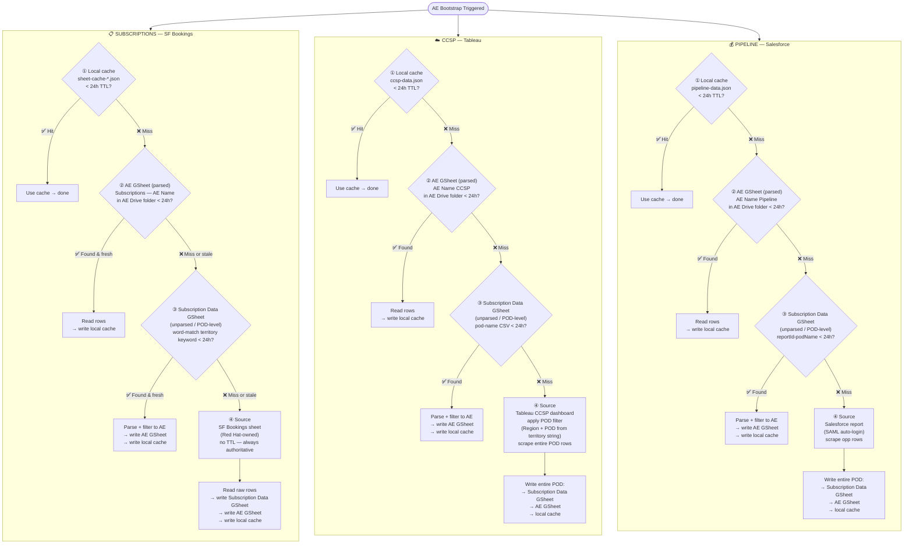

# DailyBriefDashboard — Ingestion Flow

Fallback chain is identical for all 3 flows:
**① Local cache (24h TTL) → ② AE GSheet (parsed) → ③ Subscription Data GSheet (unparsed/POD) → ④ Source**

Every fallback level writes back to local cache before returning.



---

## Daily Sync Schedule + Session Pre-flight

Runs at **6am** (configurable). Sequential — one browser session shared across all flows.
On late laptop/container start: checks `sync-state.json` → if today's sync missed → waits 60s then runs same sequence.

```mermaid
flowchart TD

    TRIGGER(["6am Scheduled Sync\nor Late Startup Detected"])

    TRIGGER --> SFB

    %% ─── SF Bookings — no browser needed ──────────────────
    subgraph SFB["① SF Bookings — No Connection Required"]
        direction TB
        SFB1["Sheets API only\nNo browser session needed"]
        SFB1 --> SFB2["Read source SF Bookings sheet\n→ write Subscription Data GSheet\n→ write AE GSheet\n→ write local cache"]
        SFB2 --> SFB3{Success?}
        SFB3 -->|✅| SFB_OK["Mark SF Bookings ✅\nin sync-state.json"]
        SFB3 -->|❌ Retry 1-3\n5m→10m→15m| SFB4["🚨 All retries failed\nDashboard banner + ntfy push\nServe stale cache"]
    end

    SFB_OK --> RHP

    %% ─── RH Portal session check ───────────────────────────
    subgraph RHP["② RH Portal Connection Pre-flight"]
        direction TB
        RHP1{"Session active?\n(92+ cookies in profile)"}
        RHP1 -->|✅ Active| RHP_OK["Session live → proceed"]
        RHP1 -->|❌ Expired| RHP2["Silent auto-reconnect\n(existing cookies — no VNC)"]
        RHP2 --> RHP3{Reconnect\nsucceeded?}
        RHP3 -->|✅| RHP_OK
        RHP3 -->|❌| RHP_FAIL["🚨 RH Portal session failed\nCCSP + Pipeline skipped\n'Reconnect via Setup page'\nDashboard banner + ntfy push"]
    end

    RHP_OK --> CCSP_SYNC
    RHP_FAIL --> DONE

    %% ─── CCSP ─────────────────────────────────────────────
    subgraph CCSP_SYNC["③ CCSP — Requires: RH Portal + Tableau"]
        direction TB
        TAB1{"Tableau connection\nactive?"}
        TAB1 -->|✅| TAB_GO["Scrape Tableau CCSP\napply POD filter\nscrape entire POD rows"]
        TAB1 -->|❌| TAB2["Attempt Tableau reconnect\n(Connect Tableau button flow)"]
        TAB2 --> TAB3{Reconnect?}
        TAB3 -->|✅| TAB_GO
        TAB3 -->|❌| TAB_FAIL["🚨 Tableau connection failed\nCCSP skipped\nDashboard banner + ntfy push"]
        TAB_GO --> TAB4["→ write Subscription Data GSheet\n→ write AE GSheet\n→ write local cache"]
        TAB4 --> MID1{"Mid-sync session\ndrop detected?"}
        MID1 -->|No| CCSP_OK["Mark CCSP ✅\nin sync-state.json"]
        MID1 -->|Yes| MID2["Silent reconnect attempt"]
        MID2 -->|✅ Success| TAB_GO
        MID2 -->|❌ Fail| MID3["Save progress so far\nMark CCSP PARTIAL\n🚨 notify\nServe pre-sync cache"]
    end

    CCSP_OK --> SFP
    TAB_FAIL --> SFP
    MID3 --> SFP

    %% ─── Salesforce session check ──────────────────────────
    subgraph SFP["④ Salesforce Connection Pre-flight"]
        direction TB
        SF1{"Salesforce session\nactive? (SAML)"}
        SF1 -->|✅| SF_OK["Session live → proceed"]
        SF1 -->|❌| SF2["SAML auto-login attempt\n(Connect Salesforce button flow)"]
        SF2 --> SF3{Login\nsucceeded?}
        SF3 -->|✅| SF_OK
        SF3 -->|❌| SF_FAIL["🚨 Salesforce session failed\nPipeline skipped\n'Reconnect via Setup page'\nDashboard banner + ntfy push"]
    end

    SF_OK --> PIPE_SYNC
    SF_FAIL --> DONE

    %% ─── Pipeline ─────────────────────────────────────────
    subgraph PIPE_SYNC["⑤ Pipeline — Requires: Salesforce"]
        direction TB
        PP1["Scrape Salesforce report\n(data fresh from 2am)\nscrape opp rows"]
        PP1 --> PP2["→ write Subscription Data GSheet\n→ write AE GSheet\n→ write local cache"]
        PP2 --> PP3{Success?}
        PP3 -->|✅| PIPE_OK["Mark Pipeline ✅\nin sync-state.json"]
        PP3 -->|❌ Retry 1-3\n5m→10m→15m| PP4["🚨 All retries failed\nDashboard banner + ntfy push\nServe stale cache"]
        PP2 --> MID4{"Mid-sync session\ndrop detected?"}
        MID4 -->|No| PP3
        MID4 -->|Yes| MID5["SAML auto-login attempt"]
        MID5 -->|✅| PP1
        MID5 -->|❌| MID6["Save progress\nMark Pipeline PARTIAL\n🚨 notify\nServe pre-sync cache"]
    end

    PIPE_OK --> DONE
    MID6 --> DONE

    DONE(["Sync complete\nsync-state.json updated\nDashboard refreshed via SSE"])
```



## Stale-Not-Blank Rule

Cache TTL expiry **never deletes data** — it marks data as stale. The dashboard always renders what's in cache. Stale data shows a staleness badge ("Last synced 18h ago"). A background sync runs to refresh. Cache is only overwritten with equal-or-more data, never blanked.

## Admin Page — Escape Hatch

The Setup page "Scrape Now" buttons bypass the entire cache hierarchy and go straight to source (L4). They reset the retry counter and mark that flow as synced for today in `sync-state.json`. Use when the scheduled sync failed or data is known stale.

## SSE Cache-Level Telemetry

**Endpoint:** `GET /api/ingest/events` — long-lived SSE stream.

Emits one event per cache tier hit during bootstrap and refresh runs:

```
event: connected
data: {"type":"connected","timestamp":"..."}

event: cache-level
data: {"type":"cache-level","ae":"Carolanne Farrell","flow":"sf-bookings","level":"L2","rowCount":42,"timestamp":"..."}
```

**Fields:** `ae` (AE name), `flow` (`sf-bookings` | `ccsp` | `pipeline`), `level` (`L1`–`L4`), `rowCount` (present when data is returned), `timestamp`.

**Monitor during a test run:**
```bash
curl -N http://localhost:7776/api/ingest/events
```

**Implementation:** `src/ingest-events.ts` — exports `onCacheLevel` / `offCacheLevel` / `emitCacheLevel` / `IngestCacheEvent`. Calls to `emitCacheLevel()` are fire-and-forget in the waterfall path.

**Important scope:** Telemetry fires on the L1→L4 waterfall path (second+ bootstrap run, daily refresh). The **onboarding path** (first-time folder creation, new AE) reads L3 directly and writes L2 — it does NOT emit cache-level events. This is expected behavior.

---

## Verified Cache Paths (2026-04-19)

| Level | Condition | Confirmed |
|-------|-----------|-----------|
| **L1** | Local cache present and < 24h TTL | ✅ Confirmed (~5s warm run) |
| **L2** | L1 absent/stale; AE GSheet present and < 24h | ✅ Confirmed (~15s warm run) |
| **L3** | Both L1 and L2 absent/stale; Subscription Data GSheet present | ✅ Confirmed (27.2s cold onboarding, CCSP and SF Pipeline both hit L3) |
| **L4** | All higher levels missing; reads authoritative source directly | ⚠️ Prod-only — `DISALLOW_LIVE_SCRAPE` blocks L4 in test container |

**SF Bookings onboarding path:** Reads L3 (Subscription Data GSheet) directly and writes L2 (AE GSheet). Does not traverse the L1→L4 waterfall during first-time folder creation.

**CCSP L4 gap:** L4 telemetry for CCSP is not distinguishable from L3 without modifying `ccsp-scraper.ts`. Tracked as `BKL-INGEST-TELEMETRY-CCSP-L4`.

**Baseline timings** (2026-04-19, Carolanne Farrell, 11 customers):
- Cold onboarding (new Drive folder): **27.2s**
- L2 warm (L1 wiped, sheets fresh): **~15s**
- L1 warm: **~5s**

---

## Invariants

| Rule | Detail |
|---|---|
| **Local cache TTL** | 24h across all 3 flows — CCSP and Pipeline update at most 1x/day |
| **Always hit local first** | Cache check is gate 1 every time, no exceptions |
| **Write-back on every fallback** | Every level that reads from a fallback writes back to local cache before returning |
| **Fallback order** | Local → AE GSheet (parsed) → Subscription Data GSheet (POD) → Source |
| **Source writes all levels** | L4 source pull writes Subscription Data first, then AE GSheet, then local cache |
| **GDrive TTL** | All GDrive reads (L2 AE GSheet, L3 Subscription Data GSheet) check modifiedTime < 24h before using — stale = miss, fall through |
| **SF Bookings source = no TTL** | The Red Hat-owned SF Bookings sheet is always authoritative — no freshness check, always read if L2/L3 miss |
| **Onboarding ≠ waterfall** | First-time AE folder creation reads L3 directly and writes L2; does not traverse L1→L4 waterfall; no cache-level events emitted |
| **SSE telemetry = waterfall only** | `emitCacheLevel()` fires during second+ bootstrap runs and daily refresh; not during onboarding |

*Last validated: 2026-04-19*
| **Subscription Data = unparsed POD** | Contains full POD rows, not filtered per AE |
| **AE GSheet = parsed** | Filtered to this AE's territory only |
